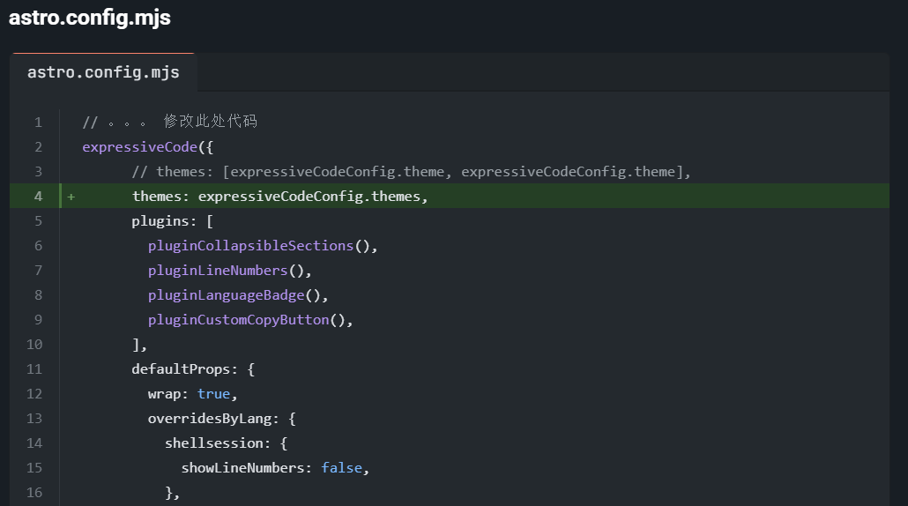
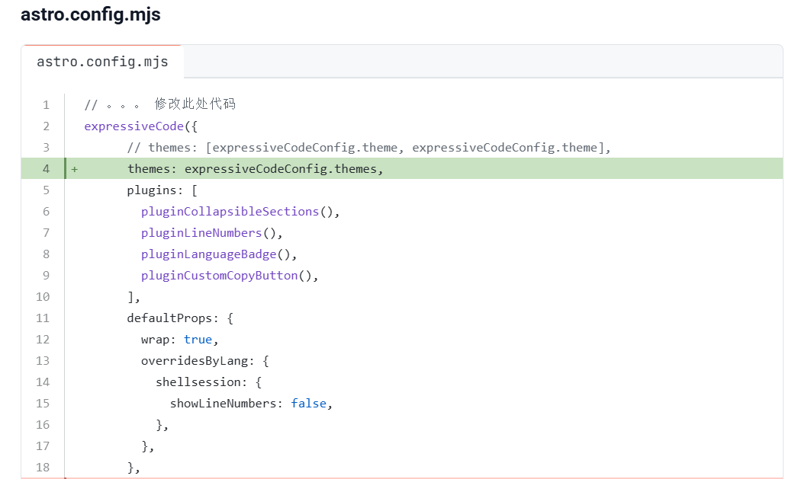

这篇文章来记录一下美化博客的代码。代码模块跟随主题变动而变化


## 修改代码

### astro.config.mjs

```js title="astro.config.mjs" ins={4} del={19-46}
// 。。。 修改此处代码
expressiveCode({
			// themes: [expressiveCodeConfig.theme, expressiveCodeConfig.theme],
			themes: expressiveCodeConfig.themes,
			plugins: [
				pluginCollapsibleSections(),
				pluginLineNumbers(),
				pluginLanguageBadge(),
				pluginCustomCopyButton(),
			],
			defaultProps: {
				wrap: true,
				overridesByLang: {
					shellsession: {
						showLineNumbers: false,
					},
				},
			},
			// styleOverrides: {
			// 	codeBackground: "var(--codeblock-bg)",
			// 	borderRadius: "0.75rem",
			// 	borderColor: "none",
			// 	codeFontSize: "0.875rem",
			// 	codeFontFamily:
			// 		"'JetBrains Mono Variable', ui-monospace, SFMono-Regular, Menlo, Monaco, Consolas, 'Liberation Mono', 'Courier New', monospace",
			// 	codeLineHeight: "1.5rem",
			// 	frames: {
			// 		editorBackground: "var(--codeblock-bg)",
			// 		terminalBackground: "var(--codeblock-bg)",
			// 		terminalTitlebarBackground: "var(--codeblock-topbar-bg)",
			// 		editorTabBarBackground: "var(--codeblock-topbar-bg)",
			// 		editorActiveTabBackground: "none",
			// 		editorActiveTabIndicatorBottomColor: "var(--primary)",
			// 		editorActiveTabIndicatorTopColor: "none",
			// 		editorTabBarBorderBottomColor: "var(--codeblock-topbar-bg)",
			// 		terminalTitlebarBorderBottomColor: "none",
			// 	},
			// 	textMarkers: {
			// 		delHue: 0,
			// 		insHue: 180,
			// 		markHue: 250,
			// 	},
			// },
			// frames: {
			// 	showCopyToClipboardButton: false,
			// },
		}),
    
    // 。。。 修改此处代码
```

### src/types/config.ts

```js title="src\types\config.ts" ins={3}
// 。。。下滑至最下面
export type ExpressiveCodeConfig = {
	theme: string[];
};
```

### src/config.ts

```js title="src\config.ts" ins={6}
// 。。。下滑至最下面

export const expressiveCodeConfig: ExpressiveCodeConfig = {
	// Note: Some styles (such as background color) are being overridden, see the astro.config.mjs file.
	// Please select a dark theme, as this blog theme currently only supports dark background color
	theme: ["github-light", "github-dark"],
};
```

### src/utils/setting-utils.ts

```js title="src\utils\setting-utils.ts" ins={2,5}
	// Set the theme for Expressive Code
	const isDarkMode = document.documentElement.classList.contains("dark");
	document.documentElement.setAttribute(
		"data-theme",
		expressiveCodeConfig.theme[Number(isDarkMode)],
	);
```


## 演示效果

### 晚上



### 白天

