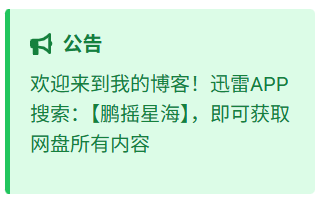

## 概述

公告配置用于在网站顶部显示重要通知、更新信息或欢迎消息。

## 基础配置

### 启用公告功能

```js title="announcementConfig"
export const announcementConfig: AnnouncementConfig = {
  title: "公告", // 公告标题
  content: "欢迎来到我的博客！这是一则示例公告。", // 公告内容
  closable: true, // 允许用户关闭公告
  link: {
    enable: true, // 启用链接
    text: "了解更多", // 链接文本
    url: "/about/", // 链接 URL
    external: false, // 内部链接
  },
};
```

## 配置选项详解

### 基础设置

| 选项       | 类型      | 说明       | 默认值                                   |
| :--------- | :-------- | :--------- | :--------------------------------------- |
| `title`    | `string`  | 公告标题   | `"公告"`                                 |
| `content`  | `string`  | 公告内容   | `"欢迎来到我的博客！这是一则示例公告。"` |
| `closable` | `boolean` | 是否可关闭 | `true`                                   |

### 链接设置

| 选项            | 类型      | 说明         | 默认值       |
| :-------------- | :-------- | :----------- | :----------- |
| `link.enable`   | `boolean` | 是否启用链接 | `true`       |
| `link.text`     | `string`  | 链接文本     | `"了解更多"` |
| `link.url`      | `string`  | 链接地址     | `"/about/"`  |
| `link.external` | `boolean` | 是否外部链接 | `false`      |

## 使用场景

### 1. 欢迎消息

```js title="demo"
export const announcementConfig: AnnouncementConfig = {
  title: "欢迎",
  content: "欢迎来到我的个人博客！这里分享技术文章和生活感悟。",
  closable: true,
  link: {
    enable: true,
    text: "了解我",
    url: "/about/",
    external: false,
  },
};
```

### 2. 更新通知

```js title="demo"
export const announcementConfig: AnnouncementConfig = {
  title: "更新通知",
  content: "网站已更新到 v2.0 版本，新增了多项功能！",
  closable: true,
  link: {
    enable: true,
    text: "查看更新日志",
    url: "/changelog/",
    external: false,
  },
};
```

### 3. 重要提醒

```js title="demo"
export const announcementConfig: AnnouncementConfig = {
  title: "重要提醒",
  content: "网站将于今晚 22:00-24:00 进行维护，期间可能无法访问。",
  closable: false, // 重要提醒不可关闭
  link: {
    enable: false, // 不需要链接
    text: "",
    url: "",
    external: false,
  },
};
```

### 4. 外部链接

```js title="demo"
export const announcementConfig: AnnouncementConfig = {
  title: "新项目发布",
  content: "我的新项目已经发布到 GitHub！",
  closable: true,
  link: {
    enable: true,
    text: "查看项目",
    url: "https://github.com/username/project",
    external: true, // 外部链接
  },
};
```

## 样式自定义

公告组件支持通过 CSS 自定义样式：

```js title="demo.css"
	/* 公告容器 */
    .announcement-container {
        background: linear-gradient(135deg, #667eea 0%, #764ba2 100%);
        color: white;
        padding: 1rem;
        border-radius: 8px;
        margin-bottom: 1rem;
        position: relative;
    }

    /* 公告标题 */
    .announcement-title {
        font-weight: bold;
        font-size: 1.1rem;
        margin-bottom: 0.5rem;
    }

    /* 公告内容 */
    .announcement-content {
        line-height: 1.6;
        margin-bottom: 1rem;
    }

    /* 关闭按钮 */
    .announcement-close {
        position: absolute;
        top: 0.5rem;
        right: 0.5rem;
        background: none;
        border: none;
        color: white;
        cursor: pointer;
        font-size: 1.2rem;
        width: auto;
        height: auto;
        padding: 0;
    }

    /* 链接样式 */
    .announcement-link {
        color: #ffd700;
        text-decoration: underline;
        font-weight: 500;
        background: rgba(255, 255, 255, 0.1);
        padding: 0.25rem 0.75rem;
        border-radius: 4px;
        transition: background 0.2s ease;
    }

    .announcement-link:hover {
        background: rgba(255, 255, 255, 0.2);
    }
```

## 新建代码

### src/config.ts

```js title="src/config.ts"
export const announcementConfig: AnnouncementConfig = {
	title: "公告", // 公告标题
	content: "欢迎来到我的博客！迅雷APP搜索：【鹏摇星海】，即可获取网盘所有内容", // 公告内容
	icon: "fa6-solid:bullhorn", // 公告图标
	type: "success", // 公告类型：info, warning, success, error
	closable: false, // 允许用户关闭公告
	link: {
		enable: false, // 启用链接
		text: "", // 链接文本
		url: "", // 链接 URL
		external: false, // 内部链接
	},
};
```

### src\types\config.ts

```js title="src\types\config.ts"
export type AnnouncementConfig = {
	title?: string; // 公告栏标题
	content: string; // 公告栏内容
	icon?: string; // 公告栏图标
	type?: "info" | "warning" | "success" | "error"; // 公告类型
	closable?: boolean; // 是否可关闭
	link?: {
		enable: boolean; // 是否启用链接
		text: string; // 链接文字
		url: string; // 链接地址
		external?: boolean; // 是否外部链接
	};
};
```

### src\i18n\i18nKey.ts

```js title="src/i18n/i18nKey.ts" ins={14-15}
enum I18nKey {
	// ....省略
	publishedAt = "publishedAt",
	license = "license",

	pinned = "pinned",

	series = "series",

	friends = "friends",

	donate = "donate",

	announcement = "announcement",
	announcementClose = "announcementClose",
}

export default I18nKey;

```

### 各国语言

```js title="各国语言"
	// en.ts	
	[Key.announcement]: "Announcement",
	[Key.announcementClose]: "Close",
        
	// es.ts
    [Key.announcement]: "Anuncio",
	[Key.announcementClose]: "Cerrar",
     
    // id.ts
    [Key.announcement]: "Pengumuman",
	[Key.announcementClose]: "Tutup",
        
    // ja.ts
    [Key.announcement]: "お知らせ",
	[Key.announcementClose]: "閉じる",
        
    // ko.ts
    [Key.announcement]: "공지사항",
	[Key.announcementClose]: "닫기",
        
    // th.ts
    [Key.announcement]: "ประกาศ",
	[Key.announcementClose]: "ปิด",
        
    // tr.ts
    [Key.announcement]: "Duyuru",
	[Key.announcementClose]: "Kapat",
        
    // vi.ts
    [Key.announcement]: "Thông báo",
	[Key.announcementClose]: "Đóng",    
        
    // zh_CN.ts
    [Key.announcement]: "公告",
	[Key.announcementClose]: "关闭",
        
     // zh_TW.ts   
     [Key.announcement]: "公告",
	 [Key.announcementClose]: "關閉",   
```

### src\components\widget\Announcement.astro

```js title="src\components\widget\Announcement.astro"
---
import { Icon } from "astro-icon/components";
import { announcementConfig } from "@/config/announcementConfig";
import I18nKey from "@/i18n/i18nKey";
import { i18n } from "@/i18n/translation";
import WidgetLayout from "./WidgetLayout.astro";

const config = announcementConfig;

interface Props {
	class?: string;
	style?: string;
}
const className = Astro.props.class;
const style = Astro.props.style;

// 根据公告类型确定样式类
const getTypeClass = (type: string | undefined) => {
	switch (type) {
		case "info":
			return "bg-blue-100 border-blue-500 text-blue-700 dark:bg-blue-900 dark:border-blue-300 dark:text-blue-200";
		case "warning":
			return "bg-yellow-100 border-yellow-500 text-yellow-700 dark:bg-yellow-900 dark:border-yellow-300 dark:text-yellow-200";
		case "success":
			return "bg-green-100 border-green-500 text-green-700 dark:bg-green-900 dark:border-green-300 dark:text-green-200";
		case "error":
			return "bg-red-100 border-red-500 text-red-700 dark:bg-red-900 dark:border-red-300 dark:text-red-200";
		default:
			return "bg-gray-100 border-gray-500 text-gray-700 dark:bg-gray-800 dark:border-gray-300 dark:text-gray-200";
	}
};
---


<WidgetLayout
    name={config.title || i18n(I18nKey.announcement)}
    id="announcement"
    class={className}
    style={style}
>
    <div class={`announcement-container border-l-4 p-4 rounded ${getTypeClass(config.type)}`}>
        <!-- 公告栏图标和标题 -->
        <div class="flex items-center gap-2 mb-2">
            {config.icon && <Icon name={config.icon} class="text-lg" />}
            {config.title && <h3 class="font-bold">{config.title}</h3>}
        </div>

        <!-- 公告栏内容 -->
        <div class="announcement-content mb-3">
            {config.content}
        </div>

        <!-- 可选链接和关闭按钮 -->
        <div class="flex items-center justify-between gap-3">
            <div>
                {
                    config.link && config.link.enable !== false && (
                        <a
                            href={config.link.url}
                            target={config.link.external ? "_blank" : "_self"}
                            rel={
                                config.link.external
                                    ? "noopener noreferrer"
                                    : undefined
                            }
                            class="announcement-link font-medium underline"
                        >
                            {config.link.text}
                        </a>
                    )
                }
            </div>

            {
                config.closable && (
                    <button
                        class="announcement-close"
                        onclick="closeAnnouncement()"
                        aria-label={i18n(I18nKey.announcementClose)}
                    >
                        <Icon name="fa6-solid:xmark" class="text-sm" />
                    </button>
                )
            }
        </div>
    </div>
</WidgetLayout>

<script>
    // 扩展 Window 接口以包含 closeAnnouncement 方法
    declare global {
        interface Window {
            closeAnnouncement: () => void;
        }
    }

    function closeAnnouncement() {
        // 通过data-id属性找到整个widget-layout元素
        const widgetLayout = document.querySelector(
            'widget-layout[data-id="announcement"]',
        );
        if (widgetLayout) {
            // 隐藏整个widget-layout元素
            (widgetLayout as HTMLElement).style.display = "none";
            // 保存关闭状态到localStorage
            localStorage.setItem("announcementClosed", "true");
        }
    }

    // 页面加载时检查是否已关闭
    document.addEventListener("DOMContentLoaded", function () {
        const widgetLayout = document.querySelector(
            'widget-layout[data-id="announcement"]',
        );
        if (
            widgetLayout &&
            localStorage.getItem("announcementClosed") === "true"
        ) {
            (widgetLayout as HTMLElement).style.display = "none";
        }
    });

    // 使公告栏函数全局可用
    window.closeAnnouncement = closeAnnouncement;
</script>
```

### src\components\widget\SideBar.astro

```js title="src\components\widget\SideBar.astro" ins={3,29}
---
import type { MarkdownHeading } from "astro";
import Announcement from "./Announcement.astro";
import Categories from "./Categories.astro";
import Profile from "./Profile.astro";
import Series from "./Series.astro";
import Tag from "./Tags.astro";
import TOC from "./TOC.astro";

interface Props {
	class?: string;
	headings?: MarkdownHeading[];
	series?: string;
}

const className = Astro.props.class;
const headings = Astro.props.headings;
const series = Astro.props.series;
---
<div id="sidebar" class:list={[className, "w-full"]}>
    <div class="flex flex-col w-full gap-4 mb-4">
        <Profile></Profile>
    </div>
    <div id="sidebar-sticky" class="transition-all duration-700 flex flex-col w-full gap-4 top-4 sticky top-4">
        <div id="series" class="flex flex-col w-full gap-4">
            { series && <Series series={ series }></Series> }
        </div>
        <Categories class="onload-animation" style="animation-delay: 150ms"></Categories>
        <Announcement></Announcement>
        <Tag class="onload-animation" style="animation-delay: 200ms"></Tag>
    </div>
</div>
```

## 效果演示

