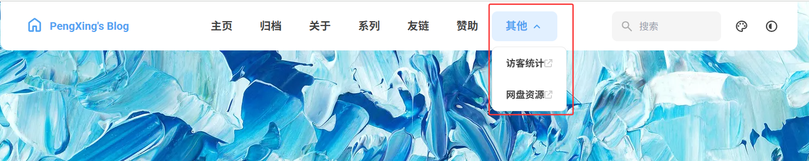

之前被 Fuwari 主题的简约清新风格打动，便将博客主题换成了它。但在使用过程中发现，原生 Fuwari 主题仅支持单级导航，这对我的博客来说并不够用 —— 我的博客内容分为生活记录、技术分享、旅行攻略等几大类，每类下又有细分内容，比如技术分享里包含基础编程、软件使用技巧等，单级导航会让访客难以快速定位内容。因此，为 Fuwari 主题添加二级导航， 支持二级菜单配置，桌面端悬停展开，移动端点击切换，如今这项功能已成功实现，在此分享具体过程。

## 二级菜单配置

在导航栏配置中支持二级菜单，可以创建下拉菜单结构：

**配置说明：**
- `name` - 菜单显示名称
- `url` - 链接地址（父级菜单建议使用 `#`）
- `children` - 子菜单数组
- `external` - 是否为外部链接

**功能特性：**
- 桌面端：鼠标悬停展开二级菜单

- 移动端：点击切换二级菜单显示/隐藏

- 支持无限层级嵌套

- 自动适应内容宽度

  

```js title="src\config.ts" ins={9-24}
export const navBarConfig: NavBarConfig = {
	links: [
		LinkPreset.Home,
		LinkPreset.Archive,
		LinkPreset.About,
		LinkPreset.Series,
		LinkPreset.Friends,
		LinkPreset.Donate,
		{
			name: "其他", // 标题
			url: "#", // 内部链接不应包含基本路径，因为它是自动添加的
			children: [
				{
					name: "访客统计",
					url: "https://cloud.umami.is/share/i6f3UwPY4n0w1LJa/pengxing.dpdns.org", // 内部链接不应包含基本路径，因为它是自动添加的
					external: true, //显示外部链接图标，并将在新选项卡中打开
				},
				{
					name: "网盘资源",
					url: "https://docs.qq.com/aio/DYmZYVGpFVGxOS3NE", // 内部链接不应包含基本路径，因为它是自动添加的
					external: true, //显示外部链接图标，并将在新选项卡中打开
				},
			],
		},
	],
};
```


## 修改代码

### src/components/Navbar.astro

```js title="src\components\Navbar.astro" ins={44-73} del={36-43} collapse={1-22,78-173}
---
import { Icon } from "astro-icon/components";
import { navBarConfig, siteConfig } from "../config";
import { LinkPresets } from "../constants/link-presets";
import { LinkPreset, type NavBarLink } from "../types/config";
import { url } from "../utils/url-utils";
import LightDarkSwitch from "./LightDarkSwitch.svelte";
import Search from "./Search.svelte";
import DisplaySettings from "./widget/DisplaySettings.svelte";
import NavMenuPanel from "./widget/NavMenuPanel.astro";

const className = Astro.props.class;

let links: NavBarLink[] = navBarConfig.links.map(
	(item: NavBarLink | LinkPreset): NavBarLink => {
		if (typeof item === "number") {
			return LinkPresets[item];
		}
		return item;
	},
);
---
<div id="navbar" class="z-50 onload-animation">
    <div class="absolute h-8 left-0 right-0 -top-8 bg-[var(--card-bg)] transition"></div> <!-- used for onload animation -->
    <div class:list={[
        className,
        "card-base !overflow-visible max-w-[var(--page-width)] h-[4.5rem] !rounded-t-none mx-auto flex items-center justify-between px-4"]}>
        <a href={url('/')} class="btn-plain scale-animation rounded-lg h-[3.25rem] px-5 font-bold active:scale-95">
            <div class="flex flex-row text-[var(--primary)] items-center text-md">
                <Icon name="material-symbols:home-outline-rounded" class="text-[1.75rem] mb-1 mr-2" />
                {siteConfig.title}
            </div>
        </a>
        <div class="hidden md:flex">
            {links.map((l) => {
                // return <a aria-label={l.name} href={l.external ? l.url : url(l.url)} target={l.external ? "_blank" : null}
                //           class="btn-plain scale-animation rounded-lg h-11 font-bold px-5 active:scale-95"
                // >
                //     <div class="flex items-center">
                //         {l.name}
                //         {l.external && <Icon name="fa6-solid:arrow-up-right-from-square" class="text-[0.875rem] transition -translate-y-[1px] ml-1 text-black/[0.2] dark:text-white/[0.2]"></Icon>}
                //     </div>
                // </a>;
                if (l.children && l.children.length > 0) {
                    // 有子菜单的情况
                    return <div class="relative group">
                        <button class="btn-plain scale-animation rounded-lg h-11 font-bold px-5 active:scale-95 flex items-center">
                            {l.name}
                            <Icon name="material-symbols:keyboard-arrow-down-rounded" class="text-[1.25rem] ml-1 transition-transform group-hover:rotate-180"></Icon>
                        </button>
                        <div class="absolute top-full left-0 mt-2 min-w-max bg-[var(--card-bg)] border border-[var(--line-divider)] rounded-lg shadow-lg opacity-0 invisible group-hover:opacity-100 group-hover:visible transition-all duration-200 z-50 whitespace-nowrap">
                            {l.children.map((child) => (
                                 <a href={child.external ? child.url : url(child.url)} target={child.external ? "_blank" : null}
                                    class="btn-plain scale-animation block px-4 py-3 text-sm font-bold hover:bg-[var(--btn-plain-bg-hover)] active:bg-[var(--btn-plain-bg-active)] first:rounded-t-lg last:rounded-b-lg transition-all duration-200 active:scale-95 mx-1 my-0.5 rounded-lg">
                                     <div class="flex items-center justify-between">
                                         {child.name}
                                         {child.external && <Icon name="fa6-solid:arrow-up-right-from-square" class="text-[0.75rem] text-black/[0.2] dark:text-white/[0.2]"></Icon>}
                                     </div>
                                 </a>
                             ))}
                        </div>
                    </div>;
                } else {
                    // 没有子菜单的情况
                    return <a aria-label={l.name} href={l.external ? l.url : url(l.url)} target={l.external ? "_blank" : null}
                              class="btn-plain scale-animation rounded-lg h-11 font-bold px-5 active:scale-95"
                    >
                        <div class="flex items-center">
                            {l.name}
                            {l.external && <Icon name="fa6-solid:arrow-up-right-from-square" class="text-[0.875rem] transition -translate-y-[1px] ml-1 text-black/[0.2] dark:text-white/[0.2]"></Icon>}
                        </div>
                    </a>;
                }

            })}
        </div>
        <div class="flex">
            <!--<SearchPanel client:load>-->
            <Search client:only="svelte"></Search>
            {!siteConfig.themeColor.fixed && (
                    <button aria-label="Display Settings" class="btn-plain scale-animation rounded-lg h-11 w-11 active:scale-90" id="display-settings-switch">
                        <Icon name="material-symbols:palette-outline" class="text-[1.25rem]"></Icon>
                    </button>
            )}
            <LightDarkSwitch client:only="svelte"></LightDarkSwitch>
            <button aria-label="Menu" name="Nav Menu" class="btn-plain scale-animation rounded-lg w-11 h-11 active:scale-90 md:!hidden" id="nav-menu-switch">
                <Icon name="material-symbols:menu-rounded" class="text-[1.25rem]"></Icon>
            </button>
        </div>
        <NavMenuPanel links={links}></NavMenuPanel>
        <DisplaySettings client:only="svelte"></DisplaySettings>
    </div>
</div>

<script>
function switchTheme() {
    if (localStorage.theme === 'dark') {
        document.documentElement.classList.remove('dark');
        localStorage.theme = 'light';
    } else {
        document.documentElement.classList.add('dark');
        localStorage.theme = 'dark';
    }
}

function loadButtonScript() {
    let switchBtn = document.getElementById("scheme-switch");
    if (switchBtn) {
        switchBtn.onclick = function () {
            switchTheme()
        };
    }

    let settingBtn = document.getElementById("display-settings-switch");
    if (settingBtn) {
        settingBtn.onclick = function () {
            let settingPanel = document.getElementById("display-setting");
            if (settingPanel) {
                settingPanel.classList.toggle("float-panel-closed");
            }
        };
    }

    let menuBtn = document.getElementById("nav-menu-switch");
    if (menuBtn) {
        menuBtn.onclick = function () {
            let menuPanel = document.getElementById("nav-menu-panel");
            if (menuPanel) {
                menuPanel.classList.toggle("float-panel-closed");
            }
        };
    }
}

loadButtonScript();
</script>

{import.meta.env.PROD && <script is:inline define:vars={{scriptUrl: url('/pagefind/pagefind.js')}}>
async function loadPagefind() {
    try {
        const response = await fetch(scriptUrl, { method: 'HEAD' });
        if (!response.ok) {
            throw new Error(`Pagefind script not found: ${response.status}`);
        }

        const pagefind = await import(scriptUrl);

        await pagefind.options({
            excerptLength: 20
        });

        window.pagefind = pagefind;

        document.dispatchEvent(new CustomEvent('pagefindready'));
        console.log('Pagefind loaded and initialized successfully, event dispatched.');
    } catch (error) {
        console.error('Failed to load Pagefind:', error);
        window.pagefind = {
            search: () => Promise.resolve({ results: [] }),
            options: () => Promise.resolve(),
        };
        document.dispatchEvent(new CustomEvent('pagefindloaderror'));
        console.log('Pagefind load error, event dispatched.');
    }
}

if (document.readyState === 'loading') {
    document.addEventListener('DOMContentLoaded', loadPagefind);
} else {
    loadPagefind();
}
</script>}

```

### src/components/widget/NavMenuPanel.astro

```js title="src\components\widget\NavMenuPanel.astro" collapse={1-11} del={13-31} ins={32-94,97-121}
---
import { Icon } from "astro-icon/components";
import { type NavBarLink } from "../../types/config";
import { url } from "../../utils/url-utils";

interface Props {
	links: NavBarLink[];
}

const links = Astro.props.links;
---
<div id="nav-menu-panel" class:list={["float-panel float-panel-closed absolute transition-all fixed right-4 px-2 py-2"]}>
    <!-- {links.map((link) => (
        <a href={link.external ? link.url : url(link.url)} class="group flex justify-between items-center py-2 pl-3 pr-1 rounded-lg gap-8
            hover:bg-[var(--btn-plain-bg-hover)] active:bg-[var(--btn-plain-bg-active)] transition
        "
           target={link.external ? "_blank" : null}
        >
            <div class="transition text-black/75 dark:text-white/75 font-bold group-hover:text-[var(--primary)] group-active:text-[var(--primary)]">
                {link.name}
            </div>
            {!link.external && <Icon name="material-symbols:chevron-right-rounded"
                  class="transition text-[1.25rem] text-[var(--primary)]"
            >
            </Icon>}
            {link.external && <Icon name="fa6-solid:arrow-up-right-from-square"
                  class="transition text-[0.75rem] text-black/25 dark:text-white/25 -translate-x-1"
            >
            </Icon>}
        </a>
    ))} -->
    {links.map((link) => {
        if (link.children && link.children.length > 0) {
            // 有子菜单的情况
            return (
                <div class="nav-menu-item-with-children">
                    <button class="group flex justify-between items-center py-2 pl-3 pr-1 rounded-lg gap-8 w-full
                        hover:bg-[var(--btn-plain-bg-hover)] active:bg-[var(--btn-plain-bg-active)] transition
                        nav-submenu-toggle"
                    >
                        <div class="transition text-black/75 dark:text-white/75 font-bold group-hover:text-[var(--primary)] group-active:text-[var(--primary)]">
                            {link.name}
                        </div>
                        <Icon name="material-symbols:keyboard-arrow-down-rounded"
                              class="transition text-[1.25rem] text-[var(--primary)] nav-submenu-arrow"
                        >
                        </Icon>
                    </button>
                    <div class="nav-submenu pl-4 max-h-0 overflow-hidden transition-all duration-200">
                        {link.children.map((child) => (
                            <a href={child.external ? child.url : url(child.url)} class="group flex justify-between items-center py-2 pl-3 pr-1 rounded-lg gap-8
                                hover:bg-[var(--btn-plain-bg-hover)] active:bg-[var(--btn-plain-bg-active)] transition
                            "
                               target={child.external ? "_blank" : null}
                            >
                                <div class="transition text-black/60 dark:text-white/60 text-sm group-hover:text-[var(--primary)] group-active:text-[var(--primary)]">
                                    {child.name}
                                </div>
                                {!child.external && <Icon name="material-symbols:chevron-right-rounded"
                                      class="transition text-[1rem] text-[var(--primary)]"
                                >
                                </Icon>}
                                {child.external && <Icon name="fa6-solid:arrow-up-right-from-square"
                                      class="transition text-[0.65rem] text-black/25 dark:text-white/25 -translate-x-1"
                                >
                                </Icon>}
                            </a>
                        ))}
                    </div>
                </div>
            );
        } else {
            // 没有子菜单的情况
            return (
                <a href={link.external ? link.url : url(link.url)} class="group flex justify-between items-center py-2 pl-3 pr-1 rounded-lg gap-8
                    hover:bg-[var(--btn-plain-bg-hover)] active:bg-[var(--btn-plain-bg-active)] transition
                "
                   target={link.external ? "_blank" : null}
                >
                    <div class="transition text-black/75 dark:text-white/75 font-bold group-hover:text-[var(--primary)] group-active:text-[var(--primary)]">
                        {link.name}
                    </div>
                    {!link.external && <Icon name="material-symbols:chevron-right-rounded"
                          class="transition text-[1.25rem] text-[var(--primary)]"
                    >
                    </Icon>}
                    {link.external && <Icon name="fa6-solid:arrow-up-right-from-square"
                          class="transition text-[0.75rem] text-black/25 dark:text-white/25 -translate-x-1"
                    >
                    </Icon>}
                </a>
            );
        }
    })}
</div>

<script>
    // 移动端二级菜单展开/收起功能
    document.addEventListener('DOMContentLoaded', function() {
        const submenuToggles = document.querySelectorAll('.nav-submenu-toggle');
        
        submenuToggles.forEach(toggle => {
            toggle.addEventListener('click', function(this: HTMLElement) {
                const submenu = this.parentElement?.querySelector('.nav-submenu') as HTMLElement;
                const arrow = this.querySelector('.nav-submenu-arrow') as HTMLElement;
                
                if (submenu && arrow) {
                    const isExpanded = submenu.style.maxHeight && submenu.style.maxHeight !== '0px';
                    
                    if (isExpanded) {
                        submenu.style.maxHeight = '0px';
                        arrow.style.transform = 'rotate(0deg)';
                    } else {
                        submenu.style.maxHeight = submenu.scrollHeight + 'px';
                        arrow.style.transform = 'rotate(180deg)';
                    }
                }
            });
        });
    });
</script>
```

### src/config.ts

```js title="src\config.ts" collapse={1-42,70-133} ins={51-66} 
import type {
	ExpressiveCodeConfig,
	LicenseConfig,
	NavBarConfig,
	ProfileConfig,
	SiteConfig,
	UmamiConfig,
} from "./types/config";
import { LinkPreset } from "./types/config";

export const siteConfig: SiteConfig = {
	title: "PengXing's Blog", // 标题
	subtitle: "爱你所爱！", // 副标题
	lang: "zh_CN", // 'en', 'zh_CN', 'zh_TW', 'ja', 'ko', 'es', 'th' 语言设置
	themeColor: {
		hue: 250, // 主题色的色调范围从0到360。例如：红色：0，青色：200，蓝色：250，粉色：345
		fixed: false, // 是否隐藏主题颜色选择器，访客可见
	},
	banner: {
		enable: true, // 是否启用横幅
		src: "assets/images/demo-banner.png", // 横幅图片的路径，相对于 /src 目录，如果路径以 / 开头则相对于 /public 目录，或者完整路径的网络图片
		position: "center", // 横幅位置，对应 object-position 属性，只支持 'top', 'center', 'bottom'，默认为 'center'
		credit: {
			enable: false, // 是否显示横幅图片的版权信息
			text: "", // 显示的版权文字
			url: "", // （可选）指向原始艺术作品或艺术家页面的 URL 链接
		},
	},
	toc: {
		enable: true, // 是否在文章右侧显示目录
		depth: 2, // 显示目录的最大标题深度，从 1 到 3
	},
	favicon: [
		// 留空数组以使用默认的 favicon
		{
			src: "/favicon/favicon.ico", // favicon 的路径，相对于 /public 目录
			theme: "light", // （可选）设置为 'light' 或 'dark'，仅当有不同的 favicon 时才设置
			sizes: "32x32", // （可选）favicon 的尺寸，仅当有不同尺寸的 favicon 时设置
		},
	],
};

export const navBarConfig: NavBarConfig = {
	links: [
		LinkPreset.Home,
		LinkPreset.Archive,
		LinkPreset.About,
		LinkPreset.Series,
		LinkPreset.Friends,
		LinkPreset.Donate,
		{
			name: "其他", // Link text
			url: "#", // Internal links should not include the base path, as it is automatically added
			children: [
				{
					name: "访客统计",
					url: "https://cloud.umami.is/share/i6f3UwPY4n0w1LJa/pengxing.dpdns.org", // Internal links should not include the base path, as it is automatically added
					external: true, // Show an external link icon and will open in a new tab
				},
				{
					name: "网盘资源",
					url: "https://docs.qq.com/aio/DYmZYVGpFVGxOS3NE", // Internal links should not include the base path, as it is automatically added
					external: true, // Show an external link icon and will open in a new tab
				},
			],
		},
	],
};

export const profileConfig: ProfileConfig = {
	avatar: "assets/images/demo-avatar.png", // 头像路径，相对于 /src 目录，如果路径以 / 开头则相对于 /public 目录
	name: "鹏星",
	bio: "Love what you love,  all will be well! / 爱你所爱，一切美好！", // 个人简介
	links: [
		// {
		//   name: "Twitter",
		//   icon: "fa6-brands:twitter", // Visit https://icones.js.org/ for icon codes
		//   // You will need to install the corresponding icon set if it's not already included
		//   // `pnpm add @iconify-json/<icon-set-name>`
		//   url: "https://twitter.com",
		// },
		// {
		//   name: "Steam",
		//   icon: "fa6-brands:steam",
		//   url: "https://store.steampowered.com",
		// },
		// {
		//   name: "GitHub",
		//   icon: "fa6-brands:github",
		//   url: "https://github.com/saicaca/fuwari",
		// },
		{
			name: "QQ频道",
			icon: "fa6-brands:qq",
			url: "https://pd.qq.com/s/38it5vmzn",
		},
		{
			name: "link3",
			icon: "fa6-brands:staylinked",
			url: "https://link3.cc/pyxh",
		},
	],
};

export const licenseConfig: LicenseConfig = {
	enable: true,
	name: "CC BY-NC-SA 4.0",
	url: "https://creativecommons.org/licenses/by-nc-sa/4.0/",
};

export const expressiveCodeConfig: ExpressiveCodeConfig = {
	// Note: Some styles (such as background color) are being overridden, see the astro.config.mjs file.
	// Please select a dark theme, as this blog theme currently only supports dark background color
	theme: ["github-light", "github-dark"],
};

// 在 config.ts 中配置 Umami 相关信息
export const umamiConfig: UmamiConfig = {
	enable: true,
	baseUrl: "https://cloud.umami.is",
	shareId: "i6f3UwPY4n0w1LJa",
	timezone: "Asia/Shanghai",
};

export const statsConfig = {
	viewsText: "浏览量",
	visitsText: "访客",
	loadingText: "统计加载中...",
	unavailableText: "统计不可用。",
	getStatsText: (pageViews: number, visits: number) =>
		`${statsConfig.viewsText} ${pageViews} · ${statsConfig.visitsText} ${visits}`,
};

```

### src/types/config.ts

```js title="src\types\config.ts" ins={7}
// 。。。。只需要修改这一处,其他保存不变

export type NavBarLink = {
	name: string;
	url: string;
	external?: boolean;
	children?: NavBarLink[]; // 支持二级菜单
};


// 。。。。只需要修改这一处,其他保存不变
```

## 演示效果

