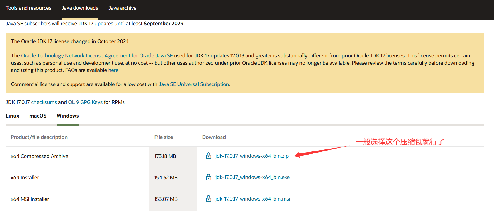
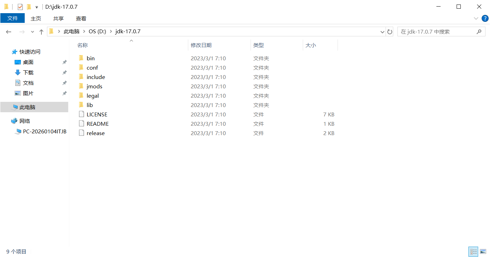
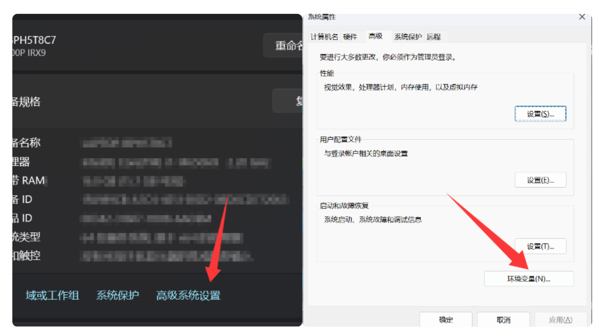
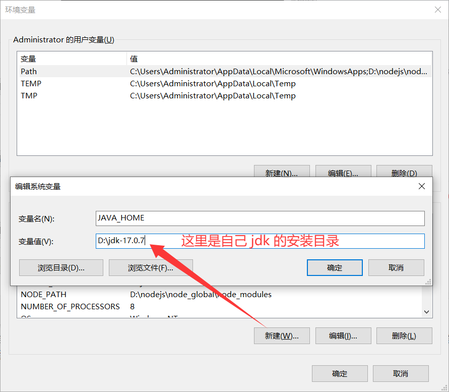
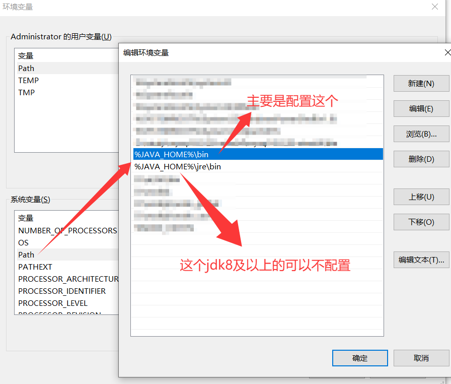
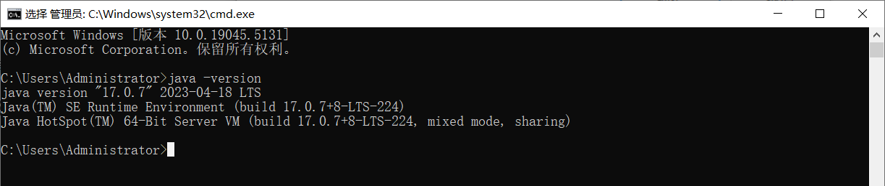
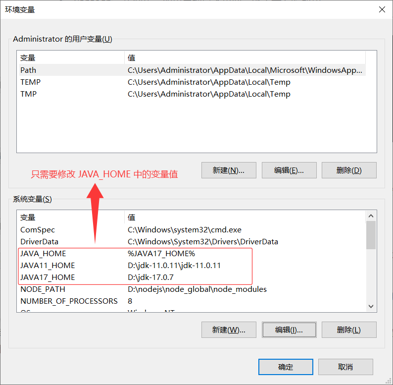
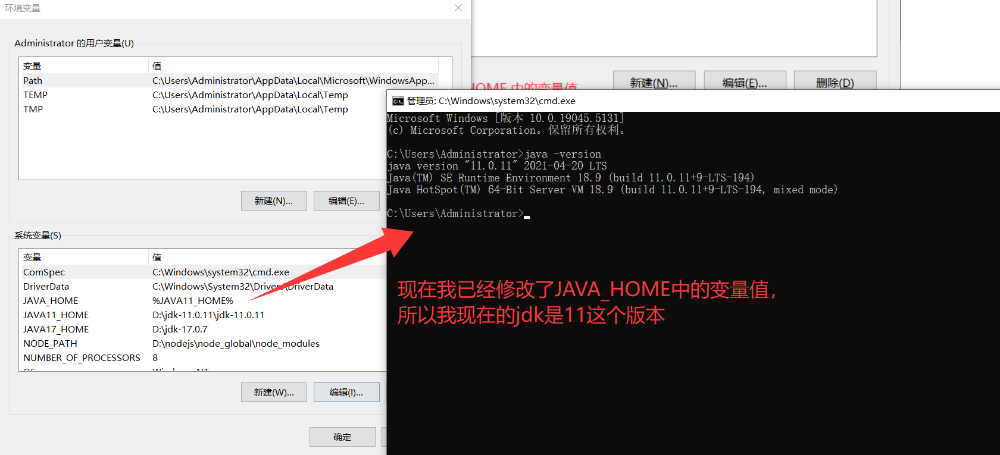
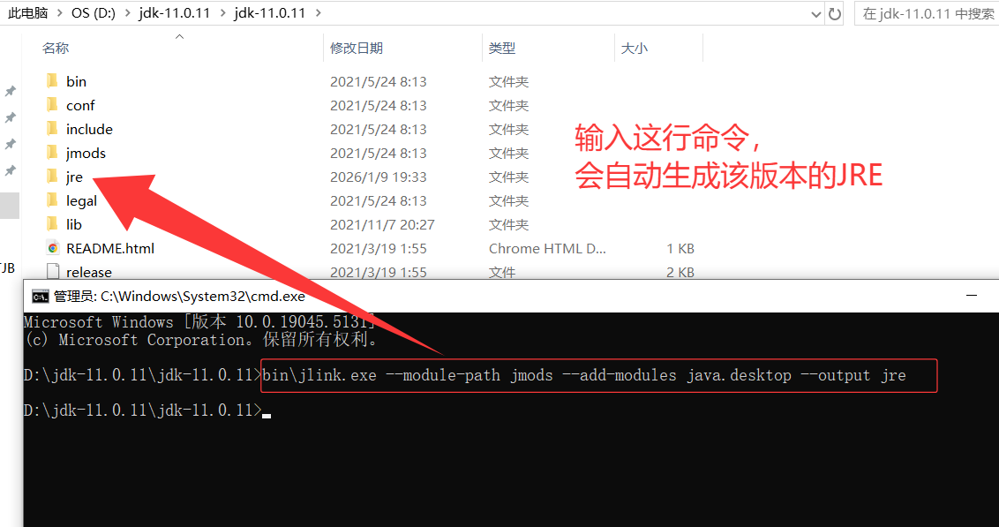

### 1. 下载 JDK

**【包含25、21、17、11、8】Oracle JDK：**https://pan.baidu.com/s/1lfmelC17IncuE-VUoE1Xog?pwd=pyxh **提取码: pyxh**

1. 这里以 JDK 17 为例，其他版本安装方式一样。

- 首先到 [官网](https://www.oracle.com/cn/java/technologies/downloads/) 找到需要版本的 JDK 压缩包下载。

- 选择 `x64 Compressed Archive` 点击下载链接即可开始下载，有的版本可能需要登录 Oracle 帐号才可以下载，注册一个就可以了。



2. 下载完成后将其解压，将其文件夹命名为 `jdk17`【小编没有重命名，你们操作可以】，解压出来的结构如图：



### 2. 配环境变量

1. 右键“此电脑” -> “属性” -> “高级系统设置” -> “环境变量”



2. 当只存在一个 JDK 时，Windows 只需要在`环境变量`中配置 `JAVA_HOME`，变量值：自己的 JDK 的安装路径（参考上面的安装教程），编辑好后点击确定。



3. 找到系统变量 path 点击编辑：



编辑好后点击确定，暂时不要点击X号关闭。

### 3. 测试JDK

1. 输入 win+r（win键就是四个方块的那个），输入cmd，按回车。


2. 输入命令 `java -version`，按回车。如果出现以下页面，就表示安装成功。



### 4. 多版本JDK配置

首先多个 JDK 的配置方式大同小异。这里假设电脑上下载了 JDK 11 和 JDK 17 两个版本，他们的安装路径分别为 `D:\jdk-11.0.11\jdk-11.0.11` 和 `D:\jdk-17.0.7`。

操作步骤主要分为四步：

1. 增加一个名字叫 `JAVA11_HOME` 的环境变量，使其指向目录 `D:\jdk-11.0.11\jdk-11.0.11`
2. 增加一个名字叫 `JAVA17_HOME` 的环境变量，使其指向目录 `D:\jdk-17.0.7`
3. 修改原来的 `JAVA_HOME`（没有的话就新增一个），使其值指向你想使用的 JDK 版本，比如我想使用 JDK 17，那就设置其值为 `%JAVA_HOME17%`
4. 系统变量 Path 中的 `bin` 和 `jre/bin` 的目录，则完全不需要去动，因为我们在之前已经设置为`%JAVA_HOME%\bin`和`%JAVA_HOME%\jre\bin`



**验证是否成功**

最后保存环境变量配置，然后打开一个新的命令行窗口输入 `java --version` 即可看到当前使用的 java 版本了。



### 5.【拓展一】为什么没有 JRE 文件夹

####  一、先说明：为什么 JDK1.8 之后没有 JRE 文件夹了？（核心原因）

这个不是安装包残缺、不是安装失败，而是 **Oracle 官方的刻意调整**，从 JDK 9 开始彻底移除，JDK 1.8 是「过渡期」：

1. JDK 1.8 **早期版本**（比如 jdk1.8.0_101 之前）：安装后自带`jre`文件夹；
2. JDK 1.8 **后期版本**（比如 jdk1.8.0_200 及以后）：安装后**无 JRE 文件夹**；
3. JDK 9 / 10 / 11 / 17 等更高版本：**完全取消了内置 JRE**。

#### 二、官方移除 JRE 的核心目的

JRE（Java 运行环境）本质是 JDK 的「子集」，JDK 中已经包含了 JRE 运行所需的所有核心文件，官方为了**节省安装包体积、精简目录结构、统一运行 / 开发环境**，就不再单独打包 JRE 了，**JRE 的功能完全可以由 JDK 本身提供**。

#### 三、这个情况对开发的「具体影响」（关心的重点）

没有 JRE 文件夹，**对 Java 代码编写、编译（javac）、本地调试运行（java）基本无影响**，但会在这些开发场景下直接报错 / 卡壳，也是你能明显感知到的影响，按出现频率排序：

##### ✔ 影响 1：IDE 配置时提示「找不到 JRE 路径」

- Eclipse/MyEclipse/IDEA 配置 JDK 的时候，部分版本会默认去`JAVA_HOME/jre`目录读取运行环境，找不到就会标红、提示「JRE 缺失」，甚至无法创建 Java 项目；
- IDEA 还好兼容性强，Eclipse 对这个问题最敏感，几乎必报错。

##### ✔ 影响 2：项目打包 / 部署时报错

- 用 maven/gradle 打包 Java 项目（比如打 jar 包、war 包）时，部分插件会默认读取`JAVA_HOME/jre`，找不到则打包失败；
- 把项目部署到 Tomcat/Jetty 等容器时，容器如果配置了关联 JDK 的 JRE 路径，会启动失败。

##### ✔ 影响 3：第三方工具 / 软件关联 Java 环境时失败

- 比如你开发中用到的：NodeJS 相关插件、Jenkins、Maven 独立运行、Android Studio 等，部分工具会要求指定 JRE 路径，无 JRE 文件夹则配置失败。

##### ✔ 无影响的场景（放心）

1. 命令行直接编译运行：`javac Hello.java` + `java Hello` 完全正常，JDK 本身就能提供运行环境；
2. IDEA 中正常开发 SpringBoot/SpringCloud 项目：新版本 IDEA 会自动识别 JDK 内置的 JRE，无需手动配置；
3. 本地运行已编译的 class 文件 /jar 包：无任何影响。

------

####  四、解决方案（生成 JRE 文件夹）

> 核心原则：**不用重新下载 JDK、不用重装，直接用 JDK 自带的命令生成官方合规的 JRE 文件夹**，生成的 JRE 和原版完全一致，完美解决所有开发问题，**推荐所有人用第一种方法**，最简单高效！
>
> 前提：你的 JDK 安装目录是确定的，比如你的目录 `D:\jdk-11.0.11\jdk-11.0.11`（先记住这个路径，下面全程用这个格式举例）

```js title="JRE文件夹生成"
// 执行生成 JRE 的核心命令（一行搞定，回车后等待 3-5 秒，无报错即成功）：
bin\jlink.exe --module-path jmods --add-modules java.desktop --output jre
```



现在就大功告成了，JDK17同样可以使用该命令生成对应的 `jre文件夹`,虽然小编个人认为对于现在新的项目开发大多都会采用jdk17及以上的版本，老项目也是采用jdk1.8，开发工具如果是自己学习我想应该会使用IntelliJ IDEA，所以这个jre不配置是完全没有关系的。