# JetBrains 产品激活失败原因整理和解决方法？常见问题整理

> 激活工具目前已支持最新版本的激活，结合大家之前在激活时，激活失败的一些共性问题，整理了一篇文章，方便大家排查，大家按着解决就可以了。

## 一、激活时间问题

### 1、激活后，显示激活时间到2026年

答：已经激活成功。显示激活时间到(2025/2026)年，说明IDE已经激活了，不用在意激活时间，时间是可以调整的，IDE激活了就可以免费使用。

## 二、激活失败，常见错误

### 1、key无效/密钥无效

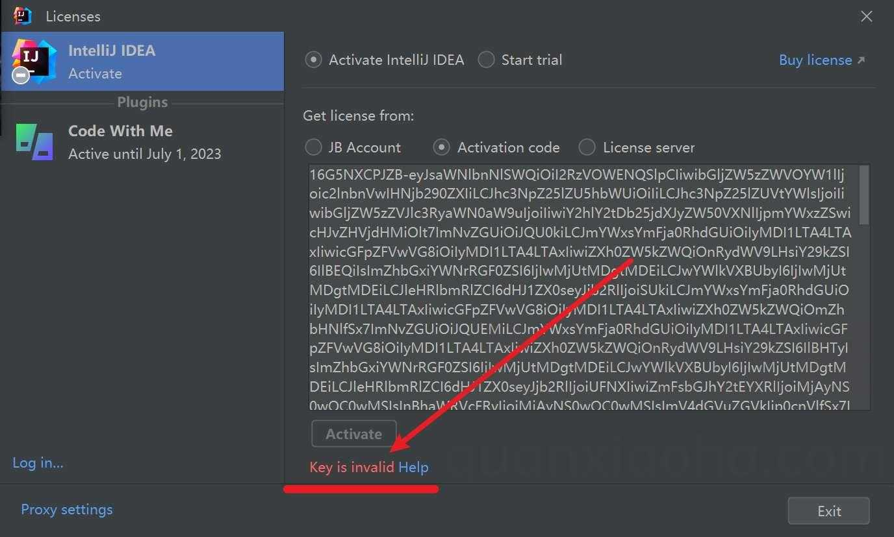

答：提示Key无效，说明工具没有生效，或者不支持当前版本

a、先排查自己的IDE版本是否支持（本激活工具需2021.3以上版本，低于该版本无法激活）和激活工具是否为最新版本

b、重新执行激活脚本，并重启电脑，重启IDE，看是否生效，一般可以解决问题

c、如果还是无法生效，请手动配置激活工具（添加javaagent路径）

### 2、xxx.jar Not Found

答：激活工具没解压，或者解压方式不对

a、工具打包为zip格式，需要先解压，尤其Windows用户，不要直接双击进入执行脚本，会提示找不到jar文件

b、在wx聊天存放路径下直接解压，wx路径有保护，会提示找不到，建议将文件单独保存一个目录（**路径不要有中文汉字和特殊符号**）

c、如果上面都对，那就是JDK没安装，找不到jar文件，请先安装JDK

### 3、报错：“Cannot collect JVM options，Cannot read...，stream did not contain valid UTF-8”异常

[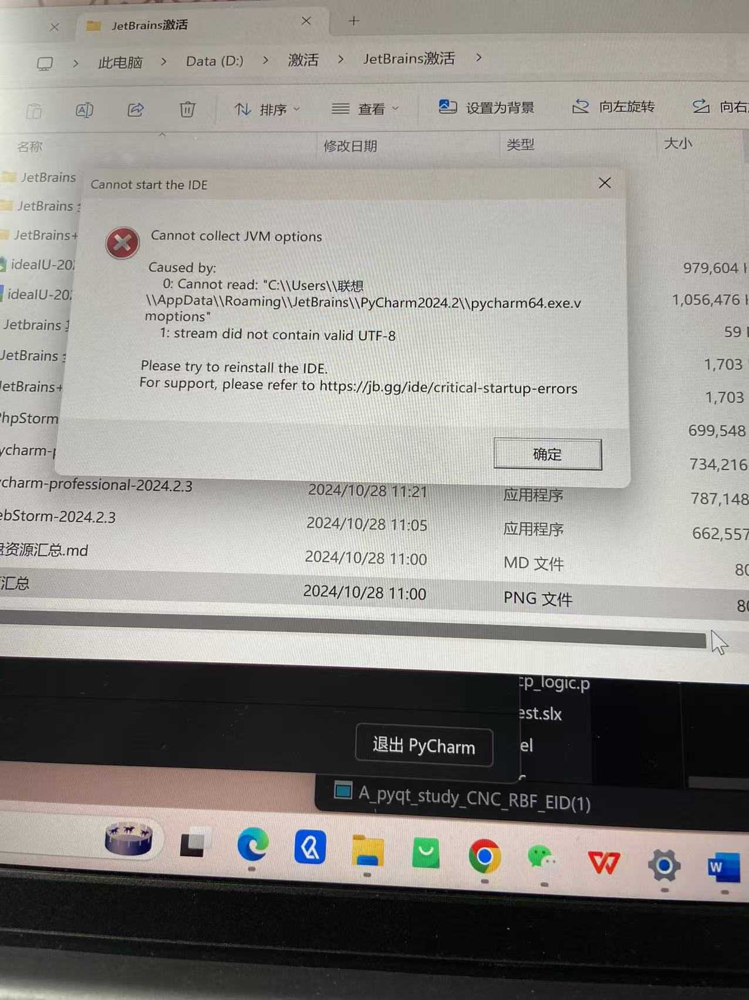](https://lzphy.top/wp-content/uploads/2024/10/wp_editor_md_14257adc1c40dc83d8e244f78308aa19.jpg)

答：最近遇到不少这个错误的，很明显，编码出问题了，建议激活工具存放**路径不要有中文汉字和特殊符号**

首先找到该文件所在位置，用记事本打开看是不是utf-8格式


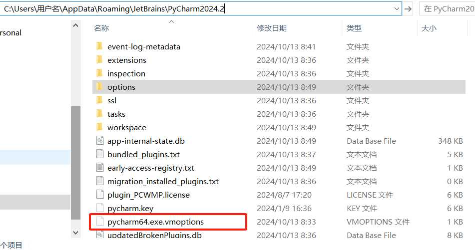

将文件编码修改为 UTF-8，注意检查是否有乱码。如果发现乱码，则需要将路径更换为全英文路径，即插件所在的路径。在下面这张图中找到红框中的 .jar 文件，将其移动到全英文路径下，然后将新路径替换到图中的红框位置。


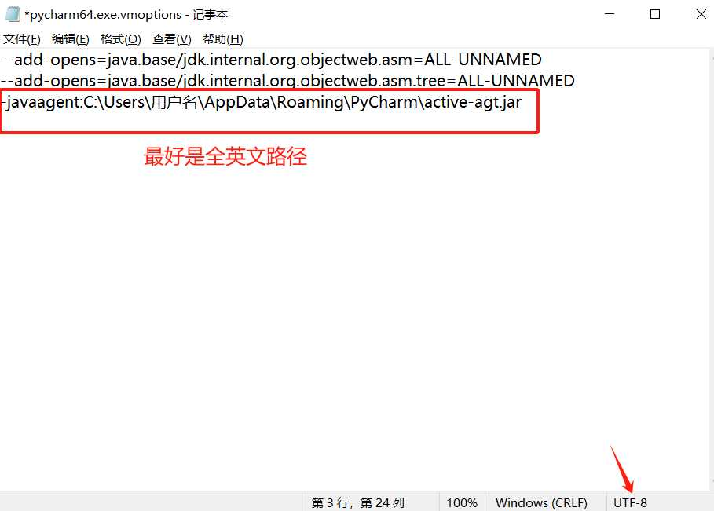


原来的插件的路径在c盘下，一般user为**中文名**就会乱码，我的方法是将找到c盘下路径的插件，复制到d盘，将文件中的插件路径改成d盘的英文路径


### 4、许可证过期/无效，提示：“许可证无法验证”

原因：出现这个问题，一般是新版本2024.2居多，这是因为官方加入了区域限制，比如原来官方的许可证验证域名是：`account.jetbrains.com`，而新版本中，根服务器许可证验证地址更换为了，大陆地区：`account.jetbrains.com.cn`，有了区域区分，造成原来的工具失效的问题。

##### 解决思路1:

如果是老用户，则可以在设置菜单中来更改（一定要更改）：

[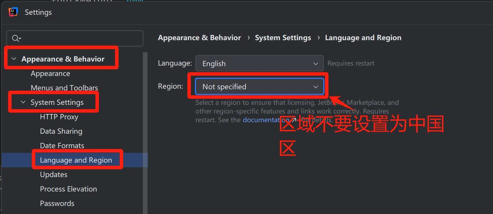](https://lzphy.top/wp-content/uploads/2024/11/wp_editor_md_9b8289a5845f7baa3fe3590d959a8624.jpg)

##### 解决思路2:

新版本一般默认的是中国大陆，双击桌面的 `IDEA` 快捷启动图标，来打开 `IDEA` 。注意，`2024.2` 之后的版本，若初次安装，会提示选择所在区域，如下图所示，如果选择了 `China Mainland`，会在激活的时候反复跳出激活码并提示激活码无效，原因是新版本会拦截 `.cn` 域名，导致激活许可被吊销，所以，**千万不要指定区域！！**

[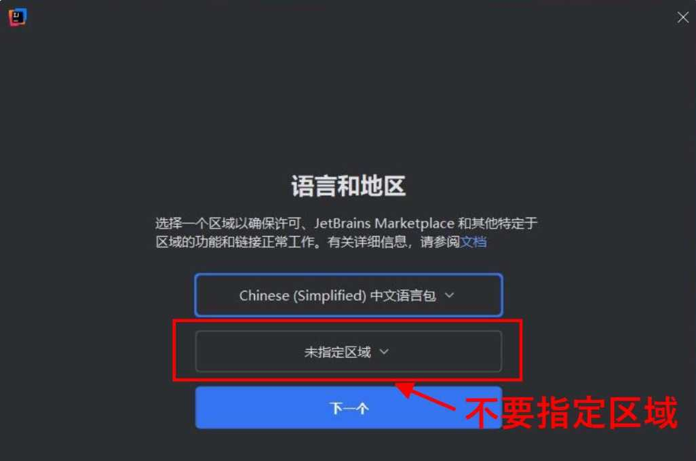](https://lzphy.top/wp-content/uploads/2024/11/wp_editor_md_8d34b701138b0446fbba98e50ba98abd.jpg)

### 5、激活成功后，重启电脑/过一段时间又失效？

答：原因是激活配置被系统自动重置了。一键激活时，是通过修改本地用户环境变量，添加配置实现破解激活，部分用户装有安全软件（360等），重启电脑后，添加的配置被系统自动重置，删除，造成激活失效，重新激活一遍脚本，再次激活即可，或者手动配置，这样更稳定，不用担心被系统删除。

手动配置激活工具（添加javaagent路径），按此教程添加最新版本的激活工具路径：https://lzphy.top/257/

### 6、Mac执行脚本报错：“Could not set environment: 150: Operation not permitted while System Integrity Protection is engaged”

[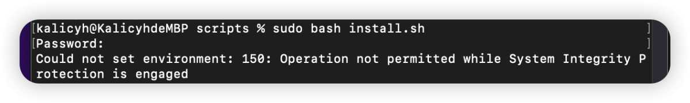](https://lzphy.top/wp-content/uploads/2024/11/wp_editor_md_25ac1a7e96d991a70d1bc641517182c0.jpg)

##### 解决思路1：

关闭SIP需要进入恢复模式，重新启动Mac，然后同时按住“Command”+“R”不放，直到看到苹果的标志再松开，然后等待片刻进入macOS恢复模式。

[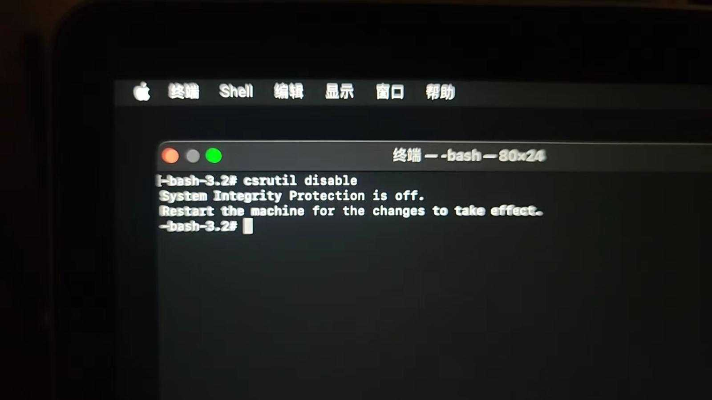](https://lzphy.top/wp-content/uploads/2024/11/wp_editor_md_804bc879095dd4f493ecaa3c0faa0b54.jpg)

进入恢复模式后，在顶部菜单点击“实用工具”→“终端”打开终端，拷贝命令“`csrutil disable`”（不含引号）粘贴进去按回车，返回提示：“`System Integrity Protection is off.`”即SIP关闭成功。
然后点击顶部菜单“”→“重新启动”即可。

##### 解决思路2：

不通过执行脚本了，也不用修改环境变量，直接手动添加激活工具的配置

### 7、提示：“This license SGKLY6KOU has been suspended.”

答：此许可证已经被暂停。说明激活码被官方封了，等网站更新，或者换其他激活方式（也有用户是用了低版本的激活工具无法激活，建议用最新工具）。可以用工具激活或者联系我购买付费版授权。

### 8、Windows用户执行脚本时提示：“没有权限”

[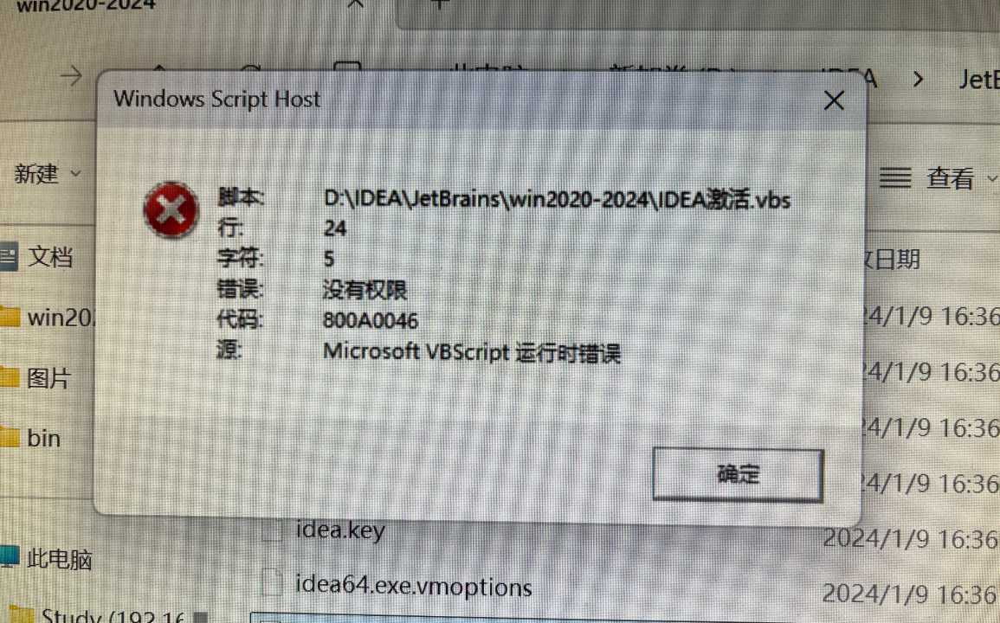](https://lzphy.top/wp-content/uploads/2024/11/wp_editor_md_f28a32273fad8d254482e8b8137b4ae8.jpg)

答：部分Windows用户会出现这个报错提示，可以尝试右键管理员运行脚本；如果右键没有出现管理员选项，那么使用系统管理员运行CMD窗口，找到激活脚本位置

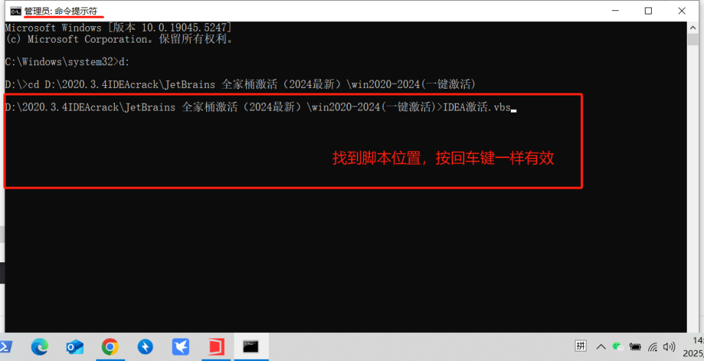

### 9、Unable to Save Data Error saving license data；IDEA每次打开总是要求激活软件，要我输入激活码

[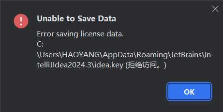](https://lzphy.top/wp-content/uploads/2024/11/wp_editor_md_3824b2fe915f32ad3c95e0114a338107.jpg)

答：只需要将这个`Unable to Save Data Error saving license data.C:\Users\HAOYANG\AppData\Roaming\JetBrains\IntelliJIdea2024.3\idea.key`(拒绝访问。) 关闭`IDEA`后，把提示路径下的`idea.key`删掉，重新激活就可以了。

[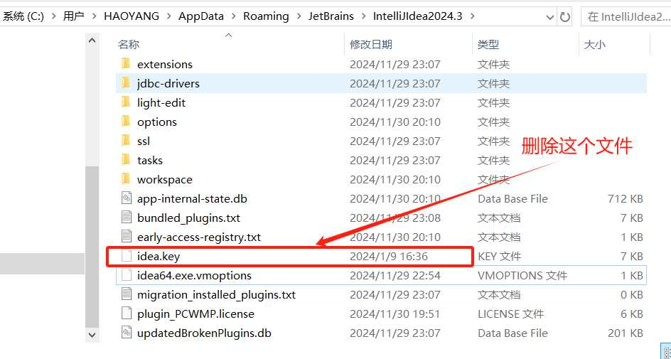](https://lzphy.top/wp-content/uploads/2024/11/wp_editor_md_52bce1563e2a175732980b9dc39cad46.jpg)

### 10.IDEA每次打开总是要求激活软件，要我输入激活码

答：使用过本站提供的激活到 2025/2026 年版本脚本 ，需要执行对应卸载脚本，将自动添加的环境变量删除。

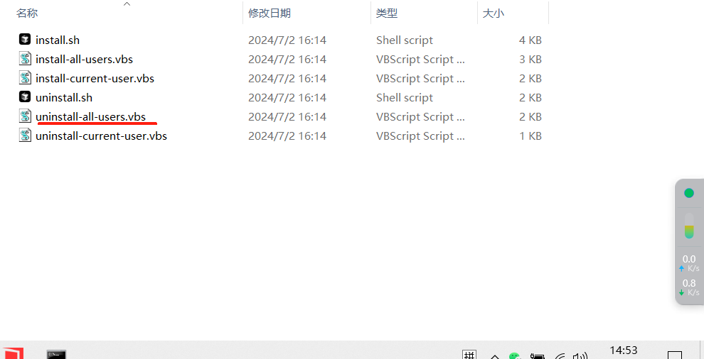


### 11.出现 Error occurred during initialization of VM agent library failed Agent_OnLoad: instrumentPlease try to reinstall the IDE. For support, please refer to https://jb.gg/ide/critical-startup-errors 解决方法


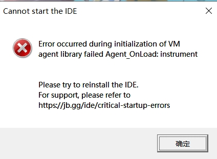


#### 问题原因：

路径不全，JVM 找不到对应的 jar 包，无法执行程序，这导致了 VM 报错。

鹏星尝试弄出这种错误，按照网上说法是：这段代码在`C:\Users\Lenovo\AppData\Roaming\JetBrains\IntelliJIdea2024.3`文件夹下，创建的`idea64.exe.vmoptions`还包含`-javaagent`。删除掉`-javaagent`保存下就可以打开了

鹏星个人尝试把`JetBrains`同级文件夹`InteIIiJIdea`删除同样会出现该问题，如果`InteIIiJIdea`无法找回，那么可以把`JetBrains`文件里面的`IntelliJIdea2024.3`文件夹删除，这个时候就**相当于我们电脑第一次安装**`IDEA`

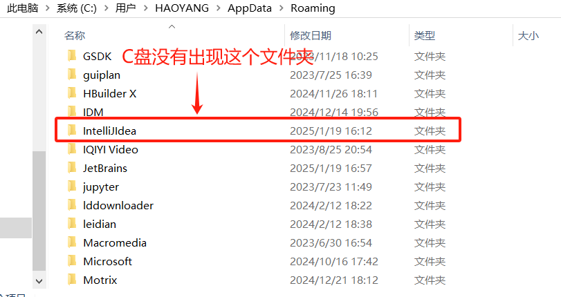

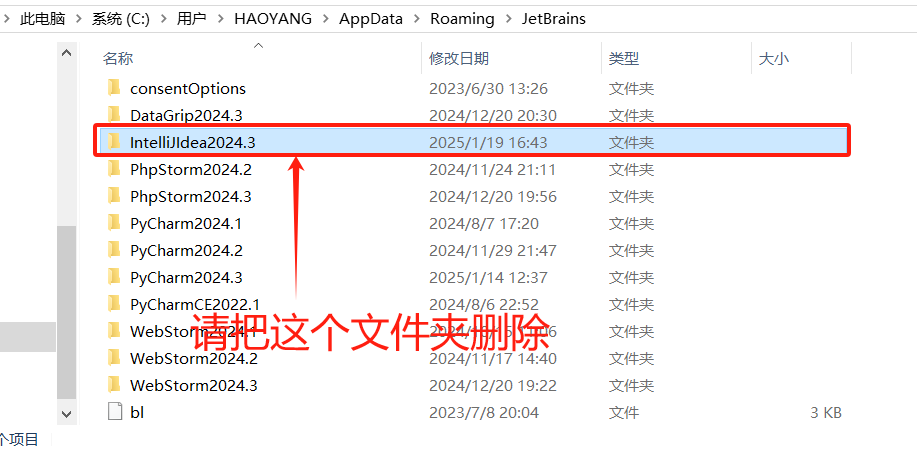


### 12.（免费版本的插件激活时功能有限。要解锁全部功能，请升级到高级版本。）A free version of the plugin is activated with limited featuresTo unlock full functionality, upgrade to the premium version.

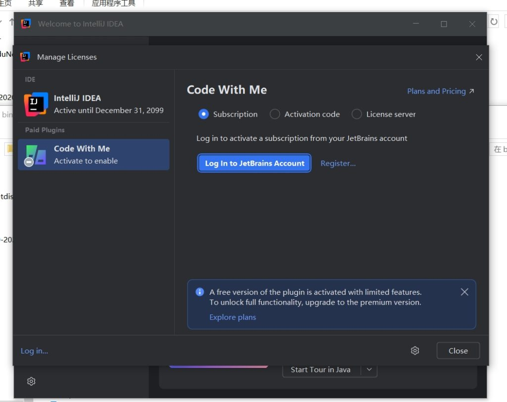


昨天小编也是第一次亲眼看到，`IDEA`安装会出现这样的错误，经历多番尝试，最终还是解决了这个问题。

多次测试后发现是**新用户在第一次安装**`JetBarins`产品，区域选择默认的**中国大陆选区**

#### 解决办法

按住快捷键 `windos + R`, 然后输入 `regedit` 回车调出注册表。

依次点击菜单 `计算机\HKEY_CURRENT_USER\SOFTWARE\JavaSoft\Prefs\jetbrains`， 然后右键删除。

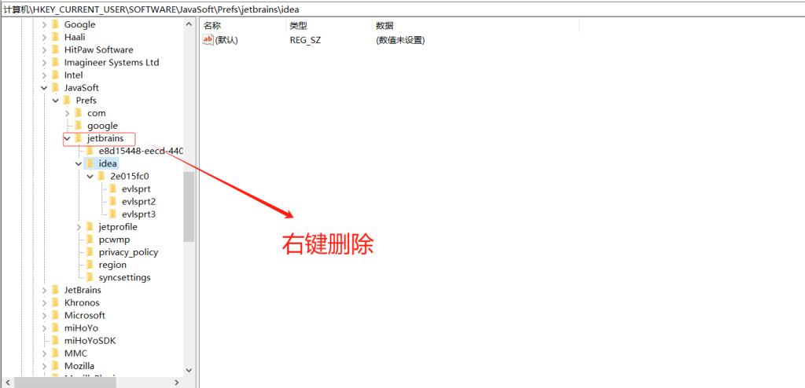

#### 残留清理

最后，还有几个地方的缓存数据需要删除：

```
C:\用户\${用户名称}\IdeaProjects\
# 如果你想删除 IDEA 相关，则只需要删除 JetBrains 目录下包含 IDEA 的文件夹即可
C:\用户\${用户名称}\AppData\Roaming\JetBrains
# 如果你想删除 IDEA 相关，则只需要删除 JetBrains 目录下包含 IDEA 的文件夹即可
C:\用户\${用户名称}\AppData\Local\JetBrains
C:\用户\公用\.jetbrains
# 如果你想删除 IDEA 相关，则只需要删除 JetBrains 目录下包含 IDEA 的文件夹即可
C:\Program Files\JetBrains
C:\ProgramData\Microsoft\Windows\Start Menu\Programs\JetBrains\
```

#### MAC电脑删除干净

打开【访达】-> 【应用程序】, 找到 IDEA 右键【移到废纸篓】：

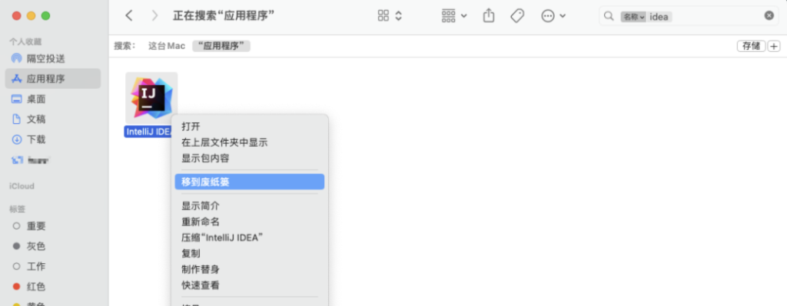

#### 残留清理

打开终端，执行如下命令，进入 *`Library`* 目录下，准备删除 IDEA 的残留信息：

注意：路径中的 *`XXX`* 为用户名，**替换成你实际的用户名，再执行**即可。

```
cd /Users/XXX/Library
```

##### 新老版本残留所在的目录不一样

建议先 `cd` 进去看下文件夹命名规则，再删除。

###### 较新版本

执行如下删除命令：

TIP: `*` 表示版本号。

```
rm -rf Preferences/JetBrains/IntelliJIdea*
rm -rf Caches/JetBrains/IntelliJIdea*
rm -rf Application\ Support/JetBrains/IntelliJIdea*
rm -rf Logs/JetBrains/IntelliJIdea*
```

###### 老版本

执行如下删除命令：

```
rm -rf Preferences/IntelliJIdea*
rm -rf Caches/IntelliJIdea*
rm -rf Application\ Support/IntelliJIdea*
rm -rf Logs/IntelliJIdea*
```

## 三、总结

总的来说我们遇到的错误大多数都是来自电脑没有完全卸载`JetBrains产品`，对于新用户来说，激活文件有概率会被杀毒软件给屏蔽掉，还有人喜欢直接在压缩包中操作，这些情况都是不会成功的。