## 零基础安装 Node.js（Windows）

- **你只要照做**：下载 -> 安装 -> 配环境变量 -> 验证
- **看不懂没关系**：每张图就是上一步文字的结果

### 1. 下载安装包

1. 打开官网下载页：[官网下载传送门](https://nodejs.org/zh-cn/download)
2. 选择你的系统版本，点击 **Windows 安装包（.msi）** 下载

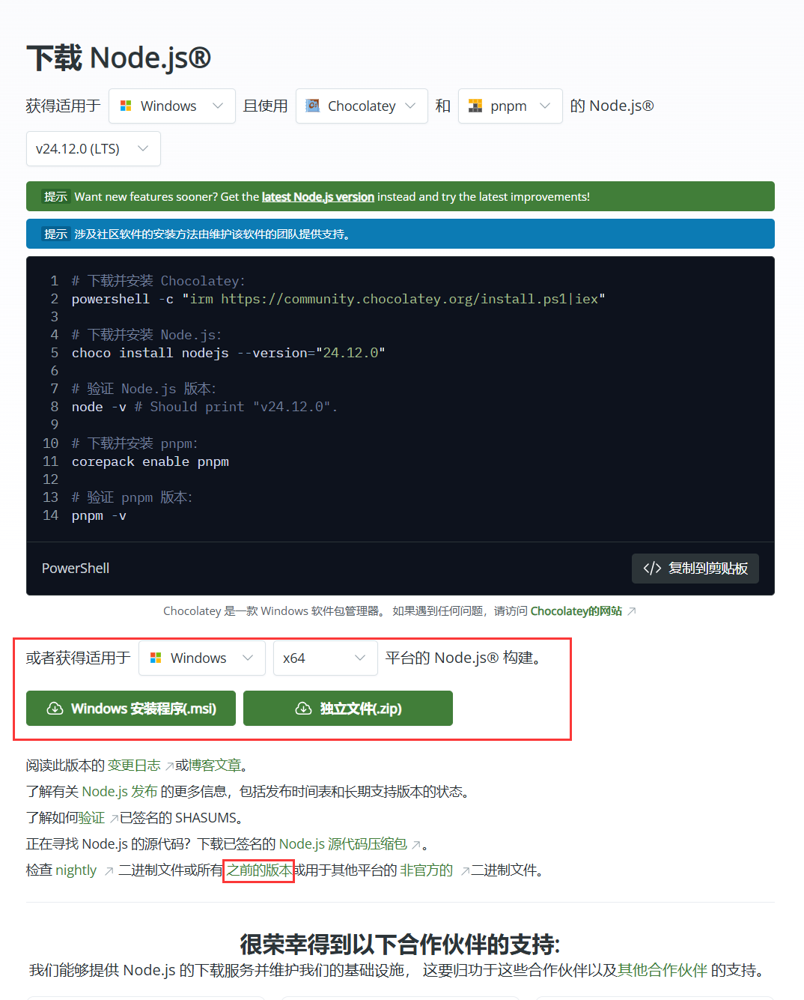

3. 想下载旧版本：在页面里找到“之前的版本/历史版本”入口

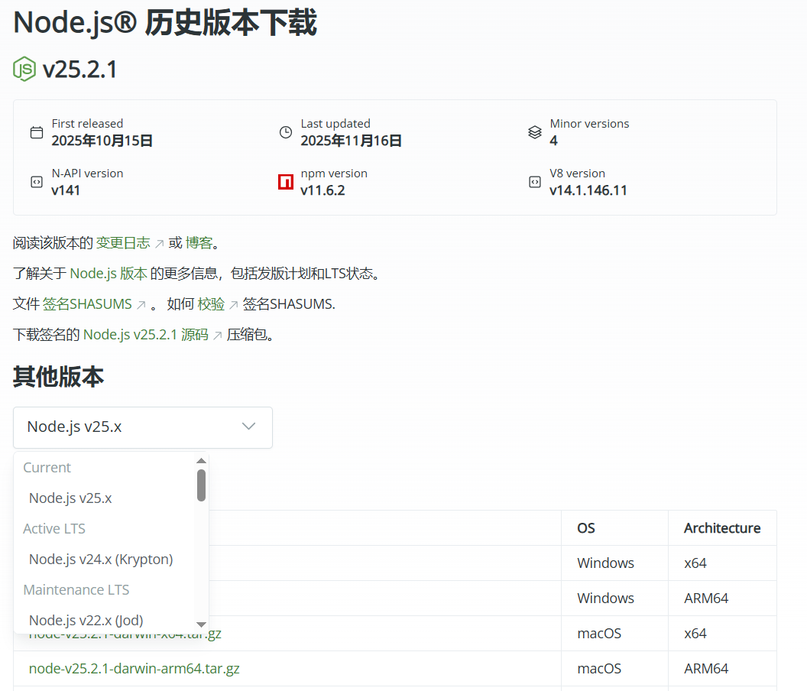

### 2. 安装程序

1. 双击下载好的 `.msi`，一路点 **Next**
2. 到选择安装位置这一步：建议不要装在 C 盘（选 D/E 盘即可）、建议目录中不要包含中文、空格以及特殊字符

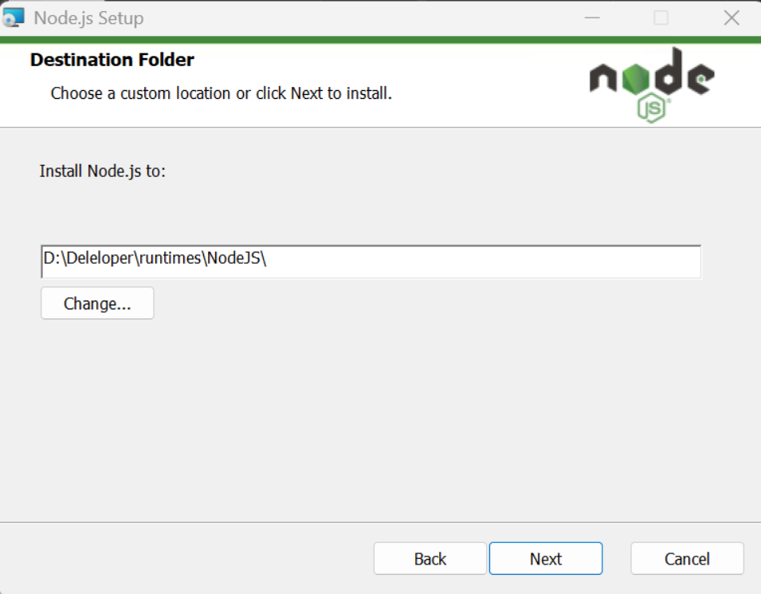

3. 这一步保持默认即可

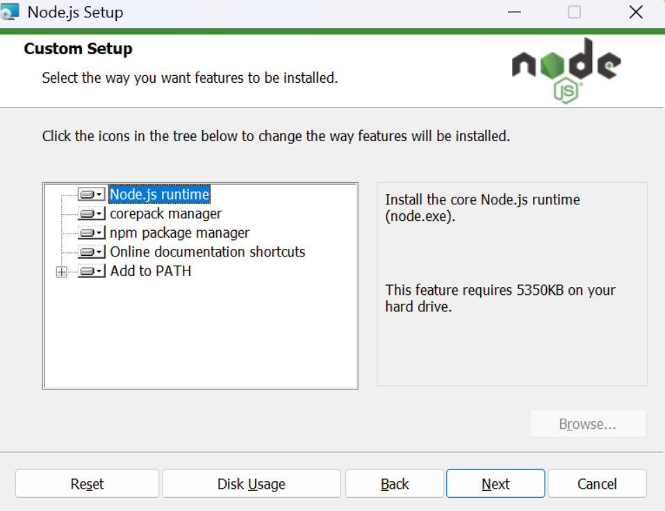

4. 继续 **Next**

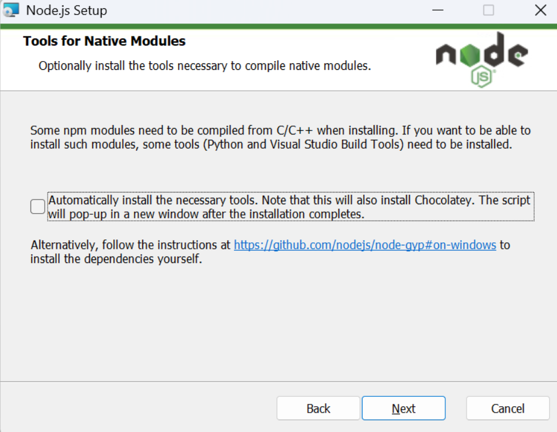

5. 点击 **Install** 开始安装

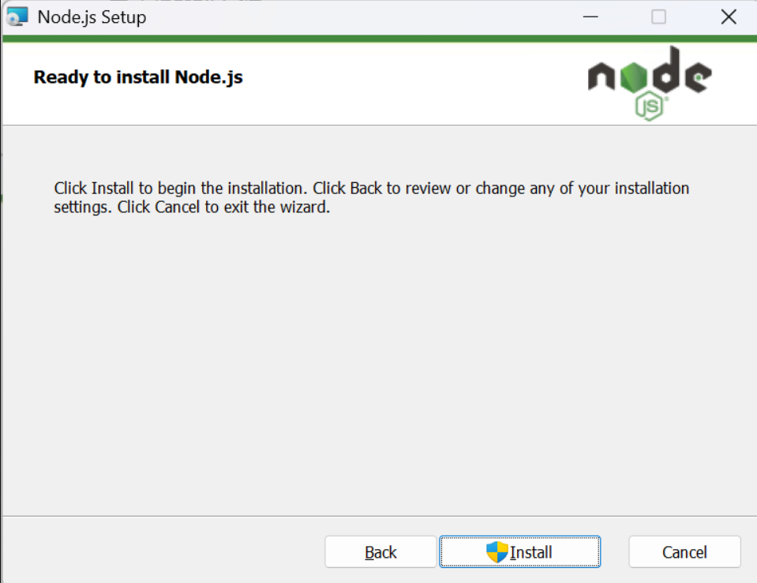

6. 点击 **Finish** 完成安装

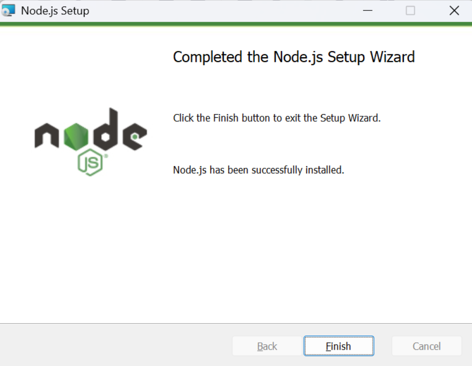

7. 验证是否安装成功

- 按 **Win + R**，输入 `cmd` 回车
- 输入：`node -v` 回车，再输入：`npm -v` 回车

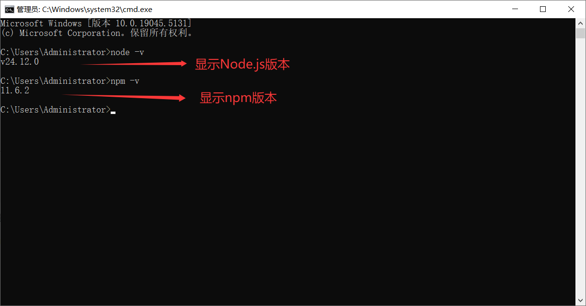

能看到版本号，说明安装成功。

### 3. 环境配置（照做即可）

#### 3.1 新建两个文件夹

1. 打开你的 Node.js 安装目录，新建两个文件夹：`node_cache`、`node_global`

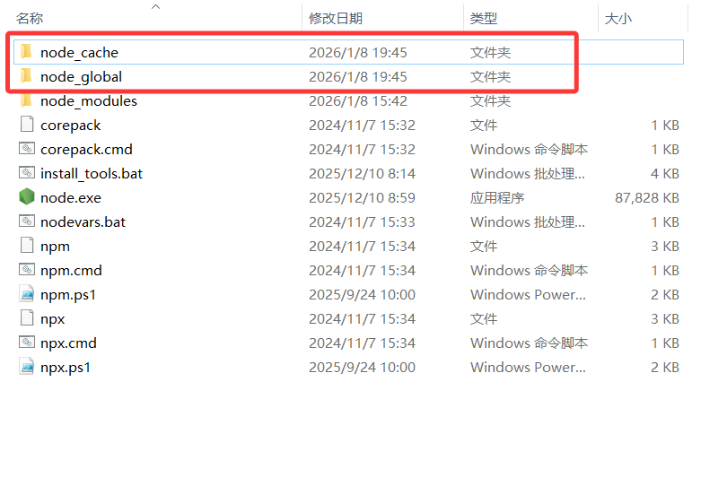

2. 进入这两个文件夹，复制它们的“文件夹地址”（后面要用）

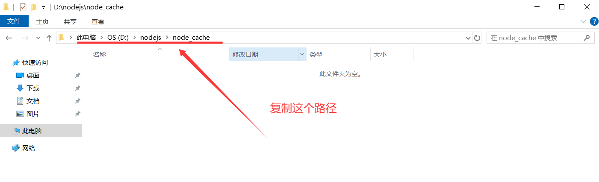

#### 3.2 设置 npm 的全局目录和缓存

1. 按 **Win + X** -> 选择 **终端（管理员）**，分别执行下面两条命令（把路径换成你自己的）

   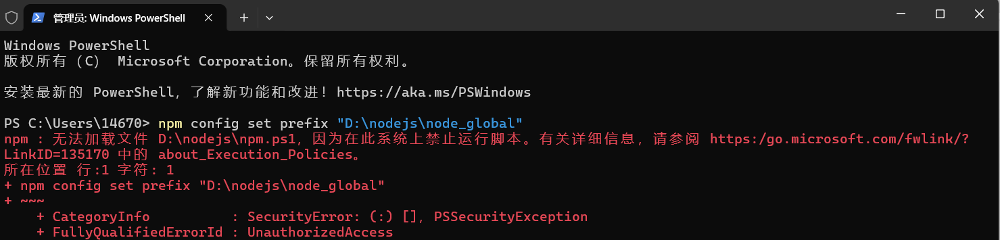

```js title="修改npm配置"
//如果出现这个请先运行 npm : 无法加载文件 D:\nodejs\npm.ps1，因为在此系统上禁止运行脚本。xxxxxxx
Set-ExecutionPolicy RemoteSigned -Scope CurrentUser

// 修改 npm 全局安装包的默认路径
npm config set prefix "D:\nodejs\node_global"

// 查看是否修改成功
npm config get prefix

// 修改 npm 全局缓存路径
npm config set cache "D:\nodejs\node_cache"

// 查看是否修改成功
npm config get cache
```

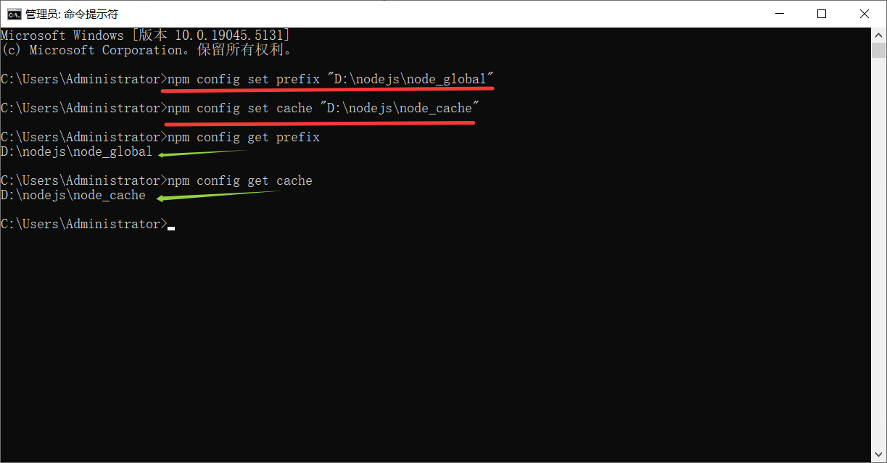

**注意**：一定要用“管理员”打开终端，否则可能失败。

> **拓充**：
>
> 1. `prefix`设置 npm 全局安装包 的存放目录，当使用`npm install -g package-name`安装全局包的时候，会默认安装到此目录,从而统一管理Node.js相关文件。
>
> 2. `cache`设置 npm 下载缓存 的存放目录，将下载的包先缓存到这里，下次安装同版本时直接使用缓存，从而节省空间，加快安装速度。
>
> **为什么要改这个路径？（核心价值）**
>
> 默认情况下，npm 的全局路径在系统盘（Windows 是 `C:\Users\你的用户名\AppData\Roaming\npm`），修改它的核心好处：
>
> 1. **避免 C 盘臃肿**：全局安装的包（如 `webpack`、`node-sass`）体积大，长期使用会占满 C 盘空间，转移到 D 盘能减轻系统盘压力；
> 2. **方便管理**：把 Node 相关的运行文件集中放到 `D:\nodejs` 目录下，便于统一备份、迁移或卸载；
> 3. **权限问题**：默认路径可能需要管理员权限才能写入，自定义路径可避免安装包时出现「权限不足」的报错。

#### 3.3 配环境变量

1. 右键“此电脑” -> “属性” -> “高级系统设置” -> “环境变量”


2. 点击“新建”，创建系统变量 `NODE_PATH`

- 变量值：`node_global`文件夹 的路径 + `\node_modules`

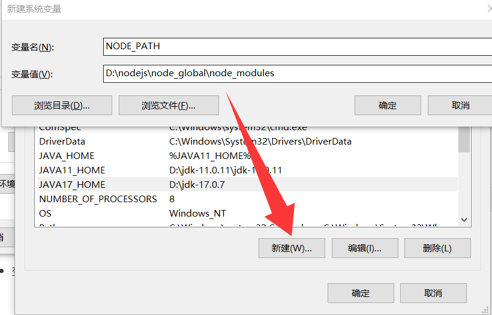

3. 在“用户变量”里编辑 `Path`

- 把默认的 `...AppData\Roaming\npm` 改成你的 `node_global` 路径

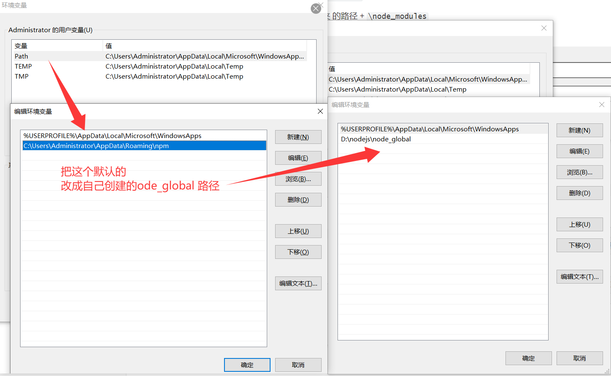

4. 在“系统变量”里选择 `Path` -> “编辑” -> “新建” -> 输入：`%NODE_PATH%`

5. 一路点“确定”保存，关闭所有窗口后，**重新打开** 终端/命令行（这一步很关键）

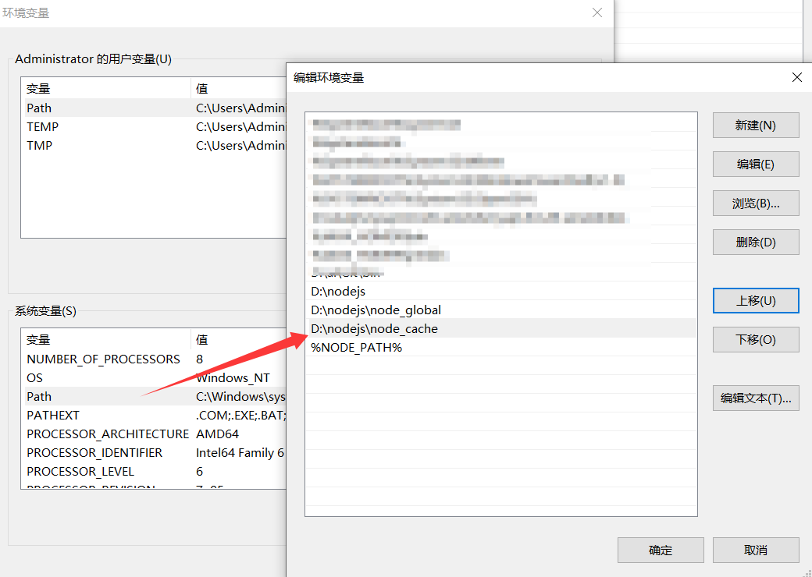

### 4. 测试（配置有没有生效）

1. 按 **Win + X** -> 选择 **终端（管理员）**
2. 执行下面命令（安装一个全局包做验证）

```js title="测试"
npm install express -g    // -g代表全局安装
```

看到安装成功的输出，就说明配置成功。

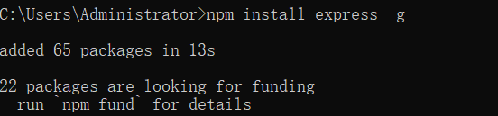

### 5. (推荐)设置 npm 国内镜像（下载更快）

如果你发现 `npm install` 很慢，再做这一步：

1. 按 **Win + X** -> 选择 **终端（管理员）**，执行：

```js title="npm 国内镜像"
npm config set registry https://mirrors.cloud.tencent.com/npm/  # 腾讯云
npm config set registry https://registry.npmmirror.com          # 淘宝源
```

2. 验证镜像源，执行以下命令检查当前镜像：

```js title="验证"
npm config get registry
```

显示自己设置的镜像源，就表示成功。

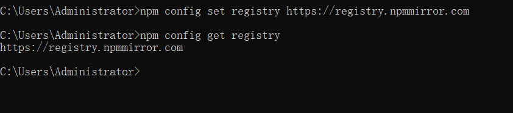

到这里，你的 Node.js 安装与环境变量配置就完成了。

### 6. 拓展：常见问题

#### 6.1 pnpm的安装

1. 现在前端主流项目基本都用 pnpm，我们可以直接把pnpm看作是npm的升级版本
2. 按 **Win + X** -> 选择 **终端（管理员）**，执行：

```js title="pnpm 安装"
// 方式 1：通过 npm 全局安装（最方便，你已安装 npm）
npm install -g pnpm

// 方式 2：通过官方脚本安装（适用于无 npm 环境）
//如果你的环境没有 npm，可执行官方脚本：
//（该脚本会自动下载并配置 pnpm，Windows 需用 PowerShell 执行）
iwr https://get.pnpm.io/install.ps1 -useb | iex
```

- 安装完成后，pnpm 会被放到你配置的 `D:\nodejs\node_global\node_modules` 目录下（和 npm 全局包同路径）。

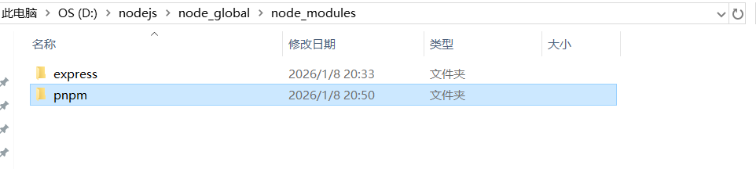

3. 验证 pnpm 是否安装成功

   重启终端（确保环境变量生效），执行：

```js title="检验"
pnpm -v
```

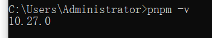

#### 6.2 权限不足 (EPERM)

在使用的时候报错较多，显示`EPERM`错误，这个错误通常是因为文件/文件夹权限问题导致的，错误示例如下：

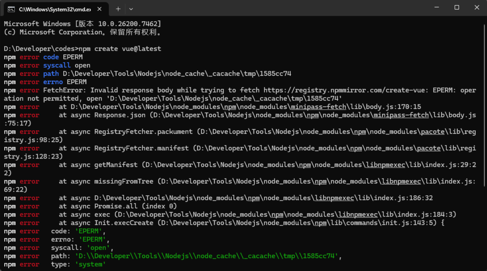

##### 解决方案：

键盘【Win+X】，打开终端管理员，重新尝试。如果不行，需要修改Node.js安装目录权限，修改npm缓存目录权限，仍旧在终端管理员执行下述命令。

```js title="修改权限"
// 修改Node.js安装目录权限
icacls "你的Node.js安装目录" /grant Users:F /T

// 修改npm缓存目录权限
icacls "你的node_global目录" /grant Users:F /T
icacls "你的node_cache目录" /grant Users:F /T
```

可以通过以下指令，获取你对应的目录

```js title="npm缓存目录"
npm config get prefix
npm config get cache
```

示例如下

```bash
icacls "D:\nodejs" /grant Users:F /T
icacls "D:\nodejs\node_global" /grant Users:F /T
icacls "D:\nodejs\node_cache" /grant Users:F /T
```

##### 为什么需要设置这些权限？

Windows 默认对非系统盘目录的权限较严格，若不授权：

- 执行 `npm install -g` 时，会提示 `EPERM: operation not permitted`（权限不足）；
- 运行 pnpm 安装包时，会提示「无法写入缓存 / 全局目录」；
- Node.js 运行时读取依赖包可能提示「访问被拒绝」。

##### 补充：权限回收 / 修正（若误操作）

如果想收回过度授权的权限（比如只需要「读取 + 写入」而非完全控制），可执行：

```
# 授予「读取+写入」权限（够用且更安全）
icacls "D:\nodejs" /grant Users:RW /T
```

参数说明：`R=读取`、`W=写入`、`F=完全控制`，根据需求选择。

##### 验证权限是否设置成功

1. 打开文件资源管理器，找到 `D:\nodejs`；
2. 右键该文件夹 →「属性」→「安全」选项卡；
3. 在「组或用户名」中找到「Users」，点击「编辑」；
4. 查看「Users 的权限」，如果「完全控制」勾选了「允许」，说明设置成功。