# 关于SPring Boot文件上传的两种方式

## 传统方式--->本地上传

### 概述场景

文件上传，是程序开发中必须会使用到一个功能,比如:

添加商品,用户头像,文章封面等需求

富文本编辑（插件文件上传）

### 文件上传原理是什么？

为什么要实现文件上传？ ---> 就是为了要共享资源，大家都可以在你的平台上看到上传的文件，一句话概括：就是把自己电脑上的文件通过程序上传到服务器的过程！

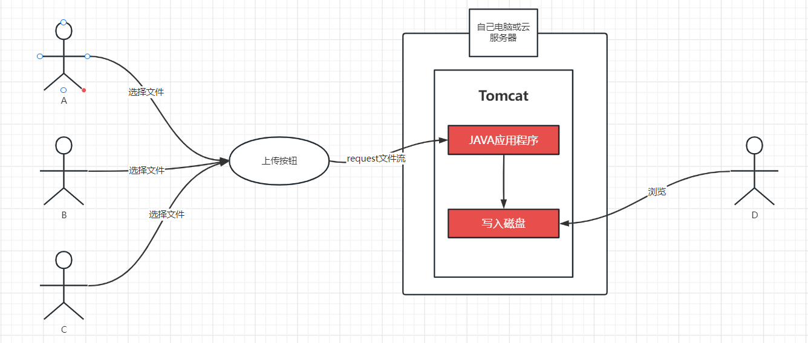

其实就是一句话:把用户的文件通过javaio流程复制到服务器的过程，称之为文件上传。

### 使用SpringBoot如何实现文件上传呢？

使用spring boot完成的本地文件上传

### 1.1、实现步骤

#### 1.1.1、搭建一个spring boot工程

```xml
<dependencies>
        <dependency>
            <groupId>org.springframework.boot</groupId>
            <artifactId>spring-boot-starter-web</artifactId>
        </dependency>
        <dependency>
            <groupId>org.springframework.boot</groupId>
            <artifactId>spring-boot-starter-freemarker</artifactId>
        </dependency>
    </dependencies>
```


#### 1.1.2、准备一个文件上传的页面

在resources/templates/upload.html

```yaml
server:
  port: 3333

spring:
  freemarker:
    suffix: .html
    cache: false
```


#### 1.1.3、实现后台的文件上传

定义文件上传的server

```java
package com.nacl.server;

import org.springframework.stereotype.Service;
import org.springframework.web.multipart.MultipartFile;

import java.io.File;
import java.io.IOException;

/**
 * @author HAOYANG
 * @create 2023-07-16 11:41
 */
@Service
public class UploadServe {

    /**
     * MultipartFile这个对象是springHvc提供的文件上传的接受的类。
     * 它的底层自动会去和HttpServletRequest request中的request.getInputstream()融合
     * 从而达到文件上传的效果。也就是告诉你一个道理:
     * 文件上传威层原理是:request.getinputstream()
     * @param multipartFile
     * @param dir
     * @return
     */
    public String uploadImg(MultipartFile multipartFile,String dir){
        //1. 指定文件上传的目录
        File targetFile = new File("D://usr//local//upload/"+dir);
        try {
            if (!targetFile.exists())targetFile.mkdirs();
            //2. 文件上传的文件名
            File targetFileName = new File(targetFile,"aaa.png");
            //2. 文件上传到指定的目录
            multipartFile.transferTo(targetFileName);
            return "ok";
        } catch (IOException e) {
            e.printStackTrace();
            return "fail";
        }
    }
}

```

定义文件上传的controller

```java
package com.nacl.controller;

import com.nacl.server.UploadServe;
import org.springframework.beans.factory.annotation.Autowired;
import org.springframework.stereotype.Controller;
import org.springframework.web.bind.annotation.PostMapping;
import org.springframework.web.bind.annotation.RequestParam;
import org.springframework.web.bind.annotation.ResponseBody;
import org.springframework.web.multipart.MultipartFile;

import javax.servlet.http.HttpServletRequest;

/**
 * @author HAOYANG
 * @create 2023-07-16 11:40
 */
@Controller
public class UploadController {

    @Autowired
    UploadServe uploadServe;
    /**
     * 文件上传具体实现
     * @param multipartFile
     * @param request
     * @return
     */
    @PostMapping("/upload/file")
    @ResponseBody
    public String upload(@RequestParam("file")MultipartFile multipartFile, HttpServletRequest request){
        if (multipartFile.isEmpty()){
            return "文件有误";
        }
        //原文件大小
        long size = multipartFile.getSize();
        //原文件名
        String originalFilename = multipartFile.getOriginalFilename();
        //原文件类型
        String contentType = multipartFile.getContentType();
        //1:获取用户指定的文件夹。问这个文件夹为什么要从页面上传递过来呢?
        //原因是:傲隔离，不司业务，不同文件放在不同的目录中
        String dir = request.getParameter("dir");
        return uploadServe.uploadImg(multipartFile,dir);
    }
}

```

定义文件上传的html

```html
<!DOCTYPE html>
<html lang="en">
<head>
    <meta charset="UTF-8">
    <title>文件上传</title>
</head>
<body>
<h1>文件上传</h1>
<form action="/upload/file" enctype="multipart/form-data" method="post">
    <input name="dir" value="bbs">
    <input name="file" type="file">
    <input type="submit" value="文件上传">
</form>
</body>
</html>
```

修改一下

```html
<!DOCTYPE html>
<html lang="en">
<head>
    <meta charset="UTF-8">
    <title>文件上传</title>
</head>
<body>
<h1>文件上传</h1>
<form action="/upload/file" id="uploadform" enctype="multipart/form-data" method="post">
    <input name="dir" value="bbs">
    <input name="file" onchange="toupload()" type="file">

</form>

<script>
    function toupload() {
        document.getElementById("uploadform").submit();
    }
</script>
</body>
</html>
```

运行项目就可以看到如下效果：

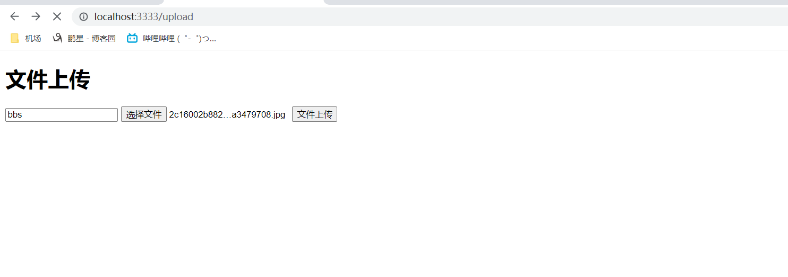

springmvc中文件上传给提供了包装对象MultipartFile原理如下：

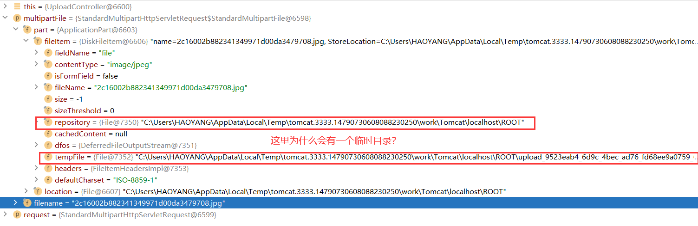

通过MultipartFile我吗很清楚的看到，文件上传已经被服务器接收。

但是会产生一个临时目录，这个目录是可以去配置

- 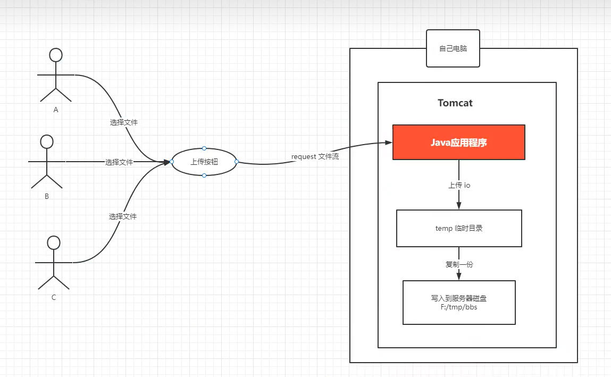

  文件上传不会直接上传真是的目录，它一定要经过一个临时目录的中转以后，才会上传到真是目录。作用:

   1、防止上传出现网络断开，或者用户上传直接刷新或者取消。因为如果用户的网络断开或者取消，就造成大量的垃圾文件

   2、保证真实目录上传的文件一定是有效的。

- 文件上传的大小:也可以进行配置的

- 文件上传的类型:也是进行配置的

  ```yaml
  server:
    port: 3333
  
  spring:
    freemarker:
      suffix: .html
      cache: false
    servlet:
      multipart:
        enabled: true
        # 单个文件上传大小  默认是1MB
        max-file-size: 10MB
        # 设置总上传的数据大小
        max-request-size: 100MB
        # 当文件达到多少大小时，进行磁盘写入
        file-size-threshold: 20MB
        # 设置临时目录
        location: D://usr//local//temp
  
  ```

  

#### 1.1.4、指定文件上传的目录

配置spring boot静态资源存储服务，将上传的文件放入指定的目录中

```java
package com.nacl.server;

import org.springframework.stereotype.Service;
import org.springframework.web.multipart.MultipartFile;

import java.io.File;
import java.io.IOException;
import java.text.SimpleDateFormat;
import java.util.Date;
import java.util.UUID;

/**
 * @author HAOYANG
 * @create 2023-07-16 11:41
 */
@Service
public class UploadServe {

    /**
     * MultipartFile这个对象是springHvc提供的文件上传的接受的类。
     * 它的底层自动会去和HttpServletRequest request中的request.getInputstream()融合
     * 从而达到文件上传的效果。也就是告诉你一个道理:
     * 文件上传威层原理是:request.getinputstream()
     * @param multipartFile
     * @param dir
     * @return
     */
    public String uploadImg(MultipartFile multipartFile,String dir){
        try {
            //1.原文件名
            String oldFilename = multipartFile.getOriginalFilename(); // 上传的文件：aaa.png
            // 2. 截取文件名的后缀
            String imgSuffix = oldFilename.substring(oldFilename.lastIndexOf("."));//拿到 .png
            //3. 生成唯一的文件名  不能用中文名，统一用英文
            String newFileName = UUID.randomUUID().toString()+imgSuffix;//将aaa.png改写成Sdjksdj532XXX.png   Sdjksdj532XXX--->这个是随意的
            //4. 日期目录
            SimpleDateFormat dateFormat = new SimpleDateFormat("yyy/MM/dd");
            String datePath = dateFormat.format(new Date());//日期目录：2023/7/16
            //5. 原文件上传以后的目录
            File targetPath = new File("D://usr//local//upload/"+dir,datePath);//生成一个最终的目录：D:/usr/local/upload/2023/7/16
            if (!targetPath.exists())targetPath.mkdirs();//如果目录不存在：D:/usr/local/upload/2023/7/16   递归创建
            //6. 指定文件上传以后的服务器的完整的文件名
            File targetFileName = new File(targetPath,newFileName);// 文件上传以后在服务器上最终文件名和目录是://如果目录不存在：D:/usr/local/upload/2023/7/16/Sdjksdj532XXX.png
            //7. 文件上传到指定的目录
            multipartFile.transferTo(targetFileName);//将用户选择的aa.png上传到D:/usr/local/upload/2023/7/16/Sdjksdj532XXX.png
            return "ok";
        } catch (IOException e) {
            e.printStackTrace();
            return "fail";
        }
    }
}

```

效果图：


#### 1.1.5、通过http请求访问资源

springboot如果去指定任意目录作为的资源的访问目录?

springboot有一个目录： static这个目录其实就是静态资源目录，这个目录下面的文件是可以通过http直接问题的。但是程序话一般打成jar包，我们没办法去文件写入到这个static下，所以springboot提供静态资源目录的额外的映射机制，就是静态资源服务映射。它就类似于: nginx的静态资源映射

配置静态资源服务映射：

```java
package com.nacl.config;

import org.springframework.context.annotation.Configuration;
import org.springframework.web.servlet.config.annotation.ResourceHandlerRegistry;
import org.springframework.web.servlet.config.annotation.WebMvcConfigurer;

/**
 * @author HAOYANG
 * @create 2023-07-16 13:06
 */
@Configuration
public class WebMvcConfiguration implements WebMvcConfigurer {

    //这个就是springboot/springMvc让程序开发者去配置文件上传的额外的静态资源服务的配置
    @Override
    public void addResourceHandlers(ResourceHandlerRegistry registry) {
        registry.addResourceHandler("/uploadimg").addResourceLocations("file:D://usr//local//upload");
    }
}

```

核心代码分析：

```java
registry.addResourceHandler("访问路径").addResourceLocations("上传资源路径");
 registry.addResourceHandler("/uploadimg/**").addResourceLocations("file:D://usr//local//upload//");
```

这个时候自己把aaa.png文件上传到D://usr//local//upload下，就可以通过http://localhost:3333/uploadimg/aaa.png，进行访问了

完整代码：

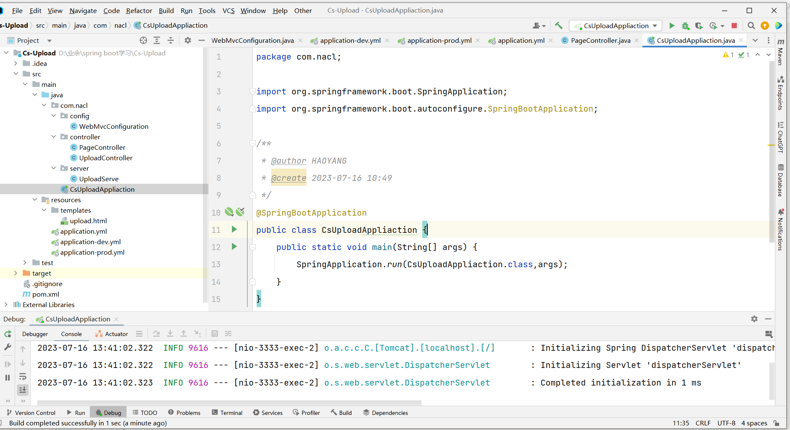

定义文件映射的WebMvcConfiguration

```java
package com.nacl.config;

import org.springframework.beans.factory.annotation.Value;
import org.springframework.context.annotation.Configuration;
import org.springframework.web.servlet.config.annotation.ResourceHandlerRegistry;
import org.springframework.web.servlet.config.annotation.WebMvcConfigurer;

/**
 * @author HAOYANG
 * @create 2023-07-16 13:06
 */
@Configuration
public class WebMvcConfiguration implements WebMvcConfigurer {

    @Value("${file.staticPatternPath}")
    private String staticPatternPath;
    @Value("${file.uploadFolder}")
    private String uploadFolder;
    //这个就是springboot/springMvc让程序开发者去配置文件上传的额外的静态资源服务的配置
    @Override
    public void addResourceHandlers(ResourceHandlerRegistry registry) {
        registry.addResourceHandler(staticPatternPath).addResourceLocations("file:"+uploadFolder);
    }
}

```

controller

```java
package com.nacl.controller;

import com.nacl.server.UploadServe;
import org.springframework.beans.factory.annotation.Autowired;
import org.springframework.stereotype.Controller;
import org.springframework.web.bind.annotation.PostMapping;
import org.springframework.web.bind.annotation.RequestParam;
import org.springframework.web.bind.annotation.ResponseBody;
import org.springframework.web.multipart.MultipartFile;

import javax.servlet.http.HttpServletRequest;

/**
 * @author HAOYANG
 * @create 2023-07-16 11:40
 */
@Controller
public class UploadController {

    @Autowired
    UploadServe uploadServe;
    /**
     * 文件上传具体实现
     * @param multipartFile
     * @param request
     * @return
     */
    @PostMapping("/upload/file")
    @ResponseBody
    public String upload(@RequestParam("file")MultipartFile multipartFile, HttpServletRequest request){
        if (multipartFile.isEmpty()){
            return "文件有误";
        }
        //原文件大小
        long size = multipartFile.getSize();
        //原文件名
        String originalFilename = multipartFile.getOriginalFilename();
        //原文件类型
        String contentType = multipartFile.getContentType();
        //1:获取用户指定的文件夹。问这个文件夹为什么要从页面上传递过来呢?
        //原因是:傲隔离，不司业务，不同文件放在不同的目录中
        String dir = request.getParameter("dir");
        return uploadServe.uploadImg(multipartFile,dir);
    }
}

```

service

```java
package com.nacl.server;

import org.springframework.beans.factory.annotation.Value;
import org.springframework.stereotype.Service;
import org.springframework.web.multipart.MultipartFile;

import java.io.File;
import java.io.IOException;
import java.text.SimpleDateFormat;
import java.util.Date;
import java.util.UUID;

/**
 * @author HAOYANG
 * @create 2023-07-16 11:41
 */
@Service
public class UploadServe {

    @Value("${file.uploadFolder}")
    private String uploadFolder;
    @Value("${file.staticpath}")
    private String staticpath;
    /**
     * MultipartFile这个对象是springHvc提供的文件上传的接受的类。
     * 它的底层自动会去和HttpServletRequest request中的request.getInputstream()融合
     * 从而达到文件上传的效果。也就是告诉你一个道理:
     * 文件上传威层原理是:request.getinputstream()
     * @param multipartFile
     * @param dir
     * @return
     */
    public String uploadImg(MultipartFile multipartFile,String dir){
        try {
            //1.原文件名
            String oldFilename = multipartFile.getOriginalFilename(); // 上传的文件：aaa.png
            // 2. 截取文件名的后缀
            String imgSuffix = oldFilename.substring(oldFilename.lastIndexOf("."));//拿到 .png
            //3. 生成唯一的文件名  不能用中文名，统一用英文
            String newFileName = UUID.randomUUID().toString()+imgSuffix;//将aaa.png改写成Sdjksdj532XXX.png   Sdjksdj532XXX--->这个是随意的
            //4. 日期目录
            SimpleDateFormat dateFormat = new SimpleDateFormat("yyy/MM/dd");
            String datePath = dateFormat.format(new Date());//日期目录：2023/7/16
            //5. 原文件上传以后的目录
            String servepath = uploadFolder;//D://usr//local//upload/
            File targetPath = new File(servepath+dir,datePath);//生成一个最终的目录：D:/usr/local/upload/2023/7/16
            if (!targetPath.exists())targetPath.mkdirs();//如果目录不存在：D:/usr/local/upload/2023/7/16   递归创建
            //6. 指定文件上传以后的服务器的完整的文件名
            File targetFileName = new File(targetPath,newFileName);// 文件上传以后在服务器上最终文件名和目录是://如果目录不存在：D:/usr/local/upload/2023/7/16/Sdjksdj532XXX.png
            //7. 文件上传到指定的目录
            multipartFile.transferTo(targetFileName);//将用户选择的aa.png上传到D:/usr/local/upload/2023/7/16/Sdjksdj532XXX.png
            // 可以访问的路径要返回页面
            //http://localhost:3333/uploadimg/bbs/2023/7/16/Sdjksdj532XXX.png
            String filename = dir+"/"+datePath+"/"+newFileName;
            return staticpath+"/uploadimg/"+filename;
        } catch (IOException e) {
            e.printStackTrace();
            return "fail";
        }
    }
}

```

application-dev.yml

```yaml
# 本机配置
file:
  staticpath: http://localhost:3333
  staticPatternPath: /uploadimg/**
  uploadFolder: D:/usr/local/upload/


```

application.yml

```yaml
server:
  port: 3333

spring:
  freemarker:
    suffix: .html
    cache: false
  profiles:
    active: dev
  servlet:
    multipart:
      enabled: true
      # 单个文件上传大小  默认是1MB
      max-file-size: 10MB
      # 设置总上传的数据大小
      max-request-size: 100MB
      # 当文件达到多少大小时，进行磁盘写入
      file-size-threshold: 20MB
      # 设置临时目录
      location: D://usr//local//temp

```

application-prod.yml

```yaml
# 服务器配置
file:
  staticpath: https://www.xxxxx.com
  staticPatternPath: /uploadimg/**
  uploadFolder: /www/upload/


```

实现效果：

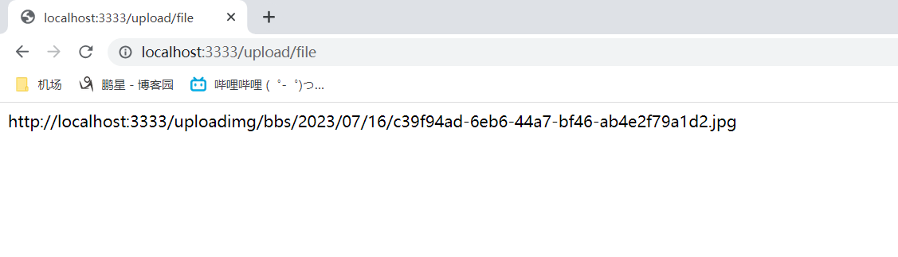


#### 1.1.6、对文件上传的思考和优化与控制

- 比如文件的格式

- 比如文件的大小

  在application.yml可以配置

- 比如文件的重命名

  简略使用UUID.*randomUUID*().toString()随机生成一个

- 比如文件的目录分类

  前端没有传入目录名称，后端有一个天然的目录--->日期目录，用指定的文件目录+日期目录

  ```java
  SimpleDateFormat dateFormat = new SimpleDateFormat("yyy/MM/dd");
  String datePath = dateFormat.format(new Date());//日期目录：2023/7/16
  //5. 原文件上传以后的目录
  String servepath = uploadFolder;//D://usr//local//upload/
  File targetPath = new File(servepath+dir,datePath);//生成一个最终的目录：D:/usr/local/upload/2023/7/16
  if (!targetPath.exists())targetPath.mkdirs();//如果目录不存在：  D:/usr/local/upload/2023/7/16  递归创建
  ```

对service进行封装

```java
package com.nacl.server;

import org.springframework.beans.factory.annotation.Value;
import org.springframework.stereotype.Service;
import org.springframework.web.multipart.MultipartFile;

import java.io.File;
import java.io.IOException;
import java.text.SimpleDateFormat;
import java.util.Date;
import java.util.HashMap;
import java.util.Map;
import java.util.UUID;

/**
 * @author HAOYANG
 * @create 2023-07-16 11:41
 */
@Service
public class UploadServe {

    @Value("${file.uploadFolder}")
    private String uploadFolder;
    @Value("${file.staticpath}")
    private String staticpath;
    /**
     * MultipartFile这个对象是springHvc提供的文件上传的接受的类。
     * 它的底层自动会去和HttpServletRequest request中的request.getInputstream()融合
     * 从而达到文件上传的效果。也就是告诉你一个道理:
     * 文件上传威层原理是:request.getinputstream()
     * @param multipartFile
     * @param dir
     * @return
     */
    public Map<String,Object> uploadImg(MultipartFile multipartFile, String dir){
        try {
            //1.原文件名
            String oldFilename = multipartFile.getOriginalFilename(); // 上传的文件：aaa.png
            // 2. 截取文件名的后缀
            String imgSuffix = oldFilename.substring(oldFilename.lastIndexOf("."));//拿到 .png
            //3. 生成唯一的文件名  不能用中文名，统一用英文
            String newFileName = UUID.randomUUID().toString()+imgSuffix;//将aaa.png改写成Sdjksdj532XXX.png   Sdjksdj532XXX--->这个是随意的
            //4. 日期目录
            SimpleDateFormat dateFormat = new SimpleDateFormat("yyy/MM/dd");
            String datePath = dateFormat.format(new Date());//日期目录：2023/7/16
            //5. 原文件上传以后的目录
            String servepath = uploadFolder;//D://usr//local//upload/
            File targetPath = new File(servepath+dir,datePath);//生成一个最终的目录：D:/usr/local/upload/2023/7/16
            if (!targetPath.exists())targetPath.mkdirs();//如果目录不存在：D:/usr/local/upload/2023/7/16   递归创建
            //6. 指定文件上传以后的服务器的完整的文件名
            File targetFileName = new File(targetPath,newFileName);// 文件上传以后在服务器上最终文件名和目录是://如果目录不存在：D:/usr/local/upload/2023/7/16/Sdjksdj532XXX.png
            //7. 文件上传到指定的目录
            multipartFile.transferTo(targetFileName);//将用户选择的aa.png上传到D:/usr/local/upload/2023/7/16/Sdjksdj532XXX.png
            // 可以访问的路径要返回页面
            //http://localhost:3333/uploadimg/bbs/2023/7/16/Sdjksdj532XXX.png
            String filename = dir+"/"+datePath+"/"+newFileName;
            Map<String,Object> map = new HashMap<>();
            map.put("url",staticpath+"/uploadimg/"+filename);
            map.put("size",multipartFile.getSize());
            map.put("ext",imgSuffix);
            map.put("filename",oldFilename);
            map.put("rpath",datePath+"/"+newFileName);
            return map;
        } catch (IOException e) {
            e.printStackTrace();
            return null;
        }
    }
}

```

对controller进行封装

```java
package com.nacl.controller;

import com.nacl.server.UploadServe;
import org.springframework.beans.factory.annotation.Autowired;
import org.springframework.stereotype.Controller;
import org.springframework.web.bind.annotation.PostMapping;
import org.springframework.web.bind.annotation.RequestParam;
import org.springframework.web.bind.annotation.ResponseBody;
import org.springframework.web.multipart.MultipartFile;

import javax.servlet.http.HttpServletRequest;
import java.util.Map;

/**
 * @author HAOYANG
 * @create 2023-07-16 11:40
 */
@Controller
public class UploadController {

    @Autowired
    UploadServe uploadServe;
    /**
     * 文件上传具体实现
     *
     * @param multipartFile
     * @param request
     * @return
     */
    @PostMapping("/upload/file")
    @ResponseBody
    public Map<String, Object> upload(@RequestParam("file")MultipartFile multipartFile, HttpServletRequest request){
        if (multipartFile.isEmpty()){
            return null;
        }
        //原文件大小
        long size = multipartFile.getSize();
        //原文件名
        String originalFilename = multipartFile.getOriginalFilename();
        //原文件类型
        String contentType = multipartFile.getContentType();
        //1:获取用户指定的文件夹。问这个文件夹为什么要从页面上传递过来呢?
        //原因是:傲隔离，不司业务，不同文件放在不同的目录中
        String dir = request.getParameter("dir");
        return uploadServe.uploadImg(multipartFile,dir);
    }
}

```


## 现在方式--->OSS对象存储

### 1. 注册阿里云


### 2. 购买OSS对象存储


### 3.创建Bucket文件存储桶

- Bucket相当于本地存储的文件夹

  1.创建Bucket列表

  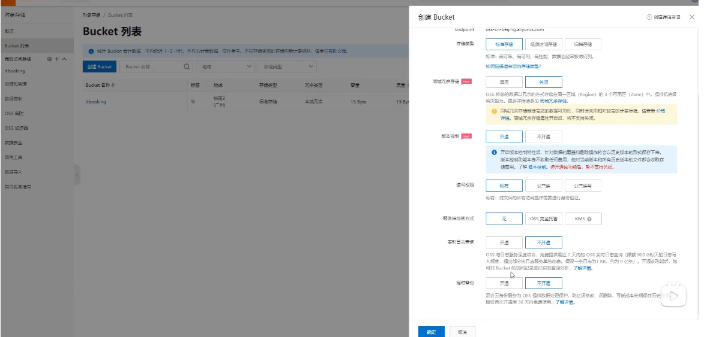

2.创建好后找到SDK下载


3.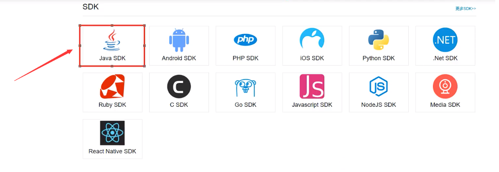

### 4.安装SDK

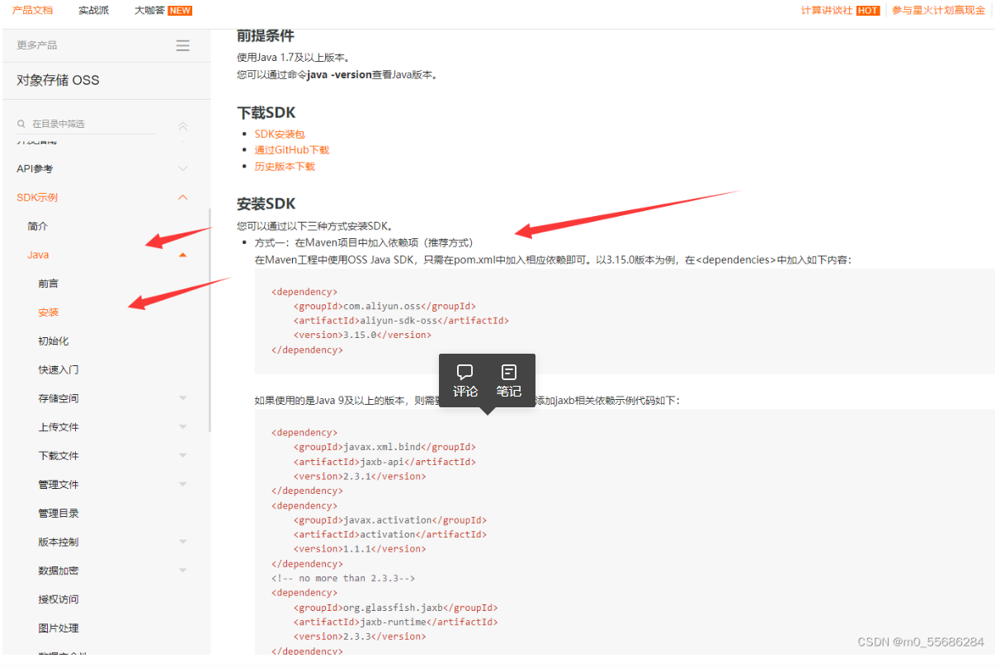

### 导入依赖：

5.导入oss的sdk依赖

定义OssUplaodService对接文件上传
		实现简单上传文件：

```java
// Endpoint以华东1（杭州）为例，其它Region请按实际情况填写。
        String endpoint = "https://oss-cn-hangzhou.aliyuncs.com";
        // 阿里云账号AccessKey拥有所有API的访问权限，风险很高。强烈建议您创建并使用RAM用户进行API访问或日常运维，请登录RAM控制台创建RAM用户。
        String accessKeyId = "yourAccessKeyId";
        String accessKeySecret = "yourAccessKeySecret";
        // 填写Bucket名称，例如examplebucket。
        String bucketName = "examplebucket";
        // 填写Object完整路径，例如exampledir/exampleobject.txt。Object完整路径中不能包含Bucket名称。
        String objectName = "exampledir/exampleobject.txt";

        // 创建OSSClient实例。
        OSS ossClient = new OSSClientBuilder().build(endpoint, accessKeyId, accessKeySecret);

        try {
            String content = "Hello OSS";
            ossClient.putObject(bucketName, objectName, new ByteArrayInputStream(content.getBytes()));
        } catch (OSSException oe) {
            System.out.println("Caught an OSSException, which means your request made it to OSS, "
                    + "but was rejected with an error response for some reason.");
            System.out.println("Error Message:" + oe.getErrorMessage());
            System.out.println("Error Code:" + oe.getErrorCode());
            System.out.println("Request ID:" + oe.getRequestId());
            System.out.println("Host ID:" + oe.getHostId());
        } catch (ClientException ce) {
            System.out.println("Caught an ClientException, which means the client encountered "
                    + "a serious internal problem while trying to communicate with OSS, "
                    + "such as not being able to access the network.");
            System.out.println("Error Message:" + ce.getMessage());
        } finally {
            if (ossClient != null) {
                ossClient.shutdown();
            }
        }

```

**填写对应参数：**

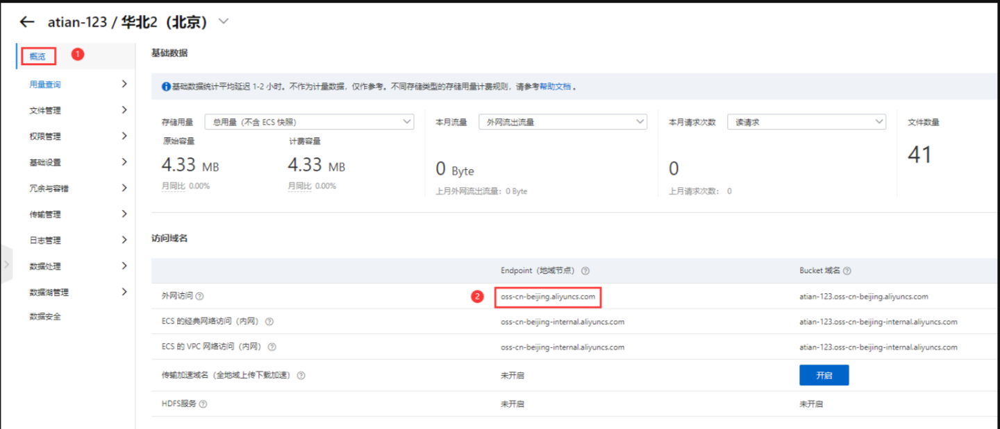


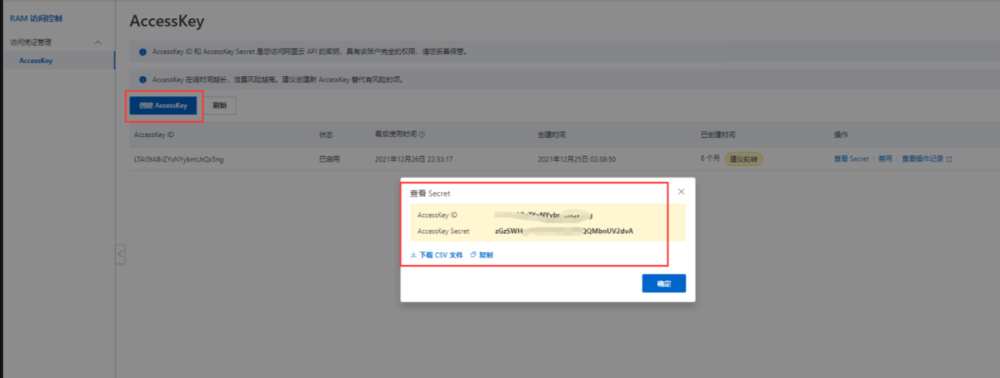

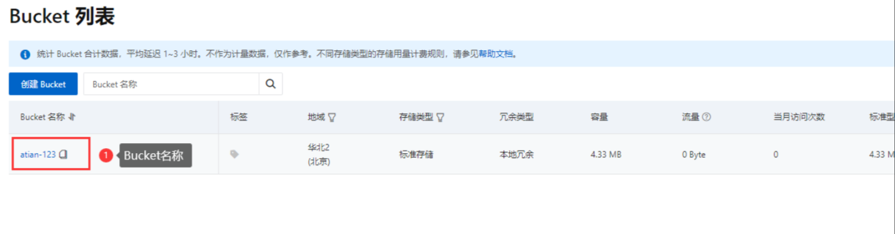

### 代码展示：

本地文件上传测试

```java
package com.tian.service;

import com.aliyun.oss.ClientException;
import com.aliyun.oss.OSS;
import com.aliyun.oss.OSSClientBuilder;
import com.aliyun.oss.OSSException;
import com.aliyun.oss.model.CannedAccessControlList;
import org.springframework.web.multipart.MultipartFile;

import java.io.ByteArrayInputStream;
import java.io.File;
import java.io.FileInputStream;
import java.io.InputStream;
import java.text.SimpleDateFormat;
import java.util.Date;
import java.util.UUID;

public class OSSservice {
    public static void main(String[] args) {
        String uploadfile = uploadfile(new File("e://1.txt"));
        System.out.println(uploadfile);

    }
    public static String uploadfile(File multipartFile){
        // Endpoint以华东1（杭州）为例，其它Region请按实际情况填写。
        String endpoint = "oss-cn-beijing.aliyuncs.com";
        // 阿里云账号AccessKey拥有所有API的访问权限，风险很高。强烈建议您创建并使用RAM用户进行API访问或日常运维，请登录RAM控制台创建RAM用户。
        String accessKeyId = "自己的accessKeyId";
        String accessKeySecret = "自己的accessKeySecret";
        // 填写Bucket名称，例如examplebucket。
        String bucketName = "atian-123";
        // 创建OSSClient实例。
        OSS ossClient = new OSSClientBuilder().build(endpoint, accessKeyId, accessKeySecret);
        try {
            //如果桶不存在，创建桶。
            if(!ossClient.doesBucketExist(bucketName)){
                //创建桶
                ossClient.createBucket(bucketName);
                //设置oss实例的访问权限：公共读
                ossClient.setBucketAcl(bucketName, CannedAccessControlList.PublicRead);
            }
            //2.获取文件上传的流
            InputStream inputStream = new FileInputStream(multipartFile);
            //3.构建日期目录
            SimpleDateFormat dateFormat = new SimpleDateFormat(  "yyyy/MM/dd");
            String datePath = dateFormat.format(new Date());
            //4.获取文件名
            String originalFilename = multipartFile.getName();
            String filename = UUID.randomUUID().toString();//生成文件名
            String substring = originalFilename.substring(originalFilename.lastIndexOf("."));//截取出后缀名
            String newName = filename + substring;//拼接
            String fileUrl = datePath+"/"+newName;//完整的目录
            //5.文件上传到阿里云服务器
            ossClient.putObject(bucketName,fileUrl,inputStream);
            //6.返回文件的访问路径
            return "https://"+bucketName+"."+endpoint +"/"+fileUrl;
            //https://atian-123.oss-cn-beijing.aliyuncs.com/2022/08/11/dfab1c62-8b2f-42e8-baa2-8ca18333a681.txt
            //成功返回
        } catch (OSSException oe) {
            System.out.println("Caught an OSSException, which means your request made it to OSS, "
                    + "but was rejected with an error response for some reason.");
            System.out.println("Error Message:" + oe.getErrorMessage());
            System.out.println("Error Code:" + oe.getErrorCode());
            System.out.println("Request ID:" + oe.getRequestId());
            System.out.println("Host ID:" + oe.getHostId());
            return "fail";
        } catch (ClientException ce) {
            System.out.println("Caught an ClientException, which means the client encountered "
                    + "a serious internal problem while trying to communicate with OSS, "
                    + "such as not being able to access the network.");
            System.out.println("Error Message:" + ce.getMessage());
            return "fail";
        } catch (Exception e) {
            System.out.println("获取文件流对象失败！！");
            return "fail";
        }finally {
            if (ossClient != null) {
                ossClient.shutdown();
            }
        }
    }
}

```

正常代码：

```java
    //-------------------------------------------------------------------------------------------------------------------
package com.tian.service;

import com.aliyun.oss.ClientException;
import com.aliyun.oss.OSS;
import com.aliyun.oss.OSSClientBuilder;
import com.aliyun.oss.OSSException;
import com.aliyun.oss.model.CannedAccessControlList;
import org.springframework.web.multipart.MultipartFile;

import java.io.ByteArrayInputStream;
import java.io.File;
import java.io.FileInputStream;
import java.io.InputStream;
import java.text.SimpleDateFormat;
import java.util.Date;
import java.util.UUID;

public class OSSservice {
    public String uploadfile(MultipartFile multipartFile){
    // Endpoint以华东1（杭州）为例，其它Region请按实际情况填写。
    String endpoint = "oss-cn-beijing.aliyuncs.com";
    // 阿里云账号AccessKey拥有所有API的访问权限，风险很高。强烈建议您创建并使用RAM用户进行API访问或日常运维，请登录RAM控制台创建RAM用户。
    String accessKeyId = "自己的accessKeyId";
    String accessKeySecret = "zGzSWHp4GWUT048gt6MQQMbnUV2dvA";
    // 填写Bucket名称，例如examplebucket。
    String bucketName = "atian-123";
    // 创建OSSClient实例。
    OSS ossClient = new OSSClientBuilder().build(endpoint, accessKeyId, accessKeySecret);
        try {
            //如果桶不存在，创建桶。
            if(!ossClient.doesBucketExist(bucketName)){
                //创建桶
                ossClient.createBucket(bucketName);
                //设置oss实例的访问权限：公共读
                ossClient.setBucketAcl(bucketName, CannedAccessControlList.PublicRead);
            }
            //2.获取文件上传的流
            InputStream inputStream = multipartFile.getInputStream();
            //3.构建日期目录
            SimpleDateFormat dateFormat = new SimpleDateFormat(  "yyyy/MM/dd");
            String datePath = dateFormat.format(new Date());
            //4.获取文件名
            String originalFilename = multipartFile.getOriginalFilename();
            String filename = UUID.randomUUID().toString();//生成文件名
            String substring = originalFilename.substring(originalFilename.lastIndexOf("."));//截取出后缀名
            String newName = filename + substring;//拼接
            String fileUrl = datePath+"/"+newName;//完整的目录
            //5.文件上传到阿里云服务器
            ossClient.putObject(bucketName,fileUrl,inputStream);
            //6.返回文件的访问路径
            return "https://"+bucketName+"."+endpoint +"/"+fileUrl;
    } catch (OSSException oe) {
        System.out.println("Caught an OSSException, which means your request made it to OSS, "
                + "but was rejected with an error response for some reason.");
        System.out.println("Error Message:" + oe.getErrorMessage());
        System.out.println("Error Code:" + oe.getErrorCode());
        System.out.println("Request ID:" + oe.getRequestId());
        System.out.println("Host ID:" + oe.getHostId());
            return "fail";
    } catch (ClientException ce) {
        System.out.println("Caught an ClientException, which means the client encountered "
                + "a serious internal problem while trying to communicate with OSS, "
                + "such as not being able to access the network.");
        System.out.println("Error Message:" + ce.getMessage());
            return "fail";
    } catch (Exception e) {
            System.out.println("获取文件流对象失败！！");
            return "fail";
        }finally {
            if (ossClient != null) {
                ossClient.shutdown();
            }
        }
    }
}

```


