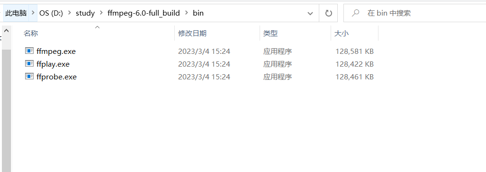
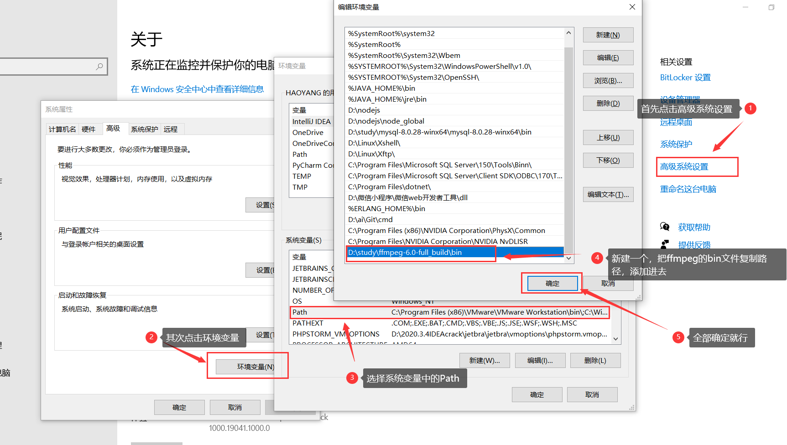
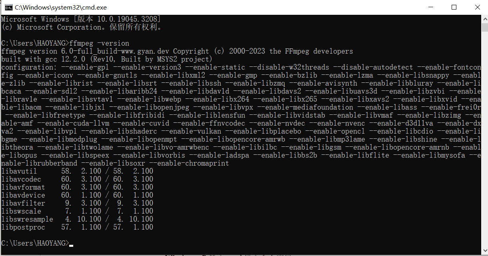

# SpringBoot整合FFmpeg进行视频分片上传------>Windows

## 分片上传的核心思路：

1. 将文件按一定的分割规则（静态或动态设定，如手动设置20M为一个分片），用slice分割成多个数据块。
2. 为每个文件生成一个唯一标识Key，用于多数据块上传时区分所属文件。
3. 所有分片上传完成，服务端校验合并标识为Key的所有分片为一个最终文件。

## 分片上传的意义：

将文件分片上传，在网络环境不佳时，可以对文件上传失败的部分重新上传，避免了每次上传都需要从文件起始位置上传的问题。分片的附带好处还能很方便的实现进度条。

## **分片上传的原理：**

使用ffmpeg，把视频文件切片成m3u8，并且通过springboot，可以实现在线的点播。客户端上传视频到服务器，服务器对视频进行切片后，返回m3u8，封面等访问路径。可以在线的播放。

## **准备工作：**

需要先在本机安装FFmpeg，并且添加到PATH环境变量

### **一：下载、解压**

下载地址：http://ffmpeg.org/download.html

下载解压至本地文件夹下（以下是我的安装路径）



### **二：配置环境变量：**

先进入bin目录获取路径：D:\study\ffmpeg-6.0-full_build\bin

配置环境变量path



### **三：使用命令行窗口检验是否安装成功**

Windows+R 输入 cmd 进入命令窗口

输入“ffmpeg –version” 如果出现如下说明配置成功



## **代码展示：**

### **pom文件**

`pom.xml`

```xml
<?xml version="1.0" encoding="UTF-8"?>
<project xmlns="http://maven.apache.org/POM/4.0.0"
         xmlns:xsi="http://www.w3.org/2001/XMLSchema-instance"
         xsi:schemaLocation="http://maven.apache.org/POM/4.0.0 http://maven.apache.org/xsd/maven-4.0.0.xsd">
    <modelVersion>4.0.0</modelVersion>

    <groupId>com.nacl</groupId>
    <artifactId>cs</artifactId>
    <version>1.0-SNAPSHOT</version>
<parent>
    <groupId>org.springframework.boot</groupId>
    <artifactId>spring-boot-starter-parent</artifactId>
    <version>2.7.2</version>
</parent>
    <properties>
        <maven.compiler.source>11</maven.compiler.source>
        <maven.compiler.target>11</maven.compiler.target>
        <project.build.sourceEncoding>UTF-8</project.build.sourceEncoding>
        <javacv.version>1.5.4</javacv.version>
        <ffmpeg.version>4.3.1-1.5.4</ffmpeg.version>
    </properties>
    <dependencies>

        <dependency>
            <groupId>commons-lang</groupId>
            <artifactId>commons-lang</artifactId>
            <version>2.6</version>
        </dependency>

        <dependency>
            <groupId>commons-fileupload</groupId>
            <artifactId>commons-fileupload</artifactId>
            <version>1.2.2</version>
        </dependency>
        <dependency>
            <groupId>commons-io</groupId>
            <artifactId>commons-io</artifactId>
            <version>2.5</version>
        </dependency>

        <!--web 模块 -->
        <dependency>
            <groupId>org.springframework.boot</groupId>
            <artifactId>spring-boot-starter-web</artifactId>
            <exclusions>
                <!--排除tomcat依赖 -->
                <exclusion>
                    <artifactId>spring-boot-starter-tomcat</artifactId>
                    <groupId>org.springframework.boot</groupId>
                </exclusion>
            </exclusions>
        </dependency>

        <!--undertow容器 -->
        <dependency>
            <groupId>org.springframework.boot</groupId>
            <artifactId>spring-boot-starter-undertow</artifactId>
        </dependency>

        <dependency>
            <groupId>org.springframework.boot</groupId>
            <artifactId>spring-boot-starter-test</artifactId>
            <scope>test</scope>
        </dependency>

        <!--      javacv 和 ffmpeg的依赖包      -->
        <dependency>
            <groupId>org.bytedeco</groupId>
            <artifactId>javacv</artifactId>
            <version>${javacv.version}</version>
            <exclusions>
                <exclusion>
                    <groupId>org.bytedeco</groupId>
                    <artifactId>*</artifactId>
                </exclusion>
            </exclusions>
        </dependency>

        <dependency>
            <groupId>org.bytedeco</groupId>
            <artifactId>ffmpeg-platform</artifactId>
            <version>${ffmpeg.version}</version>
        </dependency>

        <dependency>
            <groupId>cn.hutool</groupId>
            <artifactId>hutool-all</artifactId>
            <version>5.6.5</version>
        </dependency>

        <dependency>
            <groupId>log4j</groupId>
            <artifactId>log4j</artifactId>
            <version>1.2.17</version>
        </dependency>

        <dependency>
            <groupId>org.springframework.boot</groupId>
            <artifactId>spring-boot-starter-test</artifactId>
            <scope>test</scope>
        </dependency>

        <dependency>
            <groupId>org.junit.vintage</groupId>
            <artifactId>junit-vintage-engine</artifactId>
            <scope>test</scope>
        </dependency>

        <dependency>
            <groupId>org.springframework.boot</groupId>
            <artifactId>spring-boot-starter-web</artifactId>
            <exclusions>
                <exclusion>
                    <groupId>org.springframework.boot</groupId>
                    <artifactId>spring-boot-starter-tomcat</artifactId>
                </exclusion>
            </exclusions>
        </dependency>

        <dependency>
            <groupId>org.springframework.boot</groupId>
            <artifactId>spring-boot-starter-undertow</artifactId>
        </dependency>

        <dependency>
            <groupId>commons-codec</groupId>
            <artifactId>commons-codec</artifactId>
        </dependency>

        <dependency>
            <groupId>com.google.code.gson</groupId>
            <artifactId>gson</artifactId>
        </dependency>
        <dependency>
            <groupId>org.projectlombok</groupId>
            <artifactId>lombok</artifactId>
        </dependency>
    </dependencies>
    <build>
        <finalName>${project.artifactId}</finalName>
        <plugins>
            <plugin>
                <groupId>org.springframework.boot</groupId>
                <artifactId>spring-boot-maven-plugin</artifactId>
                <configuration>
                    <executable>true</executable>
                </configuration>
            </plugin>
        </plugins>
    </build>
</project>
```

### **yml配置**

`application.yml`

```yaml
server:
  port: 8086

app:
  # 存储转码视频的文件夹
  video-folder: D:\ffmpegVedio\

spring:
  servlet:
    multipart:
      enabled: true
      # 不限制文件大小
      max-file-size: -1
      # 不限制请求体大小
      max-request-size: -1
      # 临时IO目录
      location: "${java.io.tmpdir}"
      # 不延迟解析
      resolve-lazily: false
      # 超过1Mb，就IO到临时目录
      file-size-threshold: 1MB
  web:
    resources:
      static-locations:
        - "classpath:/static/"
        - "file:${app.video-folder}" # 把视频文件夹目录，添加到静态资源目录列表

```

### **工具类**

`MediaInfo`

```java
package com.nacl.util;

import java.util.List;

import com.google.gson.annotations.SerializedName;
/**
 * @author HAOYANG
 * @create 2023-07-29 10:31
 */
public class MediaInfo {
    public static class Format {
        @SerializedName("bit_rate")
        private String bitRate;
        public String getBitRate() {
            return bitRate;
        }
        public void setBitRate(String bitRate) {
            this.bitRate = bitRate;
        }
    }

    public static class Stream {
        @SerializedName("index")
        private int index;

        @SerializedName("codec_name")
        private String codecName;

        @SerializedName("codec_long_name")
        private String codecLongame;

        @SerializedName("profile")
        private String profile;
    }

    @SerializedName("streams")
    private List<Stream> streams;

    @SerializedName("format")
    private Format format;

    public List<Stream> getStreams() {
        return streams;
    }

    public void setStreams(List<Stream> streams) {
        this.streams = streams;
    }

    public Format getFormat() {
        return format;
    }

    public void setFormat(Format format) {
        this.format = format;
    }
}


```

`TranscodeConfig`

```java
package com.nacl.util;

import lombok.Data;
/**
 * @author HAOYANG
 * @create 2023-07-29 10:32
 */
@Data
public class TranscodeConfig {

    private String poster = "00:00:00.001";				// 截取封面的时间			HH:mm:ss.[SSS]
    private String tsSeconds = "15";			// ts分片大小，单位是秒
    private String cutStart;			// 视频裁剪，开始时间		HH:mm:ss.[SSS]
    private String cutEnd;				// 视频裁剪，结束时间		HH:mm:ss.[SSS]
    public String getPoster() {
        return poster;
    }

    public void setPoster(String poster) {
        this.poster = poster;
    }

    public String getTsSeconds() {
        return tsSeconds;
    }

    public void setTsSeconds(String tsSeconds) {
        this.tsSeconds = tsSeconds;
    }

    public String getCutStart() {
        return cutStart;
    }

    public void setCutStart(String cutStart) {
        this.cutStart = cutStart;
    }

    public String getCutEnd() {
        return cutEnd;
    }

    public void setCutEnd(String cutEnd) {
        this.cutEnd = cutEnd;
    }

    @Override
    public String toString() {
        return "TranscodeConfig [poster=" + poster + ", tsSeconds=" + tsSeconds + ", cutStart=" + cutStart + ", cutEnd="
                + cutEnd + "]";
    }
}


```

`FFmpegUtils`

```java
package com.nacl.util;

import java.io.BufferedReader;
import java.io.File;
import java.io.IOException;
import java.io.InputStreamReader;
import java.nio.charset.StandardCharsets;
import java.nio.file.Files;
import java.nio.file.Path;
import java.nio.file.Paths;
import java.nio.file.StandardOpenOption;
import java.security.NoSuchAlgorithmException;
import java.time.LocalDate;
import java.time.format.DateTimeFormatter;
import java.util.*;

import javax.crypto.KeyGenerator;

import org.apache.commons.codec.binary.Hex;
import org.slf4j.Logger;
import org.slf4j.LoggerFactory;
import org.springframework.http.HttpStatus;
import org.springframework.http.ResponseEntity;
import org.springframework.util.StringUtils;

import com.google.gson.Gson;
import org.springframework.web.bind.annotation.RequestPart;
import org.springframework.web.multipart.MultipartFile;
/**
 * @author HAOYANG
 * @create 2023-07-29 10:33
 */

public class FFmpegUtils {

    private static final Logger LOGGER = LoggerFactory.getLogger(FFmpegUtils.class);

    // 跨平台换行符
    private static final String LINE_SEPARATOR = System.getProperty("line.separator");

    /**
     * 生成随机16个字节的AESKEY
     * @return
     */
    private static byte[] genAesKey ()  {
        try {
            KeyGenerator keyGenerator = KeyGenerator.getInstance("AES");
            keyGenerator.init(128);
            return keyGenerator.generateKey().getEncoded();
        } catch (NoSuchAlgorithmException e) {
            return null;
        }
    }

    /**
     * 在指定的目录下生成key_info, key文件，返回key_info文件
     * @param folder
     * @throws IOException
     */
    private static Path genKeyInfo(String folder) throws IOException {
        // AES 密钥
        byte[] aesKey = genAesKey();
        // AES 向量
        String iv = Hex.encodeHexString(genAesKey());

        // key 文件写入
        Path keyFile = Paths.get(folder, "key");
        Files.write(keyFile, aesKey, StandardOpenOption.CREATE, StandardOpenOption.TRUNCATE_EXISTING);

        // key_info 文件写入
        StringBuilder stringBuilder = new StringBuilder();
        stringBuilder.append("key").append(LINE_SEPARATOR);					// m3u8加载key文件网络路径
        stringBuilder.append(keyFile.toString()).append(LINE_SEPARATOR);	// FFmeg加载key_info文件路径
        stringBuilder.append(iv);											// ASE 向量

        Path keyInfo = Paths.get(folder, "key_info");

        Files.write(keyInfo, stringBuilder.toString().getBytes(), StandardOpenOption.CREATE, StandardOpenOption.TRUNCATE_EXISTING);

        return keyInfo;
    }

    /**
     * 指定的目录下生成 master index.m3u8 文件
     * @param file			master m3u8文件地址
     * @param indexPath			访问子index.m3u8的路径
     * @param bandWidth			流码率
     * @throws IOException
     */
    private static void genIndex(String file, String indexPath, String bandWidth) throws IOException {
        StringBuilder stringBuilder = new StringBuilder();
        stringBuilder.append("#EXTM3U").append(LINE_SEPARATOR);
        stringBuilder.append("#EXT-X-STREAM-INF:BANDWIDTH=" + bandWidth).append(LINE_SEPARATOR);  // 码率
        stringBuilder.append(indexPath);
        Files.write(Paths.get(file), stringBuilder.toString().getBytes(StandardCharsets.UTF_8), StandardOpenOption.CREATE, StandardOpenOption.TRUNCATE_EXISTING);
    }

    /**
     * 转码视频为m3u8
     * @param source				源视频
     * @param destFolder			目标文件夹
     * @param config				配置信息
     * @throws IOException
     * @throws InterruptedException
     */
    public static void transcodeToM3u8(String source, String destFolder, TranscodeConfig config) throws IOException, InterruptedException {

        // 判断源视频是否存在
        if (!Files.exists(Paths.get(source))) {
            throw new IllegalArgumentException("文件不存在：" + source);
        }

        // 创建工作目录
        Path workDir = Paths.get(destFolder, "ts");
        Files.createDirectories(workDir);

        // 在工作目录生成KeyInfo文件
        Path keyInfo = genKeyInfo(workDir.toString());

        // 构建命令
        List<String> commands = new ArrayList<>();
        commands.add("ffmpeg");
        commands.add("-i")						;commands.add(source);					// 源文件
        commands.add("-c:v")					;commands.add("libx264");				// 视频编码为H264
        commands.add("-c:a")					;commands.add("copy");					// 音频直接copy
        commands.add("-hls_key_info_file")		;commands.add(keyInfo.toString());		// 指定密钥文件路径
        commands.add("-hls_time")				;commands.add(config.getTsSeconds());	// ts切片大小
        commands.add("-hls_playlist_type")		;commands.add("vod");					// 点播模式
        commands.add("-hls_segment_filename")	;commands.add("%06d.ts");				// ts切片文件名称

        if (StringUtils.hasText(config.getCutStart())) {
            commands.add("-ss")					;commands.add(config.getCutStart());	// 开始时间
        }
        if (StringUtils.hasText(config.getCutEnd())) {
            commands.add("-to")					;commands.add(config.getCutEnd());		// 结束时间
        }
        commands.add("index.m3u8");														// 生成m3u8文件

        // 构建进程
        Process process = new ProcessBuilder()
                .command(commands)
                .directory(workDir.toFile())
                .start()
                ;

        // 读取进程标准输出
        new Thread(() -> {
            try (BufferedReader bufferedReader = new BufferedReader(new InputStreamReader(process.getInputStream()))) {
                String line = null;
                while ((line = bufferedReader.readLine()) != null) {
                    LOGGER.info(line);
                }
            } catch (IOException e) {
            }
        }).start();

        // 读取进程异常输出
        new Thread(() -> {
            try (BufferedReader bufferedReader = new BufferedReader(new InputStreamReader(process.getErrorStream()))) {
                String line = null;
                while ((line = bufferedReader.readLine()) != null) {
                    LOGGER.info(line);
                }
            } catch (IOException e) {
            }
        }).start();


        // 阻塞直到任务结束
        if (process.waitFor() != 0) {
            throw new RuntimeException("视频切片异常");
        }

        // 切出封面
        if (!screenShots(source, String.join(File.separator, destFolder, "poster.jpg"), config.getPoster())) {
            throw new RuntimeException("封面截取异常");
        }

        // 获取视频信息
        final MediaInfo[] mediaInfo = {getMediaInfo(source)};
        if (mediaInfo[0] == null) {
            throw new RuntimeException("获取媒体信息异常");
        }

        // 生成index.m3u8文件
        genIndex(String.join(File.separator, destFolder, "index.m3u8"), "ts/index.m3u8", mediaInfo[0].getFormat().getBitRate());

        // 删除keyInfo文件
        Files.delete(keyInfo);
    }

    /**
     * 获取视频文件的媒体信息
     * @param source
     * @return
     * @throws IOException
     * @throws InterruptedException
     */
    public static MediaInfo getMediaInfo(String source) throws IOException, InterruptedException {
        List<String> commands = new ArrayList<>();
        commands.add("ffprobe");
        commands.add("-i")				;commands.add(source);
        commands.add("-show_format");
        commands.add("-show_streams");
        commands.add("-print_format")	;commands.add("json");

        Process process = new ProcessBuilder(commands)
                .start();

        MediaInfo mediaInfo = null;

        try (BufferedReader bufferedReader = new BufferedReader(new InputStreamReader(process.getInputStream()))) {
            mediaInfo = new Gson().fromJson(bufferedReader, MediaInfo.class);
        } catch (IOException e) {
            e.printStackTrace();
        }

        if (process.waitFor() != 0) {
            return null;
        }

        return mediaInfo;
    }

    /**
     * 截取视频的指定时间帧，生成图片文件
     * @param source		源文件
     * @param file			图片文件
     * @param time			截图时间 HH:mm:ss.[SSS]
     * @throws IOException
     * @throws InterruptedException
     */
    public static boolean screenShots(String source, String file, String time) throws IOException, InterruptedException {

        List<String> commands = new ArrayList<>();
        commands.add("ffmpeg");
        commands.add("-i")				;commands.add(source);
        commands.add("-ss")				;commands.add(time);
        commands.add("-y");
        commands.add("-q:v")			;commands.add("1");
        commands.add("-frames:v")		;commands.add("1");
        commands.add("-f");				;commands.add("image2");
        commands.add(file);

        Process process = new ProcessBuilder(commands)
                .start();

        // 读取进程标准输出
        new Thread(() -> {
            try (BufferedReader bufferedReader = new BufferedReader(new InputStreamReader(process.getInputStream()))) {
                String line = null;
                while ((line = bufferedReader.readLine()) != null) {
                    LOGGER.info(line);
                }
            } catch (IOException e) {
            }
        }).start();

        // 读取进程异常输出
        new Thread(() -> {
            try (BufferedReader bufferedReader = new BufferedReader(new InputStreamReader(process.getErrorStream()))) {
                String line = null;
                while ((line = bufferedReader.readLine()) != null) {
                    LOGGER.error(line);
                }
            } catch (IOException e) {
            }
        }).start();

        return process.waitFor() == 0;
    }
}

```

### **controller调用**

`UploadController`

```java
package com.nacl.controller;

/**
 * @author HAOYANG
 * @create 2023-07-29 10:33
 */
import java.io.IOException;
import java.nio.file.Files;
import java.nio.file.Path;
import java.nio.file.Paths;
import java.time.LocalDate;
import java.time.format.DateTimeFormatter;
import java.util.HashMap;
import java.util.Map;
import java.util.UUID;

import lombok.extern.slf4j.Slf4j;
import org.slf4j.Logger;
import org.slf4j.LoggerFactory;
import org.springframework.beans.factory.annotation.Value;
import org.springframework.http.HttpStatus;
import org.springframework.http.ResponseEntity;
import org.springframework.web.bind.annotation.*;
import org.springframework.web.multipart.MultipartFile;
import com.nacl.util.TranscodeConfig;
import  com.nacl.util.FFmpegUtils;

import static com.nacl.util.FFmpegUtils.transcodeToM3u8;

@Slf4j
@RestController
@RequestMapping("/uploadController")
public class UploadController {

    @Value("${app.video-folder}")
    private String videoFolder;

    private Path tempDir = Paths.get(System.getProperty("java.io.tmpdir"));

    /**
     * 上传视频进行切片处理，返回访问路径
     * @param video
     * @param transcodeConfig
     * @return
     * @throws IOException
     */
    @PostMapping("/upload")
    @CrossOrigin
    public Object upload (@RequestPart(name = "file", required = true) MultipartFile video,
                          @RequestPart(name = "config", required = true) TranscodeConfig transcodeConfig) throws IOException {
        log.info("文件信息：title={}, size={}", video.getOriginalFilename(), video.getSize());
        log.info("转码配置：{}", transcodeConfig);

        // 原始文件名称，也就是视频的标题
        String title = video.getOriginalFilename();

        // io到临时文件
        Path tempFile = tempDir.resolve(title);
        log.info("io到临时文件：{}", tempFile.toString());

        try {
            video.transferTo(tempFile);

            // 删除后缀
            title = title.substring(0, title.lastIndexOf(".")) + "-" + UUID.randomUUID().toString().replaceAll("-", "");

            // 按照日期生成子目录
            String today = DateTimeFormatter.ofPattern("yyyyMMdd").format(LocalDate.now());

            // 尝试创建视频目录
            Path targetFolder = Files.createDirectories(Paths.get(videoFolder, today, title));

            log.info("创建文件夹目录：{}", targetFolder);
            Files.createDirectories(targetFolder);

            // 执行转码操作
            log.info("开始转码");
            try {
                transcodeToM3u8(tempFile.toString(), targetFolder.toString(), transcodeConfig);
            } catch (Exception e) {
                log.error("转码异常：{}", e.getMessage());
                Map<String, Object> result = new HashMap<>();
                result.put("success", false);
                result.put("message", e.getMessage());
                return ResponseEntity.status(HttpStatus.INTERNAL_SERVER_ERROR).body(result);
            }

            // 封装结果
            Map<String, Object> videoInfo = new HashMap<>();
            videoInfo.put("title", title);
            videoInfo.put("m3u8", String.join("/", "", today, title, "index.m3u8"));
            videoInfo.put("poster", String.join("/", "", today, title, "poster.jpg"));

            //返回数据
            Map<String, Object> result = new HashMap<>();
            result.put("success", true);
            result.put("data", videoInfo);
            return result;
        } finally {
            // 始终删除临时文件
            Files.delete(tempFile);
        }
    }
}

```

### **Url转换MultipartFile的工具类**

#### **如controller中参数传的是URL 使用以下工具类转换一下即可**

`UrlToMultipartFile`

```java
package com.nacl.util;

import org.apache.commons.fileupload.FileItem;
import org.apache.commons.fileupload.FileItemFactory;
import org.apache.commons.fileupload.disk.DiskFileItemFactory;
import org.apache.commons.lang.RandomStringUtils;
import org.slf4j.Logger;
import org.slf4j.LoggerFactory;
import org.springframework.web.multipart.MultipartFile;
import org.springframework.web.multipart.commons.CommonsMultipartFile;

import java.io.*;
import java.net.HttpURLConnection;
import java.net.URL;

/**
 * @author HAOYANG
 * @create 2023-07-29 10:36
 */
public class UrlToMultipartFile {

    private static final Logger LOGGER = LoggerFactory.getLogger(UrlToMultipartFile.class);

    /**
     * inputStream 转 File
     */
    public static File inputStreamToFile(InputStream ins, String name) throws Exception{
        //System.getProperty("java.io.tmpdir")临时目录+File.separator目录中间的间隔符+文件名
        File file = new File(System.getProperty("java.io.tmpdir") + File.separator + name);
        OutputStream os = new FileOutputStream(file);
        int bytesRead;
        int len = 8192;
        byte[] buffer = new byte[len];
        while ((bytesRead = ins.read(buffer, 0, len)) != -1) {
            os.write(buffer, 0, bytesRead);
        }
        os.close();
        ins.close();
        return file;
    }

    /**
     * file转multipartFile
     */
    public static MultipartFile fileToMultipartFile(File file) {
        FileItemFactory factory = new DiskFileItemFactory(16, null);
        FileItem item=factory.createItem(file.getName(),"text/plain",true,file.getName());
        int bytesRead = 0;
        byte[] buffer = new byte[8192];
        try {
            FileInputStream fis = new FileInputStream(file);
            OutputStream os = item.getOutputStream();
            while ((bytesRead = fis.read(buffer, 0, 8192)) != -1) {
                os.write(buffer, 0, bytesRead);
            }
            os.close();
            fis.close();
        } catch (IOException e) {
            e.printStackTrace();
        }
        return new CommonsMultipartFile(item);
    }

    //url转MultipartFile
    public static MultipartFile urlToMultipartFile(String url) throws Exception {
        File file = null;
        MultipartFile multipartFile = null;
        try {
            HttpURLConnection httpUrl = (HttpURLConnection) new URL(url).openConnection();
            httpUrl.connect();
            file = UrlToMultipartFile.inputStreamToFile(httpUrl.getInputStream(),RandomStringUtils.randomAlphanumeric(8)+".mp4");
            LOGGER.info("---------"+file+"-------------");

            multipartFile = UrlToMultipartFile.fileToMultipartFile(file);
            httpUrl.disconnect();
        } catch (Exception e) {
            e.printStackTrace();
        }
        return multipartFile;
    }

}


```

### **HTML文件 进行测试**

#### 请求路径：http://localhost:8086/cs.html

`cs.html`

```html
<!DOCTYPE html>
<html lang="en">
<head>
    <meta charset="UTF-8">
    <title>Title</title>
    <script src="https://cdn.jsdelivr.net/hls.js/latest/hls.min.js"></script>
</head>
<body>
选择转码文件： <input name="file" type="file" accept="video/*" onchange="upload(event)">
<hr/>
<video id="video"  width="500" height="400" controls="controls"></video>
</body>
<script>

    const video = document.getElementById('video');

    function upload (e){
        let files = e.target.files
        if (!files) {
            return
        }

        // TODO 转码配置这里固定死了
        var transCodeConfig = {
            poster: "00:00:00.001", // 截取第1毫秒作为封面
            tsSeconds: 15,
            cutStart: "",
            cutEnd: ""
        }

        // 执行上传
        let formData = new FormData();
        formData.append("file", files[0])
        formData.append("config", new Blob([JSON.stringify(transCodeConfig)], {type: "application/json; charset=utf-8"}))

        fetch('/uploadController/upload', {
            method: 'POST',
            body: formData
        })
            .then(resp =>  resp.json())
            .then(message => {
                if (message.success){
                    // 设置封面
                    video.poster = message.data.poster;

                    // 渲染到播放器
                    var hls = new Hls();
                    hls.loadSource(message.data.m3u8);
                    hls.attachMedia(video);
                } else {
                    alert("转码异常，详情查看控制台");
                    console.log(message.message);
                }
            })
            .catch(err => {
                alert("转码异常，详情查看控制台。。。");
                throw err
            })
    }
</script>
</html>

```

# SpringBoot整合FFmpeg进行视频分片上传------>Linux

## **分片上传的核心思路：**

1. 将文件按一定的分割规则（静态或动态设定，如手动设置20M为一个分片），用slice分割成多个数据块。
2. 为每个文件生成一个唯一标识Key，用于多数据块上传时区分所属文件。
3. 所有分片上传完成，服务端校验合并标识为Key的所有分片为一个最终文件。

## **分片上传的意义：**

将文件分片上传，在网络环境不佳时，可以对文件上传失败的部分重新上传，避免了每次上传都需要从文件起始位置上传的问题。分片的附带好处还能很方便的实现进度条。

## **分片上传的原理：**

使用ffmpeg，把视频文件切片成m3u8，并且通过springboot，可以实现在线的点播。客户端上传视频到服务器，服务器对视频进行切片后，返回m3u8，封面等访问路径。可以在线的播放。

## **准备工作：**

需要先在linux下安装FFmpeg，并配置环境变量

### **一：下载、解压**

使用命令下载：

```shell
wget https://johnvansickle.com/ffmpeg/release-source/ffmpeg-4.1.tar.xz
#使用命令解压：
cd  /root/FFmpeg
tar -xvJf ffmpeg-4.1.tar.xz 
# 编辑准备
cd /root/FFmpeg/ffmpeg-4.1    # 切换到ffmpeg-4.1目录
yum install gcc  # 安装gcc编译器
```

yasm安装包

```shell
cd /root/FFmpeg
wget http://www.tortall.net/projects/yasm/releases/yasm-1.3.0.tar.gz  #下载源码包
tar zxvf yasm-1.3.0.tar.gz #解压
cd yasm-1.3.0 #进入目录
./configure #配置
make && make install #编译安装

```

安装FFmpeg

```shell
cd /root/FFmpeg/ffmpeg-4.1/
./configure --enable-shared --prefix=/usr/local/ffmpeg-4.1
make && make install #编译安装

```

下载x264

```shell
cd /root/libx264/
yum -y install git
git clone https://git.videolan.org/git/x264.git

```

安装nasm

```shell
tar -xvf nasm-2.14.02.tar.gz 
cd nasm-2.14.02
./configure
make
sudo make install
#查看是否安装成功
nasm -version

```

安装x264

```shell
cd /root/FFmpeg/libx264/x264
./configure --prefix=/usr/softinstall/x264/ --includedir=/usr/local/include --libdir=/usr/local/lib --enable-shared
make
sudo make install

```

安装FFmpeg

```shell
#配置 /etc/ld.so.conf
vim /etc/ld.so.conf #通过vim指令进入位于etc目录中的ld.so.conf
#输入i进入插入模式，将第二行的内容插入到该文件
include ld.so.conf.d/*.conf
/usr/local/ffmpeg-4.1/lib

ldconfig  #ldconfig 是一个动态链接库管理命令，其目的为了让动态链接库为系统所共享。
make
sudo make install
# ffmpeg  -i  /root/FFmpeg/wukel.mp4  -c:v  libx264  -c:a  copy  -hls_key_info_file  /root/FFmpeg/video_folder/20220308/test1/  -hls_time  15  -hls_playlist_type  vod  -hls_segment_filename  %06d.ts  index.m3u8
ldd ffmpeg
cd /root/FFmpeg/ffmpeg-4.1
./configure --prefix=/usr/softinstall/ffmpeg --enable-gpl --enable-shared --enable-libx264

# 配置环境变量
vim /etc/profile
#配置如下
export FFMPEG_HOME=/usr/local/ffmpeg-4.1
export PATH=$FFMPEG_HOME/bin:$PATH
#修改完使用命令退出
~:wq
source /etc/profile
# 测试
ffmpeg -version
~~~~~~~~成功~~~~~~~~~

```

## **代码展示：**

### pom文件

`pom.xml`

```xml
	<parent>
		<groupId>org.springframework.boot</groupId>
		<artifactId>spring-boot-starter-parent</artifactId>
		<version>2.5.4</version>
		<relativePath /> <!-- lookup parent from repository -->
	</parent>
	
	<properties>
		<java.version>1.8</java.version>
		<javacv.version>1.5.4</javacv.version>
		<ffmpeg.version>4.3.1-1.5.4</ffmpeg.version>
	</properties>
	
	<dependencies>

		<dependency>
			<groupId>commons-lang</groupId>
			<artifactId>commons-lang</artifactId>
			<version>2.6</version>
		</dependency>

		<dependency>
			<groupId>commons-fileupload</groupId>
			<artifactId>commons-fileupload</artifactId>
			<version>1.2.2</version>
		</dependency>
		<dependency>
			<groupId>commons-io</groupId>
			<artifactId>commons-io</artifactId>
			<version>2.5</version>
		</dependency>

		<!--web 模块 -->
		<dependency>
			<groupId>org.springframework.boot</groupId>
			<artifactId>spring-boot-starter-web</artifactId>
			<exclusions>
				<!--排除tomcat依赖 -->
				<exclusion>
					<artifactId>spring-boot-starter-tomcat</artifactId>
					<groupId>org.springframework.boot</groupId>
				</exclusion>
			</exclusions>
		</dependency>

		<!--undertow容器 -->
		<dependency>
			<groupId>org.springframework.boot</groupId>
			<artifactId>spring-boot-starter-undertow</artifactId>
		</dependency>

		<dependency>
			<groupId>org.springframework.boot</groupId>
			<artifactId>spring-boot-starter-test</artifactId>
			<scope>test</scope>
		</dependency>

		<!--      javacv 和 ffmpeg的依赖包      -->
		<dependency>
			<groupId>org.bytedeco</groupId>
			<artifactId>javacv</artifactId>
			<version>${javacv.version}</version>
			<exclusions>
				<exclusion>
					<groupId>org.bytedeco</groupId>
					<artifactId>*</artifactId>
				</exclusion>
			</exclusions>
		</dependency>

		<dependency>
			<groupId>org.bytedeco</groupId>
			<artifactId>ffmpeg-platform</artifactId>
			<version>${ffmpeg.version}</version>
		</dependency>

		<dependency>
			<groupId>cn.hutool</groupId>
			<artifactId>hutool-all</artifactId>
			<version>5.6.5</version>
		</dependency>

		<dependency>
			<groupId>log4j</groupId>
			<artifactId>log4j</artifactId>
			<version>1.2.17</version>
		</dependency>
		
		<dependency>
			<groupId>org.springframework.boot</groupId>
			<artifactId>spring-boot-starter-test</artifactId>
			<scope>test</scope>
		</dependency>
		
		<dependency>
			<groupId>org.junit.vintage</groupId>
			<artifactId>junit-vintage-engine</artifactId>
			<scope>test</scope>
		</dependency>

		<dependency>
			<groupId>org.springframework.boot</groupId>
			<artifactId>spring-boot-starter-web</artifactId>
			<exclusions>
				<exclusion>
					<groupId>org.springframework.boot</groupId>
					<artifactId>spring-boot-starter-tomcat</artifactId>
				</exclusion>
			</exclusions>
		</dependency>
		
		<dependency>
			<groupId>org.springframework.boot</groupId>
			<artifactId>spring-boot-starter-undertow</artifactId>
		</dependency>

		<dependency>
			<groupId>commons-codec</groupId>
			<artifactId>commons-codec</artifactId>
		</dependency>

		<dependency>
			<groupId>com.google.code.gson</groupId>
			<artifactId>gson</artifactId>
		</dependency>
	</dependencies>
	<build>
		<finalName>${project.artifactId}</finalName>
		<plugins>
			<plugin>
				<groupId>org.springframework.boot</groupId>
				<artifactId>spring-boot-maven-plugin</artifactId>
				<configuration>
					<executable>true</executable>
				</configuration>
			</plugin>
		</plugins>
	</build>

```

### **yml配置**

`application.yml`

```yaml
server:
  port: 8086

app:
  # 存储转码视频的文件夹
  video-folder: /root/FFmpeg/video_folder

spring:
  servlet:
    multipart:
      enabled: true
      # 不限制文件大小
      max-file-size: -1
      # 不限制请求体大小
      max-request-size: -1
      # 临时IO目录
      location: "${java.io.tmpdir}"
      # 不延迟解析
      resolve-lazily: false
      # 超过1Mb，就IO到临时目录
      file-size-threshold: 1MB
  web:
    resources:
      static-locations:
        - "classpath:/static/"
        - "file:${app.video-folder}" # 把视频文件夹目录，添加到静态资源目录列表

```

### **工具类**

`MediaInfo`

```java
package com.nacl.util;

import java.util.List;

import com.google.gson.annotations.SerializedName;
/**
 * @author HAOYANG
 * @create 2023-07-29 10:31
 */
public class MediaInfo {
    public static class Format {
        @SerializedName("bit_rate")
        private String bitRate;
        public String getBitRate() {
            return bitRate;
        }
        public void setBitRate(String bitRate) {
            this.bitRate = bitRate;
        }
    }

    public static class Stream {
        @SerializedName("index")
        private int index;

        @SerializedName("codec_name")
        private String codecName;

        @SerializedName("codec_long_name")
        private String codecLongame;

        @SerializedName("profile")
        private String profile;
    }

    @SerializedName("streams")
    private List<Stream> streams;

    @SerializedName("format")
    private Format format;

    public List<Stream> getStreams() {
        return streams;
    }

    public void setStreams(List<Stream> streams) {
        this.streams = streams;
    }

    public Format getFormat() {
        return format;
    }

    public void setFormat(Format format) {
        this.format = format;
    }
}


```

`TranscodeConfig`

```java
package com.nacl.util;

import lombok.Data;
/**
 * @author HAOYANG
 * @create 2023-07-29 10:32
 */
@Data
public class TranscodeConfig {

    private String poster = "00:00:00.001";				// 截取封面的时间			HH:mm:ss.[SSS]
    private String tsSeconds = "15";			// ts分片大小，单位是秒
    private String cutStart;			// 视频裁剪，开始时间		HH:mm:ss.[SSS]
    private String cutEnd;				// 视频裁剪，结束时间		HH:mm:ss.[SSS]
    public String getPoster() {
        return poster;
    }

    public void setPoster(String poster) {
        this.poster = poster;
    }

    public String getTsSeconds() {
        return tsSeconds;
    }

    public void setTsSeconds(String tsSeconds) {
        this.tsSeconds = tsSeconds;
    }

    public String getCutStart() {
        return cutStart;
    }

    public void setCutStart(String cutStart) {
        this.cutStart = cutStart;
    }

    public String getCutEnd() {
        return cutEnd;
    }

    public void setCutEnd(String cutEnd) {
        this.cutEnd = cutEnd;
    }

    @Override
    public String toString() {
        return "TranscodeConfig [poster=" + poster + ", tsSeconds=" + tsSeconds + ", cutStart=" + cutStart + ", cutEnd="
                + cutEnd + "]";
    }
}


```

`FFmpegUtils`

```java
package com.nacl.util;

import java.io.BufferedReader;
import java.io.File;
import java.io.IOException;
import java.io.InputStreamReader;
import java.nio.charset.StandardCharsets;
import java.nio.file.Files;
import java.nio.file.Path;
import java.nio.file.Paths;
import java.nio.file.StandardOpenOption;
import java.security.NoSuchAlgorithmException;
import java.time.LocalDate;
import java.time.format.DateTimeFormatter;
import java.util.*;

import javax.crypto.KeyGenerator;

import org.apache.commons.codec.binary.Hex;
import org.slf4j.Logger;
import org.slf4j.LoggerFactory;
import org.springframework.http.HttpStatus;
import org.springframework.http.ResponseEntity;
import org.springframework.util.StringUtils;

import com.google.gson.Gson;
import org.springframework.web.bind.annotation.RequestPart;
import org.springframework.web.multipart.MultipartFile;
/**
 * @author HAOYANG
 * @create 2023-07-29 10:33
 */

public class FFmpegUtils {

    private static final Logger LOGGER = LoggerFactory.getLogger(FFmpegUtils.class);

    // 跨平台换行符
    private static final String LINE_SEPARATOR = System.getProperty("line.separator");

    /**
     * 生成随机16个字节的AESKEY
     * @return
     */
    private static byte[] genAesKey ()  {
        try {
            KeyGenerator keyGenerator = KeyGenerator.getInstance("AES");
            keyGenerator.init(128);
            return keyGenerator.generateKey().getEncoded();
        } catch (NoSuchAlgorithmException e) {
            return null;
        }
    }

    /**
     * 在指定的目录下生成key_info, key文件，返回key_info文件
     * @param folder
     * @throws IOException
     */
    private static Path genKeyInfo(String folder) throws IOException {
        // AES 密钥
        byte[] aesKey = genAesKey();
        // AES 向量
        String iv = Hex.encodeHexString(genAesKey());

        // key 文件写入
        Path keyFile = Paths.get(folder, "key");
        Files.write(keyFile, aesKey, StandardOpenOption.CREATE, StandardOpenOption.TRUNCATE_EXISTING);

        // key_info 文件写入
        StringBuilder stringBuilder = new StringBuilder();
        stringBuilder.append("key").append(LINE_SEPARATOR);					// m3u8加载key文件网络路径
        stringBuilder.append(keyFile.toString()).append(LINE_SEPARATOR);	// FFmeg加载key_info文件路径
        stringBuilder.append(iv);											// ASE 向量

        Path keyInfo = Paths.get(folder, "key_info");

        Files.write(keyInfo, stringBuilder.toString().getBytes(), StandardOpenOption.CREATE, StandardOpenOption.TRUNCATE_EXISTING);

        return keyInfo;
    }

    /**
     * 指定的目录下生成 master index.m3u8 文件
     * @param file			master m3u8文件地址
     * @param indexPath			访问子index.m3u8的路径
     * @param bandWidth			流码率
     * @throws IOException
     */
    private static void genIndex(String file, String indexPath, String bandWidth) throws IOException {
        StringBuilder stringBuilder = new StringBuilder();
        stringBuilder.append("#EXTM3U").append(LINE_SEPARATOR);
        stringBuilder.append("#EXT-X-STREAM-INF:BANDWIDTH=" + bandWidth).append(LINE_SEPARATOR);  // 码率
        stringBuilder.append(indexPath);
        Files.write(Paths.get(file), stringBuilder.toString().getBytes(StandardCharsets.UTF_8), StandardOpenOption.CREATE, StandardOpenOption.TRUNCATE_EXISTING);
    }

    /**
     * 转码视频为m3u8
     * @param source				源视频
     * @param destFolder			目标文件夹
     * @param config				配置信息
     * @throws IOException
     * @throws InterruptedException
     */
    public static void transcodeToM3u8(String source, String destFolder, TranscodeConfig config) throws IOException, InterruptedException {

        // 判断源视频是否存在
        if (!Files.exists(Paths.get(source))) {
            throw new IllegalArgumentException("文件不存在：" + source);
        }

        // 创建工作目录
        Path workDir = Paths.get(destFolder, "ts");
        Files.createDirectories(workDir);

        // 在工作目录生成KeyInfo文件
        Path keyInfo = genKeyInfo(workDir.toString());

        // 构建命令
        List<String> commands = new ArrayList<>();
        commands.add("ffmpeg");
        commands.add("-i")						;commands.add(source);					// 源文件
        commands.add("-c:v")					;commands.add("libx264");				// 视频编码为H264
        commands.add("-c:a")					;commands.add("copy");					// 音频直接copy
        commands.add("-hls_key_info_file")		;commands.add(keyInfo.toString());		// 指定密钥文件路径
        commands.add("-hls_time")				;commands.add(config.getTsSeconds());	// ts切片大小
        commands.add("-hls_playlist_type")		;commands.add("vod");					// 点播模式
        commands.add("-hls_segment_filename")	;commands.add("%06d.ts");				// ts切片文件名称

        if (StringUtils.hasText(config.getCutStart())) {
            commands.add("-ss")					;commands.add(config.getCutStart());	// 开始时间
        }
        if (StringUtils.hasText(config.getCutEnd())) {
            commands.add("-to")					;commands.add(config.getCutEnd());		// 结束时间
        }
        commands.add("index.m3u8");														// 生成m3u8文件

        // 构建进程
        Process process = new ProcessBuilder()
                .command(commands)
                .directory(workDir.toFile())
                .start()
                ;

        // 读取进程标准输出
        new Thread(() -> {
            try (BufferedReader bufferedReader = new BufferedReader(new InputStreamReader(process.getInputStream()))) {
                String line = null;
                while ((line = bufferedReader.readLine()) != null) {
                    LOGGER.info(line);
                }
            } catch (IOException e) {
            }
        }).start();

        // 读取进程异常输出
        new Thread(() -> {
            try (BufferedReader bufferedReader = new BufferedReader(new InputStreamReader(process.getErrorStream()))) {
                String line = null;
                while ((line = bufferedReader.readLine()) != null) {
                    LOGGER.info(line);
                }
            } catch (IOException e) {
            }
        }).start();


        // 阻塞直到任务结束
        if (process.waitFor() != 0) {
            throw new RuntimeException("视频切片异常");
        }

        // 切出封面
        if (!screenShots(source, String.join(File.separator, destFolder, "poster.jpg"), config.getPoster())) {
            throw new RuntimeException("封面截取异常");
        }

        // 获取视频信息
        final MediaInfo[] mediaInfo = {getMediaInfo(source)};
        if (mediaInfo[0] == null) {
            throw new RuntimeException("获取媒体信息异常");
        }

        // 生成index.m3u8文件
        genIndex(String.join(File.separator, destFolder, "index.m3u8"), "ts/index.m3u8", mediaInfo[0].getFormat().getBitRate());

        // 删除keyInfo文件
        Files.delete(keyInfo);
    }

    /**
     * 获取视频文件的媒体信息
     * @param source
     * @return
     * @throws IOException
     * @throws InterruptedException
     */
    public static MediaInfo getMediaInfo(String source) throws IOException, InterruptedException {
        List<String> commands = new ArrayList<>();
        commands.add("ffprobe");
        commands.add("-i")				;commands.add(source);
        commands.add("-show_format");
        commands.add("-show_streams");
        commands.add("-print_format")	;commands.add("json");

        Process process = new ProcessBuilder(commands)
                .start();

        MediaInfo mediaInfo = null;

        try (BufferedReader bufferedReader = new BufferedReader(new InputStreamReader(process.getInputStream()))) {
            mediaInfo = new Gson().fromJson(bufferedReader, MediaInfo.class);
        } catch (IOException e) {
            e.printStackTrace();
        }

        if (process.waitFor() != 0) {
            return null;
        }

        return mediaInfo;
    }

    /**
     * 截取视频的指定时间帧，生成图片文件
     * @param source		源文件
     * @param file			图片文件
     * @param time			截图时间 HH:mm:ss.[SSS]
     * @throws IOException
     * @throws InterruptedException
     */
    public static boolean screenShots(String source, String file, String time) throws IOException, InterruptedException {

        List<String> commands = new ArrayList<>();
        commands.add("ffmpeg");
        commands.add("-i")				;commands.add(source);
        commands.add("-ss")				;commands.add(time);
        commands.add("-y");
        commands.add("-q:v")			;commands.add("1");
        commands.add("-frames:v")		;commands.add("1");
        commands.add("-f");				;commands.add("image2");
        commands.add(file);

        Process process = new ProcessBuilder(commands)
                .start();

        // 读取进程标准输出
        new Thread(() -> {
            try (BufferedReader bufferedReader = new BufferedReader(new InputStreamReader(process.getInputStream()))) {
                String line = null;
                while ((line = bufferedReader.readLine()) != null) {
                    LOGGER.info(line);
                }
            } catch (IOException e) {
            }
        }).start();

        // 读取进程异常输出
        new Thread(() -> {
            try (BufferedReader bufferedReader = new BufferedReader(new InputStreamReader(process.getErrorStream()))) {
                String line = null;
                while ((line = bufferedReader.readLine()) != null) {
                    LOGGER.error(line);
                }
            } catch (IOException e) {
            }
        }).start();

        return process.waitFor() == 0;
    }
}

```

### **controller调用**

`UploadController`

```java
package com.nacl.controller;

/**
 * @author HAOYANG
 * @create 2023-07-29 10:33
 */
import java.io.IOException;
import java.nio.file.Files;
import java.nio.file.Path;
import java.nio.file.Paths;
import java.time.LocalDate;
import java.time.format.DateTimeFormatter;
import java.util.HashMap;
import java.util.Map;
import java.util.UUID;

import lombok.extern.slf4j.Slf4j;
import org.slf4j.Logger;
import org.slf4j.LoggerFactory;
import org.springframework.beans.factory.annotation.Value;
import org.springframework.http.HttpStatus;
import org.springframework.http.ResponseEntity;
import org.springframework.web.bind.annotation.*;
import org.springframework.web.multipart.MultipartFile;
import com.nacl.util.TranscodeConfig;
import  com.nacl.util.FFmpegUtils;

import static com.nacl.util.FFmpegUtils.transcodeToM3u8;

@Slf4j
@RestController
@RequestMapping("/uploadController")
public class UploadController {

    @Value("${app.video-folder}")
    private String videoFolder;

    private Path tempDir = Paths.get(System.getProperty("java.io.tmpdir"));

    /**
     * 上传视频进行切片处理，返回访问路径
     * @param video
     * @param transcodeConfig
     * @return
     * @throws IOException
     */
    @PostMapping("/upload")
    @CrossOrigin
    public Object upload (@RequestPart(name = "file", required = true) MultipartFile video,
                          @RequestPart(name = "config", required = true) TranscodeConfig transcodeConfig) throws IOException {
        log.info("文件信息：title={}, size={}", video.getOriginalFilename(), video.getSize());
        log.info("转码配置：{}", transcodeConfig);

        // 原始文件名称，也就是视频的标题
        String title = video.getOriginalFilename();

        // io到临时文件
        Path tempFile = tempDir.resolve(title);
        log.info("io到临时文件：{}", tempFile.toString());

        try {
            video.transferTo(tempFile);

            // 删除后缀
            title = title.substring(0, title.lastIndexOf(".")) + "-" + UUID.randomUUID().toString().replaceAll("-", "");

            // 按照日期生成子目录
            String today = DateTimeFormatter.ofPattern("yyyyMMdd").format(LocalDate.now());

            // 尝试创建视频目录
            Path targetFolder = Files.createDirectories(Paths.get(videoFolder, today, title));

            log.info("创建文件夹目录：{}", targetFolder);
            Files.createDirectories(targetFolder);

            // 执行转码操作
            log.info("开始转码");
            try {
                transcodeToM3u8(tempFile.toString(), targetFolder.toString(), transcodeConfig);
            } catch (Exception e) {
                log.error("转码异常：{}", e.getMessage());
                Map<String, Object> result = new HashMap<>();
                result.put("success", false);
                result.put("message", e.getMessage());
                return ResponseEntity.status(HttpStatus.INTERNAL_SERVER_ERROR).body(result);
            }

            // 封装结果
            Map<String, Object> videoInfo = new HashMap<>();
            videoInfo.put("title", title);
            videoInfo.put("m3u8", String.join("/", "", today, title, "index.m3u8"));
            videoInfo.put("poster", String.join("/", "", today, title, "poster.jpg"));

            //返回数据
            Map<String, Object> result = new HashMap<>();
            result.put("success", true);
            result.put("data", videoInfo);
            return result;
        } finally {
            // 始终删除临时文件
            Files.delete(tempFile);
        }
    }
}

```

### **Url转换MultipartFile的工具类**

#### **如controller中参数传的是URL 使用以下工具类转换一下即可**

`UrlToMultipartFile`

```java
package com.nacl.util;

import org.apache.commons.fileupload.FileItem;
import org.apache.commons.fileupload.FileItemFactory;
import org.apache.commons.fileupload.disk.DiskFileItemFactory;
import org.apache.commons.lang.RandomStringUtils;
import org.slf4j.Logger;
import org.slf4j.LoggerFactory;
import org.springframework.web.multipart.MultipartFile;
import org.springframework.web.multipart.commons.CommonsMultipartFile;

import java.io.*;
import java.net.HttpURLConnection;
import java.net.URL;

/**
 * @author HAOYANG
 * @create 2023-07-29 10:36
 */
public class UrlToMultipartFile {

    private static final Logger LOGGER = LoggerFactory.getLogger(UrlToMultipartFile.class);

    /**
     * inputStream 转 File
     */
    public static File inputStreamToFile(InputStream ins, String name) throws Exception{
        //System.getProperty("java.io.tmpdir")临时目录+File.separator目录中间的间隔符+文件名
        File file = new File(System.getProperty("java.io.tmpdir") + File.separator + name);
        OutputStream os = new FileOutputStream(file);
        int bytesRead;
        int len = 8192;
        byte[] buffer = new byte[len];
        while ((bytesRead = ins.read(buffer, 0, len)) != -1) {
            os.write(buffer, 0, bytesRead);
        }
        os.close();
        ins.close();
        return file;
    }

    /**
     * file转multipartFile
     */
    public static MultipartFile fileToMultipartFile(File file) {
        FileItemFactory factory = new DiskFileItemFactory(16, null);
        FileItem item=factory.createItem(file.getName(),"text/plain",true,file.getName());
        int bytesRead = 0;
        byte[] buffer = new byte[8192];
        try {
            FileInputStream fis = new FileInputStream(file);
            OutputStream os = item.getOutputStream();
            while ((bytesRead = fis.read(buffer, 0, 8192)) != -1) {
                os.write(buffer, 0, bytesRead);
            }
            os.close();
            fis.close();
        } catch (IOException e) {
            e.printStackTrace();
        }
        return new CommonsMultipartFile(item);
    }

    //url转MultipartFile
    public static MultipartFile urlToMultipartFile(String url) throws Exception {
        File file = null;
        MultipartFile multipartFile = null;
        try {
            HttpURLConnection httpUrl = (HttpURLConnection) new URL(url).openConnection();
            httpUrl.connect();
            file = UrlToMultipartFile.inputStreamToFile(httpUrl.getInputStream(),RandomStringUtils.randomAlphanumeric(8)+".mp4");
            LOGGER.info("---------"+file+"-------------");

            multipartFile = UrlToMultipartFile.fileToMultipartFile(file);
            httpUrl.disconnect();
        } catch (Exception e) {
            e.printStackTrace();
        }
        return multipartFile;
    }

}


```

