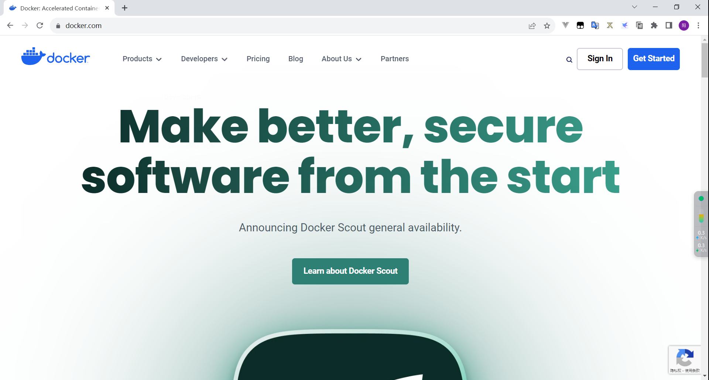
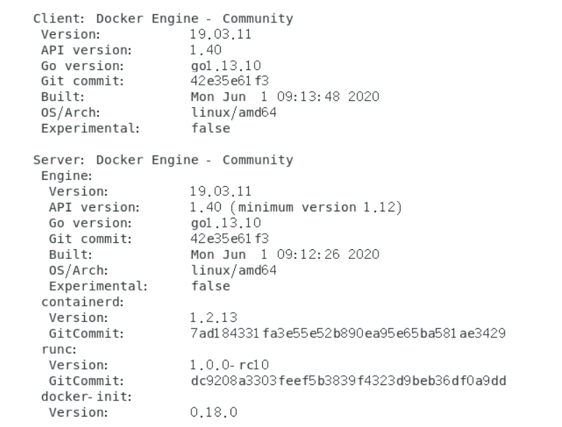
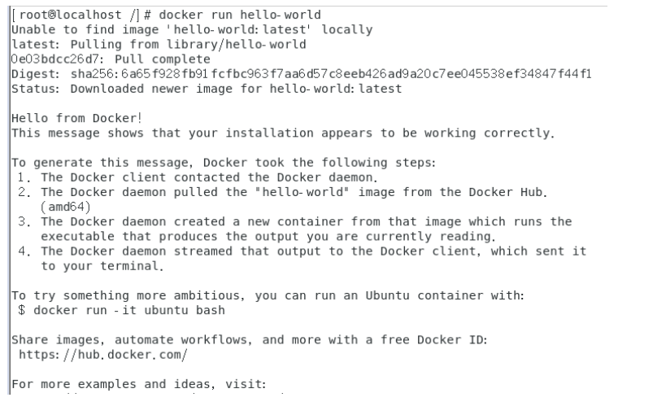
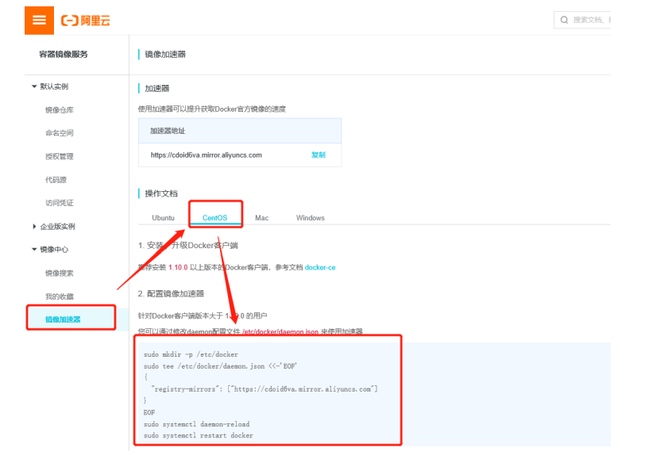
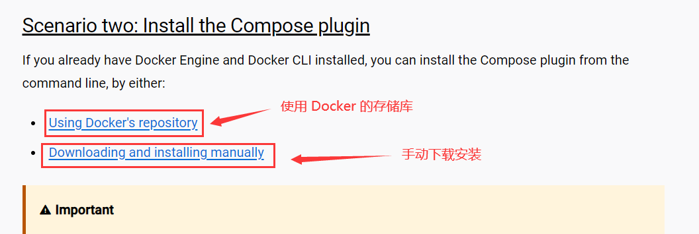

> Docker -> 虚拟化容器技术。
>
> Docker基于镜像，可以秒级启动各种容器。每一种容器都是一个完整的运行环境，容器之间互相隔离。

1. [官网地址](https://www.docker.com/)
2. [公共仓库](https://hub.docker.com/)
3. [安装文档](https://docs.docker.com/get-docker/)



#### 1. 选择要安装的平台

Docker要求CentOS系统的内核版本高于3.0

```shell
#系统内核要求3.0以上
[root@localhost ~]# uname -r #通过 uname -r 命令查看你当前的内核版本
3.10.0-1062.el7.x86_64

[Service]
Environment="HTTP_PROXY=http://127.0.0.1:7890"
Environment="HTTPS_PROXY=http://127.0.0.1:7890"
Environment="NO_PROXY=localhost,127.0.0.1"
https_proxy=http://127.0.0.1:7890
http_proxy=http://127.0.0.1:7890
#系统版本CentOS 7
[root@localhost ~]# cat /etc/os-release 
NAME="CentOS Linux"
VERSION="7 (Core)"
ID="centos"
ID_LIKE="rhel fedora"
VERSION_ID="7"
PRETTY_NAME="CentOS Linux 7 (Core)"
ANSI_COLOR="0;31"
CPE_NAME="cpe:/o:centos:centos:7"
HOME_URL="https://www.centos.org/"
BUG_REPORT_URL="https://bugs.centos.org/"

CENTOS_MANTISBT_PROJECT="CentOS-7"
CENTOS_MANTISBT_PROJECT_VERSION="7"
REDHAT_SUPPORT_PRODUCT="centos"
REDHAT_SUPPORT_PRODUCT_VERSION="7"
```

[安装文档地址](https://docs.docker.com/engine/install/centos/)

#### 2. 首先卸载已安装的Docker

> 使用**Root权限**登录 Centos。确保yum包更新到最新。

```shell
sudo yum update
```


> 如果你的操作系统没有安装过Docker , 就不需要执行卸载命令。
>
> 如果本身登录的账号是管理员root,那么后面可以选择性添加sudo，添加了也没事

```shell
# 1. 卸载旧版本
# 旧版本的 Docker 的名称是 docker或者 docker-engine. 在尝试安装新版本之前卸载任何此类旧版本， 以及相关的依赖项
sudo yum remove docker \
                  docker-client \
                  docker-client-latest \
                  docker-common \
                  docker-latest \
                  docker-latest-logrotate \
                  docker-logrotate \
                  docker-engine
                  
# 2. 安装 yum-utils包（它提供了 yum-config-manager 实用程序）并设置存储库。
sudo yum install -y yum-utils

# 3. 设置镜像仓库 方法默认是从国外的，不推荐
sudo yum-config-manager --add-repo https://download.docker.com/linux/centos/docker-ce.repo

#推荐使用国内的
sudo yum-config-manager --add-repo https://mirrors.aliyun.com/docker-ce/linux/centos/docker-ce.repo

#更新软件包索引
sudo yum makecache fast

# 4. 安装docker docker-ce 社区版 而ee是企业版
sudo yum install docker-ce docker-ce-cli containerd.io docker-buildx-plugin docker-compose-plugin# 这里我们使用社区版即可

# 5. 启动docker
sudo systemctl start docker

# 6. 使用docker version 查看是否安装成功
sudo docker version
```



```shell
# 7. 测试
sudo docker run hello-world
```



```shell
#8.查看一下下载的hello-world镜像
[root@iZuf6cg38u89lshzyuh44nZ docker]# sudo docker images
REPOSITORY    TAG       IMAGE ID       CREATED       SIZE
hello-world   latest    9c7a54a9a43c   3 weeks ago   13.3kB

```

了解：卸载docker

```shell
#1.卸载依赖
sudo yum remove docker-ce docker-ce-cli containerd.io

#2. 删除资源
sudo rm -rf /var/lib/docker
# /var/lib/docker 是docker的默认工作路径！
```

#### 3. 阿里云镜像加速

##### 1、登录阿里云找到容器服务——>镜像加速器



##### 2、配置使用

```shell
sudo mkdir -p /etc/docker
# https://pf91ydru.mirror.aliyuncs.com用自己的，每个人都有的
sudo tee /etc/docker/daemon.json <<-'EOF'
{
  "registry-mirrors": ["https://pf91ydru.mirror.aliyuncs.com"]
}
EOF
sudo systemctl daemon-reload
sudo systemctl restart docker

```

#### 4. 安装docker-compose

> Compose有多种安装方式，例如通过Shell、pip以及将Compose作为容器安装等。本书讲解通过Shell来安装的方式，其他安装方式可详见官方文档：https://docs.docker.com/compose/install/



##### 1.  要下载并安装 Compose CLI 插件，请运行：

```shell
# 此命令下载最新版本的 Docker Compose
sudo curl -L https://github.com/docker/compose/releases/download/v2.23.3/docker-compose-`uname -s`-`uname -m` -o /usr/local/bin/docker-compose
# sudo: 这是一个命令，表示以超级用户（root）权限运行后面的命令。这允许你执行可能需要管理员权限的操作。

# curl -L: curl是一个命令行工具，用于从网络上获取数据。-L选项告诉curl如果遇到HTTP重定向，就跟随重定向。

# https://github.com/docker/compose/releases/download/1.18.0/docker-compose-uname -s-uname -m``: 这是一个URL，它指示curl从哪里下载文件。uname -s和uname -m是Unix系统命令，分别用于获取操作系统的名称和机器架构。例如，如果操作系统是Linux，uname -s可能会返回Linux，而uname -m可能会返回x86_64。这些信息将用于构建下载的文件名。

# -o /usr/local/bin/docker-compose: 这是告诉curl将下载的文件保存到哪个位置。在这个例子中，它将下载的文件保存到/usr/local/bin/docker-compose。

# 总的来说，这条命令的含义是：以超级用户权限，从GitHub上下载适用于当前操作系统的Docker Compose版本，并保存到/usr/local/bin/docker-compose。
```

##### 2. 将可执行权限应用于二进制文件：

```shell
# 给docker-compose执行权限
sudo chmod +x /usr/local/bin/docker-compose
```

##### 3. 测试安装与卸载。

```shell
# 测试安装是否成功，成功的话打印从出docker-compose的版本信息
docker-compose version 
# 卸载方式
sudo rm /usr/local/bin/docker-compose
```

