>申明：本教程 GoLand 破解补丁、激活码均收集于网络，请勿商用，仅供个人学习使用，如有侵权，请联系作者删除。若条件允许，希望大家购买正版 ！
>
>**本文提供三种激活方式，MAC，Windows，Linux均可使用**
>
>PS: 本教程最新更新时间: 2026年5月22日, 网站持续更新，收藏本站防失联哟~

废话不多说，先上 `GoLand 2026.1.2` 版本破解成功的截图，如下，可以看到已经成功破解到 2099 年辣，舒服！

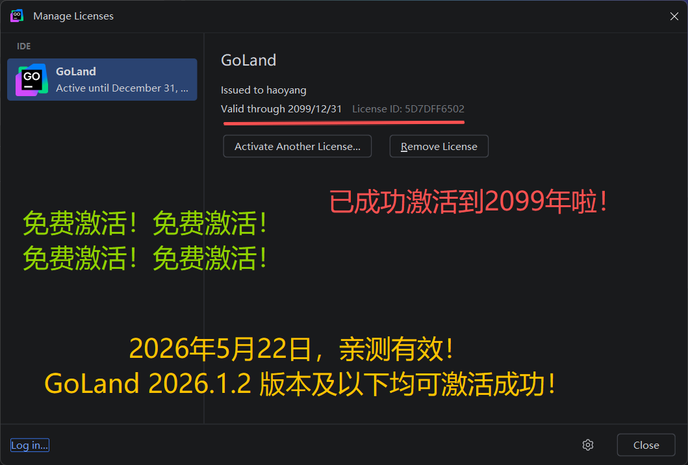

## 下载 GoLand 安装包

访问 `GoLand`官网：https://www.jetbrains.com/go/download/ ，下载 `GoLand 2026.1.2` 版本的安装包。

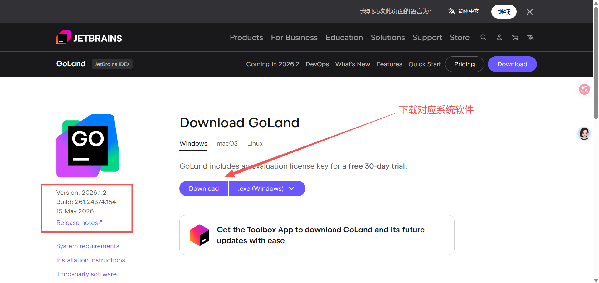

## 开始安装

下载完成后，安装步骤如下图所示 :

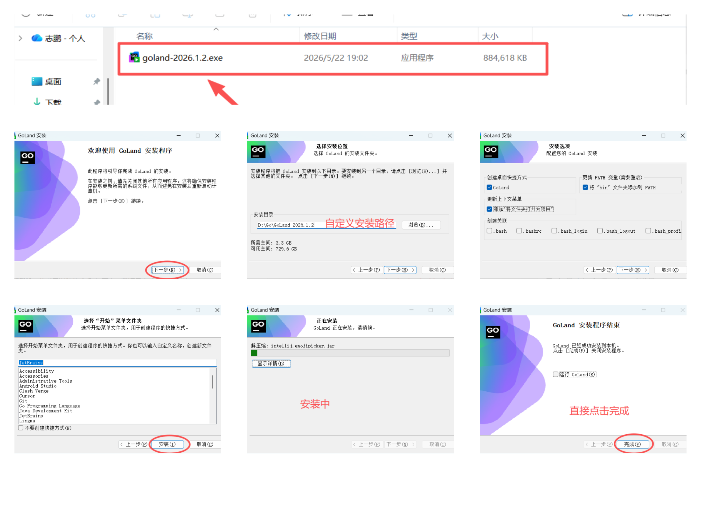

1. 双击 `.exe` 安装包开始安装 GoLand；
2. 点击**下一步**按钮；
3. 自定义 GoLand 的安装路径，这里我选择安装在了 `D:\Go\` 盘下，点击**下一步**按钮；
4. **勾选创建桌面快捷方式**，点击**下一步**按钮；
5. 点击**安装**按钮；
6. 等待安装成功...；
7. 安装成功后，**先不要勾选运行 GoLand**, 直接点击**完成**按钮，完毕弹框，准备开始进入破解步骤；

## 下载破解脚本

破解脚本我放置在了网盘中，并提供了多个备用链接，以防下载失效。

> **提示：破解脚本的网盘链接文末获取~**
>
> **提示：破解脚本的网盘链接文末获取~**
>
> **提示：破解脚本的网盘链接文末获取~**

下载成功后，是个压缩包，我这里解压到了 `E:\pojie\pojie2099` 文件夹下。注意，将它**解压到一个路径中没有 “中文”，“空格” 的位置**，一定要这么做，不然会导致破解失败！！！

解压成功后，内容如下：

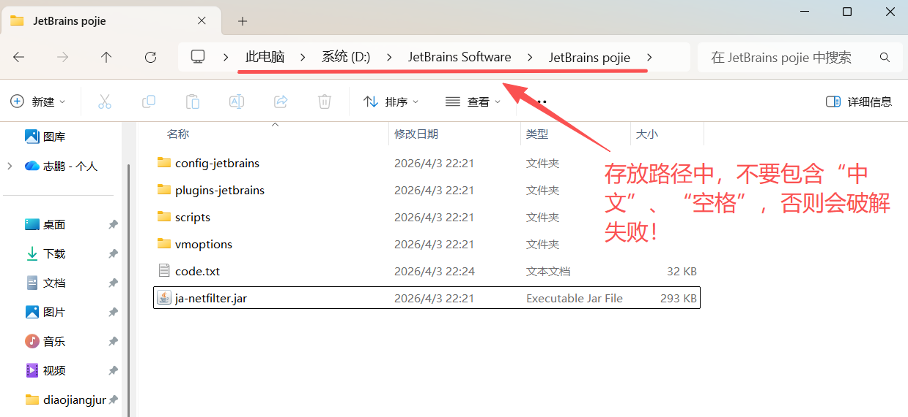

### Mac 系统

如果你是 Mac 系统用户，一定要将解压后的文件，放置到 “**应用程序**” 中，否则可能会激活失败！！

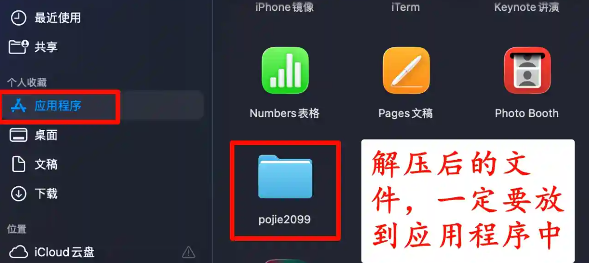

## 开始激活

### Windows 系统

进入到 `/scripts` 脚本文件夹下，对于 Windows 系统用户，鼠标右键 `install-all-users.vbs`，打开方式选择下图所示（或者双击打开也行），运行此脚本，它的作用是为当前系统所有用户执行破解：

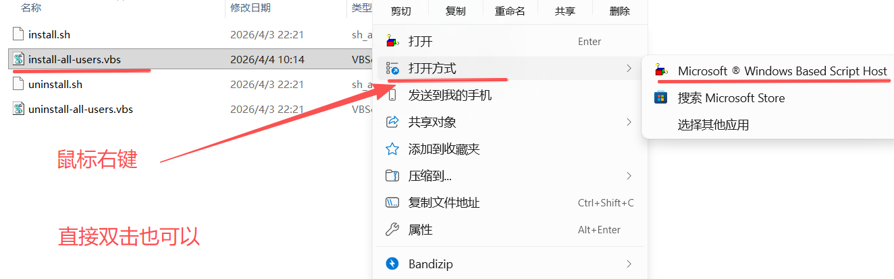

:::tip

如果出现以下问题还请

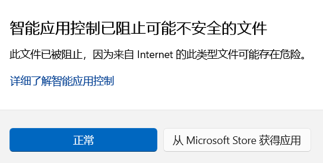

**方法一：点击"正常"按钮（推荐）**

直接点击蓝色的 **"正常"** 按钮，告诉系统这个文件是安全的，允许继续运行。

**方法二：解除文件锁定（如果方法一无效）**

如果点击"正常"后仍被阻止，需要手动解除 Windows 对文件的锁定：

1. **找到下载的 `install-all-users.vbs` 文件**
2. **右键点击文件 → 属性**
3. 在"常规"选项卡底部，勾选 **"解除锁定"**（Unblock）复选框
4. 点击 **应用 → 确定**
5. 重新双击运行安装程序

**方法三：暂时关闭智能应用控制（不推荐长期使用）**

如果上述方法都无效：

1. 打开 **设置 → 隐私和安全性 → Windows 安全中心**
2. 点击 **应用和浏览器控制**
3. 在"智能应用控制"下选择 **关闭**
4. 运行安装程序，安装完成后再重新开启

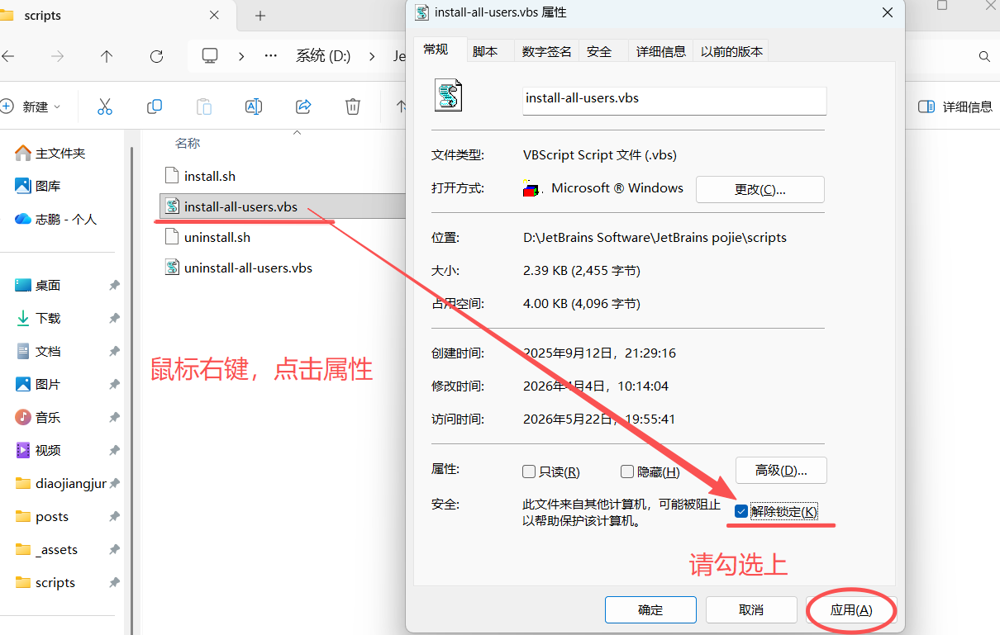

:::

执行破解脚本

> **TIP**: `uninstall-all-users.vbs` 的脚本作用是，卸载掉当前激活补丁，后续如果想卸载，可执行此脚本。

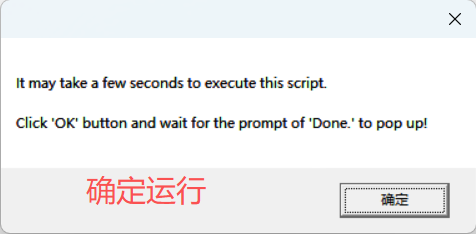

然后，点击弹框中的**确定**按钮，需要等待个 10s - 30s 时间（部分用户可能需要等待好几分钟，本人就是，所以，耐心等待一会就行，不要急~）。

**注意**:

- 如果执行脚本，提示你 “**未安装 IDE**”, 先打开一下 IDE, 让脚本识别到，再执行脚本。如果没提示，则不用管。

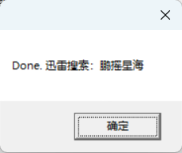

当提示上图所示的 `Done` , 则表示脚本执行成功，此时离成功只差最后一步了，继续后面的步骤。

### Mac 系统

对于 Mac 系统用户，进入解压后的文件夹，右键在 `/scripts` 目录下打开一个终端窗口，操作如下：

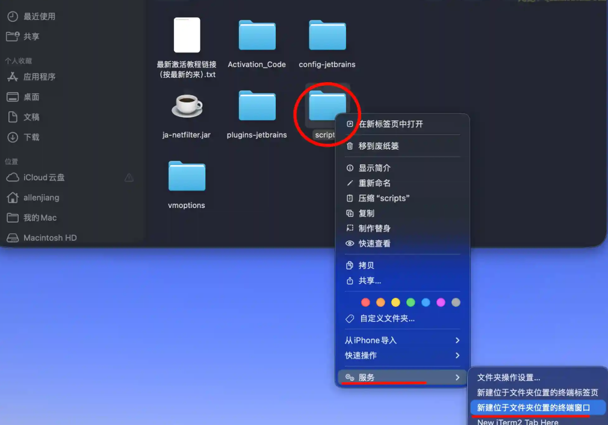

在终端中，输入命令 `sh install.sh` ，看到提示 “**成功**”，则表示脚本执行成功，此时离成功只差最后一步了，继续后面的步骤。

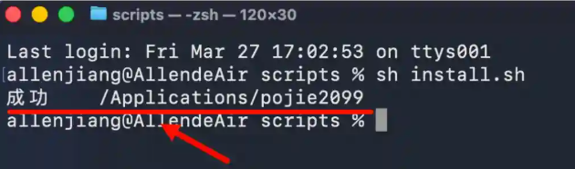

## 启动 IDE

双击桌面的 `IDEA` 快捷启动图标，来打开 `IDEA` 。注意，`2024.2` 之后的版本，若初次安装，会提示选择所在区域，如下图所示，如果选择了 `China Mainland`，会在激活的时候反复跳出激活码并提示激活码无效，原因是新版本会拦截 `.cn` 域名，导致激活许可被吊销，所以，**千万不要指定区域！！**

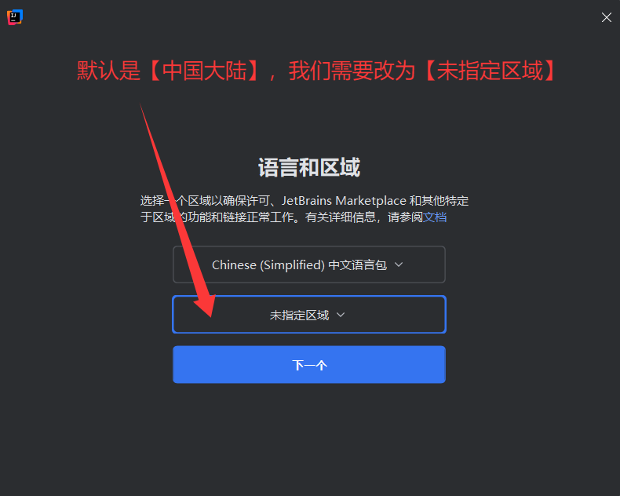

如果是老用户，则可以在设置菜单中来更改（一定要更改）：

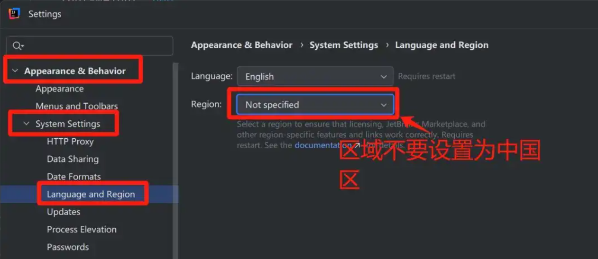

点击 `Activate License` 按钮，开始激活 GoLand，如下图：

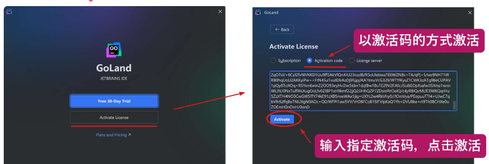

勾选 `Activation code` ，以激活码的方式来激活，输入指定激活码，点击 `Activate` 激活按钮即可激活成功啦, **注意，部分小伙伴会提示 `Key is invalid`, 不妨重启一下电脑再输入激活试试**，基本上都能成功。

## 获取对应激活码

对应激活码从哪获取呢？进入到 `/Activation_Code` 目录下（Mac 系统的后续步骤也是一样的，这里就不单独截图了）：

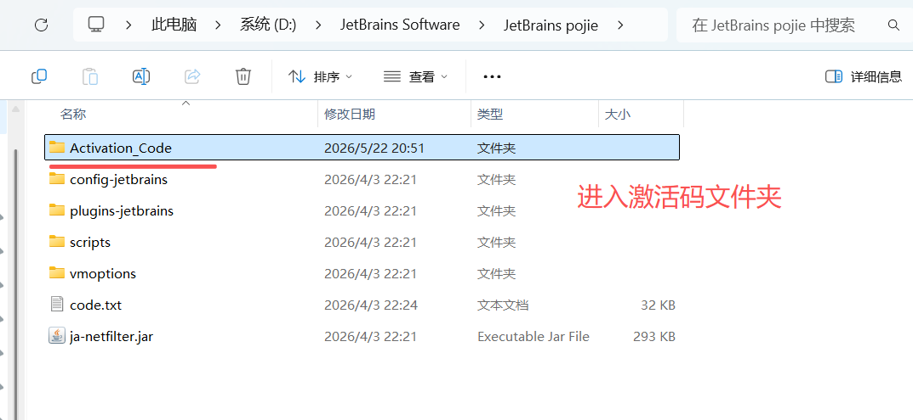

选择你想要激活的产品对应的 `txt` 文件，比如 GoLand, 就打开 `GoLand激活码.txt` 文件：

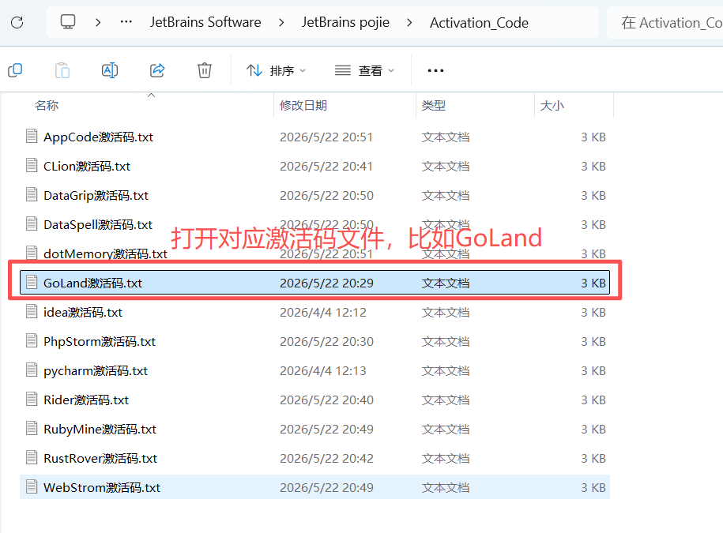

按住 `Ctrl + A` 全选所有内容，再按 `Ctrl + C` 进行复制，切记不要漏掉任何一个字母，否则会激活失败！！

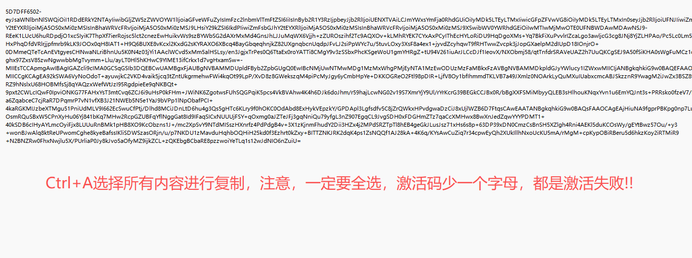

## 注意！！

激活成功后，不要移动、重命名、删除用来激活的文件夹，激活会绑定补丁所在路径，一旦发生了变动，都会导致激活生效，需要重新再次激活！！！

## 激活脚本下载地址

夸克网盘：https://pan.quark.cn/s/634e7ab54e51

百度网盘：https://pan.baidu.com/s/1L6OsEc2vG-Elzpc4_mns_A?pwd=pyxh

下载地址：训雷口令-----> 鹏摇星海
