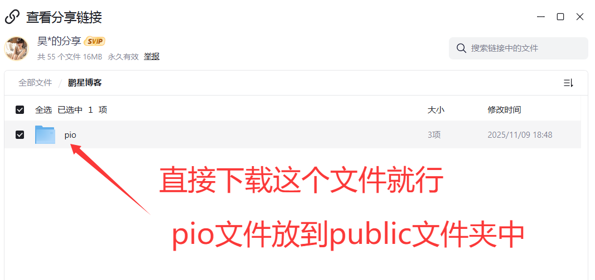

## 概述

`pioConfig.ts` 文件用于配置网站中的看板娘功能，支持 Spine 和 Live2D 两种类型的看板娘模型。

## 配置类型

### 1. Spine 看板娘配置

Spine 是一种2D骨骼动画技术，适合制作轻量级的看板娘动画。

#### 基本配置结构

```typescript
interface SpineModelConfig {
  enable: boolean;                    // 是否启用
  model: {
    path: string;                    // 模型文件路径
    scale: number;                   // 缩放比例
    x: number;                       // X轴偏移
    y: number;                       // Y轴偏移
  };
  position: {
    corner: string;                  // 显示位置
    offsetX: number;                 // X轴偏移
    offsetY: number;                 // Y轴偏移
  };
  size: {
    width: number;                   // 容器宽度
    height: number;                  // 容器高度
  };
  interactive: {
    enabled: boolean;                // 是否启用交互
    clickAnimations: string[];       // 点击动画列表
    clickMessages: string[];         // 点击消息列表
    messageDisplayTime: number;      // 消息显示时间
    idleAnimations: string[];        // 待机动画列表
    idleInterval: number;            // 待机动画间隔
  };
  responsive: {
    hideOnMobile: boolean;           // 移动端是否隐藏
    mobileBreakpoint: number;        // 移动端断点
  };
  zIndex: number;                    // 层级
  opacity: number;                   // 透明度
}
```

#### 配置示例

```typescript
export const spineModelConfig: SpineModelConfig = {
  enable: true,
  model: {
    path: "/pio/models/spine/firefly/1310.json",
    scale: 1.0,
    x: 0,
    y: 0,
  },
  position: {
    corner: "bottom-left",
    offsetX: 0,
    offsetY: 0,
  },
  size: {
    width: 250,
    height: 280,
  },
  interactive: {
    enabled: true,
    clickAnimations: [
      "emoji_0", "emoji_1", "emoji_2", 
      "emoji_3", "emoji_4", "emoji_5", "emoji_6"
    ],
    clickMessages: [
      "你好呀！我是流萤~",
      "今天也要加油哦！✨",
      "想要一起去看星空吗？🌟"
    ],
    messageDisplayTime: 3000,
    idleAnimations: ["idle", "emoji_0", "emoji_1"],
    idleInterval: 8000,
  },
  responsive: {
    hideOnMobile: true,
    mobileBreakpoint: 768,
  },
  zIndex: 1000,
  opacity: 1.0,
};
```

### 2. Live2D 看板娘配置

Live2D 是一种更高级的2D角色动画技术，提供更丰富的表情和动作。

#### 基本配置结构

```typescript
interface Live2DModelConfig {
  enable: boolean;                    // 是否启用
  model: {
    path: string;                    // 模型文件路径
  };
  position: {
    corner: string;                  // 显示位置
    offsetX: number;                 // X轴偏移
    offsetY: number;                 // Y轴偏移
  };
  size: {
    width: number;                   // 容器宽度
    height: number;                  // 容器高度
  };
  interactive: {
    enabled: boolean;                // 是否启用交互
    clickMessages: string[];         // 点击消息列表
    messageDisplayTime: number;      // 消息显示时间
  };
  responsive: {
    hideOnMobile: boolean;           // 移动端是否隐藏
    mobileBreakpoint: number;        // 移动端断点
  };
}
```

#### 配置示例

```typescript
export const live2dModelConfig: Live2DModelConfig = {
  enable: false,
  model: {
    path: "/pio/models/live2d/snow_miku/model.json",
  },
  position: {
    corner: "bottom-right",
    offsetX: 0,
    offsetY: 0,
  },
  size: {
    width: 230,
    height: 280,
  },
  interactive: {
    enabled: true,
    clickMessages: [
      "你好！我是Miku~",
      "有什么需要帮助的吗？",
      "今天天气真不错呢！"
    ],
    messageDisplayTime: 3000,
  },
  responsive: {
    hideOnMobile: true,
    mobileBreakpoint: 768,
  },
};
```

## 配置选项详解

### 位置配置 (position)

#### 显示位置 (corner)

| 值               | 说明   |
| :--------------- | :----- |
| `"bottom-left"`  | 左下角 |
| `"bottom-right"` | 右下角 |
| `"top-left"`     | 左上角 |
| `"top-right"`    | 右上角 |

#### 偏移设置

```typescript
position: {
  corner: "bottom-right",
  offsetX: 20,  // 距离右边缘20px
  offsetY: 20,  // 距离底部20px
}
```

### 尺寸配置 (size)

```typescript
size: {
  width: 250,   // 容器宽度（像素）
  height: 280,  // 容器高度（像素）
}
```

**注意事项：**

- 尺寸过大会影响页面性能
- 建议根据模型实际大小调整
- 移动端会自动缩放

### 交互配置 (interactive)

#### 点击动画 (clickAnimations)

```typescript
clickAnimations: [
  "emoji_0",    // 动画名称1
  "emoji_1",    // 动画名称2
  "emoji_2"     // 动画名称3
]
```

**说明：**

- 动画名称必须与模型文件中的动画名称一致
- 点击时会随机播放其中一个动画
- 可以添加多个动画增加趣味性

#### 点击消息 (clickMessages)

```typescript
clickMessages: [
  "你好呀！我是流萤~",
  "今天也要加油哦！✨",
  "想要一起去看星空吗？🌟"
]
```

**说明：**

- 点击时会随机显示一条消息
- 支持emoji表情
- 消息会显示在模型旁边

#### 待机动画 (idleAnimations)

```typescript
idleAnimations: [
  "idle",      // 基础待机动画
  "emoji_0",   // 其他待机动画
  "emoji_1"
]
```

**说明：**

- 模型空闲时会循环播放这些动画
- 建议包含一个基础的idle动画
- 可以添加多个动画增加变化

### 响应式配置 (responsive)

```typescript
responsive: {
  hideOnMobile: true,        // 移动端隐藏
  mobileBreakpoint: 768,     // 移动端断点（像素）
}
```

**断点说明：**

- 屏幕宽度小于断点值时视为移动端
- 移动端可以隐藏看板娘以节省空间
- 建议断点设置为768px

## 模型文件管理

### 文件结构

```js title="文件结构"
public/pio/models/
├── spine/                    # Spine模型目录
│   └── haoyang/             # 具体模型目录
│       ├── 1310.json        # 模型配置文件
│       ├── 1310.atlas       # 图集文件
│       └── 1310.png         # 纹理图片
└── live2d/                  # Live2D模型目录
    └── snow_miku/           # 具体模型目录
        ├── model.json       # 模型配置文件
        └── textures/        # 纹理目录
            └── *.png        # 纹理图片
```

### 模型文件获取

#### Spine 模型

1. 从官方商店购买或下载免费模型
2. 导出为JSON格式
3. 确保包含.atlas和.png文件

#### Live2D 模型

1. 从官方商店购买或下载免费模型
2. 确保包含model.json文件
3. 整理纹理文件到textures目录

## 实现代码

### 复制看板娘文件

夸克网盘：https://pan.quark.cn/s/c9afe5235080



### 新建 pioConfig.ts 文件

> 如果没有把 `src/config.ts` 模块化，那么不需要新建 `pioConfig.ts` 文件，直接把 `spineModelConfig` 或`live2dModelConfig` 写入到 `config.ts` 中就行

```js title="Spine 看板娘配置 和 Live2D 看板娘配置"
import type { SpineModelConfig, Live2DModelConfig } from "../types/config";

// Spine 看板娘配置
export const spineModelConfig: SpineModelConfig = {
  enable: true, // 启用 Spine 看板娘
  model: {
    // Spine模型文件路径
    path: "/pio/models/spine/haoyang/1310.json",
    scale: 1.0, // 模型缩放比例
    x: 0, // X轴偏移
    y: 0, // Y轴偏移
  },
  position: {
    // 显示位置 bottom-left，bottom-right，top-left，top-right，注意：在右下角可能会挡住返回顶部按钮
    corner: "bottom-left",
    offsetX: 0, // 距离右边缘0px
    offsetY: 0, // 距离底部0px
  },
  size: {
    width: 135, // 容器宽度
    height: 165, // 容器高度
  },
  interactive: {
    enabled: true, // 启用交互功能
    clickAnimations: [
      "emoji_0",
      "emoji_1",
      "emoji_2",
      "emoji_3",
      "emoji_4",
      "emoji_5",
      "emoji_6",
    ], // 点击时随机播放的动画列表
    clickMessages: [
      "你好呀！我是鹏星~",
      "今天也要加油哦！✨",
      "想要一起去看星空吗？🌟",
      "记得要好好休息呢~",
      "有什么想对我说的吗？💫",
      "让我们一起探索未知的世界吧！🚀",
      "每一颗星星都有自己的故事~⭐",
      "希望能带给你温暖和快乐！💖",
    ], // 点击时随机显示的文字消息
    messageDisplayTime: 3000, // 文字显示时间（毫秒）
    idleAnimations: ["idle", "emoji_0", "emoji_1", "emoji_3", "emoji_4"], // 待机动画列表
    idleInterval: 8000, // 待机动画切换间隔（8秒）
  },
  responsive: {
    hideOnMobile: true, // 在移动端隐藏
    mobileBreakpoint: 768, // 移动端断点
  },
  zIndex: 1000, // 层级
  opacity: 1.0, // 完全不透明
};

// Live2D 看板娘配置
export const live2dModelConfig: Live2DModelConfig = {
  enable: false, // 启用 Live2D 看板娘
  model: {
    // Live2D模型文件路径
    path: "/pio/models/live2d/snow_miku/model.json",
    // path: "/pio/models/live2d/illyasviel/illyasviel.model.json",
  },
  position: {
    // 显示位置 bottom-left，bottom-right，top-left，top-right，注意：在右下角可能会挡住返回顶部按钮
    corner: "bottom-left", // 显示位置
    offsetX: 0, // 距离边缘20px
    offsetY: 0, // 距离底部20px
  },
  size: {
    width: 135, // 容器宽度
    height: 165, // 容器高度
  },
  interactive: {
    enabled: true, // 启用交互功能
    // motions 和 expressions 将从模型 JSON 文件中自动读取
    clickMessages: [
      "你好！我是鹏星~",
      "有什么需要帮助的吗？",
      "今天天气真不错呢！",
      "要不要一起玩游戏？",
      "记得按时休息哦！",
    ], // 点击时随机显示的文字消息
    messageDisplayTime: 3000, // 文字显示时间（毫秒）
  },
  responsive: {
    hideOnMobile: true, // 在移动端隐藏
    mobileBreakpoint: 768, // 移动端断点
  },
};
```

### 新增src\types\config.ts看板娘类别

```js title="Spine 看板娘配置和Live2D 看板娘配置"
// Spine 看板娘配置
export type SpineModelConfig = {
	enable: boolean; // 是否启用 Spine 看板娘
	model: {
	  path: string; // 模型文件路径 (.json)
	  scale?: number; // 模型缩放比例，默认1.0
	  x?: number; // X轴偏移，默认0
	  y?: number; // Y轴偏移，默认0
	};
	position: {
	  corner: "bottom-left" | "bottom-right" | "top-left" | "top-right"; // 显示位置
	  offsetX?: number; // 水平偏移量，默认20px
	  offsetY?: number; // 垂直偏移量，默认20px
	};
	size: {
	  width?: number; // 容器宽度，默认280px
	  height?: number; // 容器高度，默认400px
	};
	interactive?: {
	  enabled?: boolean; // 是否启用交互功能，默认true
	  clickAnimations?: string[]; // 点击时随机播放的动画列表
	  clickMessages?: string[]; // 点击时随机显示的文字消息
	  messageDisplayTime?: number; // 文字显示时间（毫秒），默认3000
	  idleAnimations?: string[]; // 待机动画列表
	  idleInterval?: number; // 待机动画切换间隔（毫秒），默认10000
	};
	responsive?: {
	  hideOnMobile?: boolean; // 是否在移动端隐藏，默认false
	  mobileBreakpoint?: number; // 移动端断点，默认768px
	};
	zIndex?: number; // 层级，默认1000
	opacity?: number; // 透明度，0-1，默认1.0
  };
  
  // Live2D 看板娘配置
  export type Live2DModelConfig = {
	enable: boolean; // 是否启用 Live2D 看板娘
	model: {
	  path: string; // 模型文件夹路径或model3.json文件路径
	};
	position?: {
	  corner?: "bottom-left" | "bottom-right" | "top-left" | "top-right"; // 显示位置，默认bottom-right
	  offsetX?: number; // 水平偏移量，默认20px
	  offsetY?: number; // 垂直偏移量，默认20px
	};
	size?: {
	  width?: number; // 容器宽度，默认280px
	  height?: number; // 容器高度，默认250px
	};
	interactive?: {
	  enabled?: boolean; // 是否启用交互功能，默认true
	  // motions 和 expressions 将从模型 JSON 文件中自动读取
	  clickMessages?: string[]; // 点击时随机显示的文字消息
	  messageDisplayTime?: number; // 文字显示时间（毫秒），默认3000
	};
	responsive?: {
	  hideOnMobile?: boolean; // 是否在移动端隐藏，默认false
	  mobileBreakpoint?: number; // 移动端断点，默认768px
	};
  };
  
```

### 新建src\components\widget\PioMessageBox.astro

```js title="src\components\widget\PioMessageBox.astro"
---
// 消息框公共组件
// 用于Live2D和Spine模型的消息显示
---

<script>
    // 全局变量，跟踪当前显示的消息容器和隐藏定时器
    let currentMessageContainer: HTMLDivElement | null = null;
    let hideMessageTimer: number | null = null;
  
    // 消息显示函数
    export function showMessage(message: string, options: { containerId?: string; displayTime?: number } = {}) {
      // 防止空消息或重复调用
      if (!message || !message.trim()) {
        return;
      }
  
      // 立即清除之前的消息
      if (currentMessageContainer) {
        if (hideMessageTimer !== null) {
          clearTimeout(hideMessageTimer);
        }
        if (currentMessageContainer.parentNode) {
          currentMessageContainer.parentNode.removeChild(currentMessageContainer);
        }
        currentMessageContainer = null;
      }
  
      // 确保DOM中没有残留的消息容器
      const existingMessages = document.querySelectorAll(
        ".model-message-container"
      );
      existingMessages.forEach((msg) => {
        if (msg.parentNode) {
          msg.parentNode.removeChild(msg);
        }
      });
  
      // 检测暗色主题
      const isDarkMode =
        document.documentElement.classList.contains("dark") ||
        window.matchMedia("(prefers-color-scheme: dark)").matches;
  
      // 创建消息容器
      const messageContainer = document.createElement("div");
      messageContainer.className = "model-message-container";
  
      // 创建消息元素
      const messageEl = document.createElement("div");
      messageEl.className = "model-message";
      messageEl.textContent = message;
  
      // 创建箭头元素
      const arrowEl = document.createElement("div");
      arrowEl.className = "model-message-arrow";
  
      // 设置容器样式
      Object.assign(messageContainer.style, {
        position: "fixed",
        zIndex: "1001",
        pointerEvents: "none",
        opacity: "0",
        transform: "translateY(15px) translateX(-50%) scale(0.9)",
        transition: "all 0.4s cubic-bezier(0.34, 1.56, 0.64, 1)",
      });
  
      // 设置消息框美化样式（支持暗色主题）
      const messageStyles = {
        position: "relative",
        background: isDarkMode
          ? "linear-gradient(135deg, rgba(45, 55, 72, 0.95), rgba(26, 32, 44, 0.9))"
          : "linear-gradient(135deg, rgba(255, 255, 255, 0.95), rgba(240, 248, 255, 0.9))",
        color: isDarkMode ? "#e2e8f0" : "#2c3e50",
        padding: "12px 16px",
        borderRadius: "16px",
        fontSize: "14px",
        fontWeight: "500",
        fontFamily:
          '-apple-system, BlinkMacSystemFont, "Segoe UI", Roboto, sans-serif',
        maxWidth: "240px",
        minWidth: "100px",
        wordWrap: "break-word",
        textAlign: "center",
        whiteSpace: "pre-wrap",
        boxShadow: isDarkMode
          ? "0 8px 32px rgba(0, 0, 0, 0.3), 0 2px 8px rgba(0, 0, 0, 0.2)"
          : "0 8px 32px rgba(0, 0, 0, 0.12), 0 2px 8px rgba(0, 0, 0, 0.08)",
        border: isDarkMode
          ? "1px solid rgba(255, 255, 255, 0.1)"
          : "1px solid rgba(255, 255, 255, 0.6)",
        backdropFilter: "blur(12px)",
        letterSpacing: "0.3px",
        lineHeight: "1.4",
      };
      Object.assign(messageEl.style, messageStyles);
  
      // 设置箭头样式（居中显示）
      Object.assign(arrowEl.style, {
        position: "absolute",
        top: "100%",
        left: "50%",
        transform: "translateX(-50%)", // 箭头居中
        width: "0",
        height: "0",
        borderLeft: "8px solid transparent",
        borderRight: "8px solid transparent",
        borderTop: isDarkMode
          ? "8px solid rgba(45, 55, 72, 0.95)"
          : "8px solid rgba(255, 255, 255, 0.95)",
        filter: "drop-shadow(0 2px 4px rgba(0, 0, 0, 0.1))",
      });
  
      // 组装消息框元素
      messageEl.appendChild(arrowEl);
      messageContainer.appendChild(messageEl);
  
      // 添加到页面并保存引用
      document.body.appendChild(messageContainer);
      currentMessageContainer = messageContainer;
  
      // 将消息显示在模型头顶居中
      const container = document.getElementById(options.containerId || "model-container");
      if (container) {
        const rect = container.getBoundingClientRect();
  
        // 消息框居中显示在模型上方
        const containerCenterX = rect.left + rect.width / 2;
  
        // 使用估算的消息框尺寸进行初步定位
        const estimatedMessageWidth = 240; // 使用maxWidth作为估算
        const estimatedMessageHeight = 60; // 估算高度
        const screenPadding = 10; // 距离屏幕边缘的最小距离
  
        // 计算消息框的实际位置（考虑translateX(-50%)的影响）
        let messageX = containerCenterX;
        let messageY = rect.top - estimatedMessageHeight - 25; // 距离模型顶部25px
  
        // 屏幕边界检查 - 水平方向
        const minX = screenPadding + estimatedMessageWidth / 2; // 考虑translateX(-50%)
        const maxX =
          window.innerWidth - screenPadding - estimatedMessageWidth / 2;
  
        if (messageX < minX) {
          messageX = minX;
        } else if (messageX > maxX) {
          messageX = maxX;
        }
  
        // 屏幕边界检查 - 垂直方向
        const minY = screenPadding;
        const maxY = window.innerHeight - estimatedMessageHeight - screenPadding;
  
        if (messageY < minY) {
          // 如果上方空间不够，显示在模型下方
          messageY = rect.bottom + 25;
          // 调整箭头方向（显示在下方）
          arrowEl.style.top = "0";
          arrowEl.style.bottom = "auto";
          arrowEl.style.borderTop = "none";
          arrowEl.style.borderBottom = isDarkMode
            ? "8px solid rgba(45, 55, 72, 0.95)"
            : "8px solid rgba(255, 255, 255, 0.95)";
        } else if (messageY > maxY) {
          messageY = maxY;
        }
  
        // 设置位置
        messageContainer.style.left = messageX + "px";
        messageContainer.style.top = messageY + "px";
  
        // 在消息框渲染后，进行精确的边界调整
        setTimeout(() => {
          const actualMessageRect = messageContainer.getBoundingClientRect();
          const actualWidth = actualMessageRect.width;
          const actualHeight = actualMessageRect.height;
  
          // 重新计算水平位置
          let adjustedX = containerCenterX;
          const actualMinX = screenPadding + actualWidth / 2;
          const actualMaxX = window.innerWidth - screenPadding - actualWidth / 2;
  
          if (adjustedX < actualMinX) {
            adjustedX = actualMinX;
          } else if (adjustedX > actualMaxX) {
            adjustedX = actualMaxX;
          }
  
          // 重新计算垂直位置
          let adjustedY = rect.top - actualHeight - 25;
          const actualMinY = screenPadding;
          const actualMaxY = window.innerHeight - actualHeight - screenPadding;
          let isAboveModel = true; // 标记消息框是否在模型上方
  
          if (adjustedY < actualMinY) {
            adjustedY = rect.bottom + 25;
            isAboveModel = false;
          } else if (adjustedY > actualMaxY) {
            adjustedY = actualMaxY;
          }
  
          // 计算箭头应该指向的位置（模型中心）
          const modelCenterX = rect.left + rect.width / 2;
          const messageCenterX = adjustedX; // 消息框中心位置
          const arrowOffsetX = modelCenterX - messageCenterX; // 箭头相对于消息框中心的偏移
  
          // 限制箭头偏移范围，避免超出消息框边界
          const maxOffset = actualWidth / 2 - 20; // 留出20px边距
          const clampedOffsetX = Math.max(
            -maxOffset,
            Math.min(maxOffset, arrowOffsetX)
          );
  
          // 根据最终位置调整箭头方向和位置
          if (isAboveModel) {
            // 消息框在模型上方，箭头向下
            Object.assign(arrowEl.style, {
              position: "absolute",
              top: "100%",
              left: "50%",
              bottom: "auto",
              transform: `translateX(calc(-50% + ${clampedOffsetX}px))`,
              width: "0",
              height: "0",
              borderLeft: "8px solid transparent",
              borderRight: "8px solid transparent",
              borderTop: isDarkMode
                ? "8px solid rgba(45, 55, 72, 0.95)"
                : "8px solid rgba(255, 255, 255, 0.95)",
              borderBottom: "none",
              filter: "drop-shadow(0 2px 4px rgba(0, 0, 0, 0.1))",
            });
          } else {
            // 消息框在模型下方，箭头向上
            Object.assign(arrowEl.style, {
              position: "absolute",
              top: "0",
              left: "50%",
              bottom: "auto",
              transform: `translateX(calc(-50% + ${clampedOffsetX}px))`,
              width: "0",
              height: "0",
              borderLeft: "8px solid transparent",
              borderRight: "8px solid transparent",
              borderTop: "none",
              borderBottom: isDarkMode
                ? "8px solid rgba(45, 55, 72, 0.95)"
                : "8px solid rgba(255, 255, 255, 0.95)",
              filter: "drop-shadow(0 2px 4px rgba(0, 0, 0, 0.1))",
            });
          }
  
          // 应用调整后的位置
          messageContainer.style.left = adjustedX + "px";
          messageContainer.style.top = adjustedY + "px";
        }, 50); // 增加延迟确保消息框完全渲染
      }
  
      // 显示动画
      setTimeout(() => {
        messageContainer.style.opacity = "1";
        messageContainer.style.transform =
          "translateY(0) translateX(-50%) scale(1)";
      }, 100); // 延迟到边界调整完成后
  
      // 自动隐藏
      const displayTime = options.displayTime || 3000;
      hideMessageTimer = window.setTimeout(() => {
        messageContainer.style.opacity = "0";
        messageContainer.style.transform =
          "translateY(-15px) translateX(-50%) scale(0.95)";
        setTimeout(() => {
          if (messageContainer.parentNode) {
            messageContainer.parentNode.removeChild(messageContainer);
          }
          // 清除引用
          if (currentMessageContainer === messageContainer) {
            currentMessageContainer = null;
          }
        }, 400);
      }, displayTime);
    }
  
    // 清理消息函数
    export function clearMessage() {
      if (currentMessageContainer) {
        if (hideMessageTimer !== null) {
          clearTimeout(hideMessageTimer);
        }
        if (currentMessageContainer.parentNode) {
          currentMessageContainer.parentNode.removeChild(currentMessageContainer);
        }
        currentMessageContainer = null;
      }
  
      // 清理所有消息容器
      const existingMessages = document.querySelectorAll(
        ".model-message-container"
      );
      existingMessages.forEach((msg) => {
        if (msg.parentNode) {
          msg.parentNode.removeChild(msg);
        }
      });
    }
  
    // 将函数暴露到全局作用域
    (window as any).showModelMessage = showMessage;
    (window as any).clearModelMessage = clearMessage;
  </script>
```

### 新建src\components\widget\Live2DWidget.astro

```js title="src\components\widget\Live2DWidget.astro"
---
import type { Live2DModelConfig } from "@/types/config";
import MessageBox from "./PioMessageBox.astro";
import { url } from "@/utils/url-utils";

interface Props {
  config: Live2DModelConfig;
}

const { config } = Astro.props;

// 获取位置和尺寸配置
const position = config.position || {
  corner: "bottom-right" as const,
  offsetX: 20,
  offsetY: 20,
};
const size = config.size || { width: 280, height: 250 };
---

<div
  id="live2d-widget"
  class="live2d-widget"
  style={` 
    width: ${size.width}px;
    height: ${size.height}px;
    ${position.corner?.includes("right") ? "right" : "left"}: ${position.offsetX}px;
    ${position.corner?.includes("top") ? "top" : "bottom"}: ${position.offsetY}px;
  `}
>
  <canvas id="live2d-canvas" width={size.width} height={size.height}></canvas>
</div>

<!-- 引入消息框组件 -->
<MessageBox />

<script define:vars={{ config, modelPath: url(config.model.path), sdkPath: url("/pio/static/live2d-sdk/live2d.min.js") }}>
  let modelData = null;
  let motionGroups = {};
  let hitAreas = {};
  let currentMotionGroup = "idle";
  let currentMotionIndex = 0;

  // Use loadlive2d function from the working project
  function initLive2D() {
    if (!window.loadlive2d) {
      console.error("loadlive2d function not available");
      return;
    }

    if (!config.model || !config.model.path) {
      console.error("No model path configured");
      return;
    }

    const modelPath = modelPath;

    // Load model data first to get motion groups and hit areas
    fetch(modelPath)
      .then((response) => response.json())
      .then((data) => {
        modelData = data;
        motionGroups = data.motions || {};
        hitAreas = data.hit_areas_custom || data.hit_areas || {};

        console.log("Loaded model data:", {
          motionGroups: Object.keys(motionGroups),
          hitAreas: Object.keys(hitAreas),
        });

        // Load the model using loadlive2d
        window.loadlive2d("live2d-canvas", modelPath);

        // Setup interactions after a delay to ensure model is loaded
        setTimeout(() => {
          setupInteractions();
        }, 2000);
      })
      .catch((error) => {
        console.error("Failed to load model data:", error);
      });
  }

  // Setup click interactions and drag functionality
  function setupInteractions() {
    const canvas = document.getElementById("live2d-canvas");
    const container = document.getElementById("live2d-widget");
    if (!canvas || !container) return;

    canvas.addEventListener("click", handleClick);

    // 添加拖拽功能
    let isDragging = false;
    let dragStart = { x: 0, y: 0 };
    let containerStart = { x: 0, y: 0 };

    // 鼠标事件
    container.addEventListener("mousedown", (e) => {
      if (e.button !== 0) return; // 只响应左键
      isDragging = true;
      dragStart = { x: e.clientX, y: e.clientY };

      const rect = container.getBoundingClientRect();
      containerStart = { x: rect.left, y: rect.top };

      container.style.cursor = "grabbing";
      e.preventDefault();
    });

    document.addEventListener("mousemove", (e) => {
      if (!isDragging) return;

      const deltaX = e.clientX - dragStart.x;
      const deltaY = e.clientY - dragStart.y;

      const newX = containerStart.x + deltaX;
      const newY = containerStart.y + deltaY;

      // 边界检查
      const maxX = window.innerWidth - container.offsetWidth;
      const maxY = window.innerHeight - container.offsetHeight;

      const clampedX = Math.max(0, Math.min(newX, maxX));
      const clampedY = Math.max(0, Math.min(newY, maxY));

      container.style.left = clampedX + "px";
      container.style.right = "auto";
      container.style.top = clampedY + "px";
      container.style.bottom = "auto";
    });

    document.addEventListener("mouseup", () => {
      if (isDragging) {
        isDragging = false;
        container.style.cursor = "grab";
      }
    });

    // 触摸事件（移动端支持）
    container.addEventListener("touchstart", (e) => {
      if (e.touches.length !== 1) return;
      isDragging = true;
      const touch = e.touches[0];
      dragStart = { x: touch.clientX, y: touch.clientY };

      const rect = container.getBoundingClientRect();
      containerStart = { x: rect.left, y: rect.top };

      e.preventDefault();
    });

    document.addEventListener("touchmove", (e) => {
      if (!isDragging || e.touches.length !== 1) return;

      const touch = e.touches[0];
      const deltaX = touch.clientX - dragStart.x;
      const deltaY = touch.clientY - dragStart.y;

      const newX = containerStart.x + deltaX;
      const newY = containerStart.y + deltaY;

      // 边界检查
      const maxX = window.innerWidth - container.offsetWidth;
      const maxY = window.innerHeight - container.offsetHeight;

      const clampedX = Math.max(0, Math.min(newX, maxX));
      const clampedY = Math.max(0, Math.min(newY, maxY));

      container.style.left = clampedX + "px";
      container.style.right = "auto";
      container.style.top = clampedY + "px";
      container.style.bottom = "auto";

      e.preventDefault();
    });

    document.addEventListener("touchend", () => {
      isDragging = false;
    });

    // 设置初始光标样式
    container.style.cursor = "grab";

    // 窗口大小变化时重新检查边界
    window.addEventListener("resize", () => {
      const rect = container.getBoundingClientRect();
      const maxX = window.innerWidth - container.offsetWidth;
      const maxY = window.innerHeight - container.offsetHeight;

      if (rect.left > maxX) {
        container.style.left = maxX + "px";
        container.style.right = "auto";
      }
      if (rect.top > maxY) {
        container.style.top = maxY + "px";
        container.style.bottom = "auto";
      }
    });

    console.log("Live2D interactions and drag functionality setup complete");
  }

  // Handle click events
  function handleClick(event) {
    if (!motionGroups || Object.keys(motionGroups).length === 0) {
      console.log("No motion groups available");
      return;
    }

    const rect = event.target.getBoundingClientRect();
    const x = event.clientX - rect.left;
    const y = event.clientY - rect.top;

    // Convert to normalized coordinates
    const normalizedX = (x / rect.width) * 2 - 1;
    const normalizedY = -((y / rect.height) * 2 - 1);

    console.log("Click at:", { x: normalizedX, y: normalizedY });

    // Determine which motion to play based on hit areas
    let motionGroup = "tap_body"; // default

    // Check head area
    if (hitAreas.head_x && hitAreas.head_y) {
      const [headXMin, headXMax] = hitAreas.head_x;
      const [headYMin, headYMax] = hitAreas.head_y;

      if (
        normalizedX >= headXMin &&
        normalizedX <= headXMax &&
        normalizedY >= headYMin &&
        normalizedY <= headYMax
      ) {
        motionGroup = "flick_head";
        console.log("Head area clicked - playing flick_head motion");
      }
    }

    // Check body area (if not head)
    if (motionGroup === "tap_body" && hitAreas.body_x && hitAreas.body_y) {
      const [bodyXMin, bodyXMax] = hitAreas.body_x;
      const [bodyYMin, bodyYMax] = hitAreas.body_y;

      if (
        normalizedX >= bodyXMin &&
        normalizedX <= bodyXMax &&
        normalizedY >= bodyYMin &&
        normalizedY <= bodyYMax
      ) {
        console.log("Body area clicked - playing tap_body motion");
      }
    }

    // Play motion
    playMotion(motionGroup);

    // Show message
    showMessage();
  }

  // 消息框功能已移至公共组件 MessageBox.astro

  // Show random message using the common MessageBox component
  function showMessage() {
    const messages = config.interactive?.clickMessages || [
      "你好！伊利雅~",
      "有什么需要帮助的吗？",
      "今天天气真不错呢！",
      "要不要一起玩游戏？",
      "记得按时休息哦！",
    ];

    const randomMessage = messages[Math.floor(Math.random() * messages.length)];

    // 使用公共消息框组件
    if (window.showModelMessage) {
      window.showModelMessage(randomMessage, {
        containerId: "live2d-widget",
        displayTime: config.interactive?.messageDisplayTime || 3000
      });
    }
  }

  // Play motion from a specific group
  function playMotion(groupName) {
    if (!motionGroups[groupName] || motionGroups[groupName].length === 0) {
      console.log(`No motions available for group: ${groupName}`);
      // Fallback to any available motion group
      const availableGroups = Object.keys(motionGroups).filter(
        (key) => motionGroups[key].length > 0
      );
      if (availableGroups.length > 0) {
        groupName = availableGroups[0];
        console.log(`Using fallback group: ${groupName}`);
      } else {
        return;
      }
    }

    const motions = motionGroups[groupName];
    let motionIndex;

    if (groupName === currentMotionGroup) {
      // Cycle through motions in the same group
      currentMotionIndex = (currentMotionIndex + 1) % motions.length;
      motionIndex = currentMotionIndex;
    } else {
      // Random motion from new group
      motionIndex = Math.floor(Math.random() * motions.length);
      currentMotionIndex = motionIndex;
    }

    currentMotionGroup = groupName;

    console.log(`Playing motion ${motionIndex} from group ${groupName}`);

    // Trigger motion change by reloading model with different parameters
    // This is a workaround since we can't directly control motions in loadlive2d
    const canvas = document.getElementById("live2d-canvas");
    if (canvas && window.loadlive2d) {
      // Add motion info to canvas data for potential future use
      canvas.dataset.currentMotionGroup = groupName;
      canvas.dataset.currentMotionIndex = motionIndex;

      // Trigger a visual feedback
      canvas.style.transform = "scale(1.05)";
      setTimeout(() => {
        canvas.style.transform = "scale(1)";
      }, 150);
    }
  }

  // Load Live2D and initialize
  function loadLive2DSDK() {
    // 检查移动端显示设置，如果隐藏则不加载运行时
    if (
      config.responsive?.hideOnMobile &&
      window.innerWidth <= (config.responsive.mobileBreakpoint || 768)
    ) {
      console.log("📱 Mobile device detected, skipping Live2D model initialization");
      const widget = document.getElementById("live2d-widget");
      if (widget) widget.style.display = "none";
      return;
    }

    // Check if Live2D SDK is already loaded
    if (window.loadlive2d) {
      initLive2D();
      return;
    }

    // Load Live2D SDK
    const script = document.createElement("script");
    script.src = sdkPath;
    script.onload = () => {
      // Wait a bit for the SDK to initialize
      setTimeout(() => {
        if (window.loadlive2d) {
          initLive2D();
        } else {
          console.error("loadlive2d function not found after loading SDK");
        }
      }, 100);
    };
    script.onerror = () => {
      console.error("Failed to load Live2D SDK");
    };
    document.head.appendChild(script);
  }

  // Handle responsive display
  function handleResponsive() {
    const widget = document.getElementById("live2d-widget");
    if (!widget) return;

    const responsive = config.responsive;
    if (responsive?.hideOnMobile) {
      const breakpoint = responsive.mobileBreakpoint || 768;
      if (window.innerWidth <= breakpoint) {
        widget.style.display = "none";
      } else {
        widget.style.display = "block";
      }
    }
  }

  // Initialize when ready (only once)
  if (document.readyState === "loading") {
    document.addEventListener("DOMContentLoaded", () => {
      // 检查是否已经初始化
      if (!window.live2dModelInitialized) {
        loadLive2DSDK();
        window.live2dModelInitialized = true;
      }
      handleResponsive();
    });
  } else {
    // 检查是否已经初始化
    if (!window.live2dModelInitialized) {
      loadLive2DSDK();
      window.live2dModelInitialized = true;
    }
    handleResponsive();
  }

  // Handle window resize for responsive behavior
  window.addEventListener("resize", handleResponsive);

  // 监听 Swup 页面切换事件（如果使用了 Swup）
  if (typeof window.swup !== "undefined" && window.swup.hooks) {
    window.swup.hooks.on("content:replace", () => {
      // 只更新响应式显示，不重新创建模型
      setTimeout(() => {
        handleResponsive();
      }, 100);
    });
  } else {
    // 如果 Swup 还未加载，监听启用事件
    document.addEventListener("swup:enable", () => {
      if (window.swup && window.swup.hooks) {
        window.swup.hooks.on("content:replace", () => {
          setTimeout(() => {
            handleResponsive();
          }, 100);
        });
      }
    });
  }
</script>

<style>
  .live2d-widget {
    position: fixed;
    z-index: 999;
    pointer-events: auto; /* 启用指针事件以支持拖拽 */
    cursor: grab; /* 默认显示拖拽光标 */
  }

  #live2d-canvas {
    pointer-events: auto;
    cursor: pointer;
    transition: all 0.3s ease;
    width: 100%;
    height: 100%;
  }

  .live2d-widget:hover #live2d-canvas {
    opacity: 1;
  }

  /* 拖拽时的光标样式 */
  .live2d-widget:active {
    cursor: grabbing;
  }
</style>
```

### 新建src\components\widget\SpineModel.astro

```js title="src\components\widget\SpineModel.astro"
---
import { spineModelConfig } from "@/config/pioConfig";
import MessageBox from "./PioMessageBox.astro";
import { url } from "@/utils/url-utils";
---

<!-- Spine Web Player CSS 将在 script 中动态加载 -->{
  spineModelConfig.enable && (
    <div
      id="spine-model-container"
      style={`
      position: fixed;
      ${spineModelConfig.position.corner.includes("right") ? "right" : "left"}: ${spineModelConfig.position.offsetX}px;
      ${spineModelConfig.position.corner.includes("top") ? "top" : "bottom"}: ${spineModelConfig.position.offsetY}px;
      width: ${spineModelConfig.size.width}px;
      height: ${spineModelConfig.size.height}px;
      pointer-events: auto;
      z-index: 1000;
    `}
    >
      <div id="spine-player-container" style="width: 100%; height: 100%;" />
      <div id="spine-error" style="display: none;" />
    </div>
  )
}

<!-- 引入消息框组件 -->
<MessageBox />

<script define:vars={{ spineModelConfig, modelPath: url(spineModelConfig.model.path), atlasPath: url(spineModelConfig.model.path.replace(".json", ".atlas")), cssPath: url("/pio/static/spine-player.min.css"), jsPath: url("/pio/static/spine-player.min.js") }}>
  // 动态加载 Spine CSS（带本地备用）
  function loadSpineCSS() {
    if (!spineModelConfig.enable) return;

    // 检查是否已经加载
    const existingLink = document.querySelector('link[href*="spine-player"]');
    if (existingLink) return;

    // 首先尝试加载 CDN CSS
    const cdnLink = document.createElement("link");
    cdnLink.rel = "stylesheet";
    cdnLink.href =
      "https://unpkg.com/@esotericsoftware/spine-player@4.2.*/dist/spine-player.min.css";

    // 监听加载失败事件，自动回退到本地文件
    cdnLink.onerror = function () {
      console.warn("⚠️ Spine CSS CDN failed, trying local fallback...");

      // 移除失败的 CDN link
      if (cdnLink.parentNode) {
        cdnLink.parentNode.removeChild(cdnLink);
      }

      // 创建本地备用 CSS link
      const localLink = document.createElement("link");
      localLink.rel = "stylesheet";
      localLink.href = cssPath;
      localLink.onerror = function () {
        console.error("❌ Failed to load Spine CSS");
      };

      document.head.appendChild(localLink);
    };

    document.head.appendChild(cdnLink);
  }

  // 消息框功能已移至公共组件 MessageBox.astro
  let isClickProcessing = false; // 防止重复点击的标志
  let lastClickTime = 0; // 记录最后一次点击时间

  // 全局变量，防止重复初始化
  window.spineModelInitialized = window.spineModelInitialized || false;
  window.spinePlayerInstance = window.spinePlayerInstance || null;

  // 消息显示函数 - 使用公共消息框组件
  function showMessage(message) {
    // 使用公共消息框组件
    if (window.showModelMessage) {
      window.showModelMessage(message, {
        containerId: "spine-model-container",
        displayTime: spineModelConfig.interactive.messageDisplayTime || 3000
      });
    }
  }

  // 更新响应式显示
  function updateResponsiveDisplay() {
    if (!spineModelConfig.enable) return;

    const container = document.getElementById("spine-model-container");
    if (!container) return;

    // 检查移动端显示设置
    if (
      spineModelConfig.responsive.hideOnMobile &&
      window.innerWidth <= spineModelConfig.responsive.mobileBreakpoint
    ) {
      container.style.display = "none";
    } else {
      container.style.display = "block";
    }
  }

  // 清理函数
  function cleanupSpineModel() {
    console.log("🧹 Cleaning up existing Spine model...");

    // 清理消息显示（使用公共组件）
    if (window.clearModelMessage) {
      window.clearModelMessage();
    }

    // 清理现有的播放器实例
    if (window.spinePlayerInstance) {
      try {
        if (window.spinePlayerInstance.dispose) {
          window.spinePlayerInstance.dispose();
        }
      } catch (e) {
        console.warn("Error disposing spine player:", e);
      }
      window.spinePlayerInstance = null;
    }

    // 清理容器内容
    const playerContainer = document.getElementById("spine-player-container");
    if (playerContainer) {
      playerContainer.innerHTML = "";
    }

    // 重置初始化标志
    window.spineModelInitialized = false;
  }

  async function initSpineModel() {
    if (!spineModelConfig.enable) return;

    // 检查移动端显示设置，如果隐藏则不加载运行时
    if (
      spineModelConfig.responsive.hideOnMobile &&
      window.innerWidth <= spineModelConfig.responsive.mobileBreakpoint
    ) {
      console.log("📱 Mobile device detected, skipping Spine model initialization");
      const container = document.getElementById("spine-model-container");
      if (container) container.style.display = "none";
      return;
    }

    // 检查是否已经初始化
    if (window.spineModelInitialized) {
      console.log("⏭️ Spine model already initialized, skipping...");
      return;
    }

    console.log("🎯 Initializing Spine Model...");

    // 先清理可能存在的旧实例
    cleanupSpineModel();

    // 首先加载 CSS
    loadSpineCSS();

    // 加载 Spine Web Player 运行时
    const loadSpineRuntime = () => {
      return new Promise((resolve, reject) => {
        if (typeof window.spine !== "undefined") {
          console.log("✅ Spine runtime already loaded");
          resolve();
          return;
        }

        console.log("📦 Loading Spine runtime...");
        const script = document.createElement("script");
        script.src =
          "https://unpkg.com/@esotericsoftware/spine-player@4.2.*/dist/iife/spine-player.min.js";
        script.onload = () => {
          console.log("✅ Spine runtime loaded from CDN");
          resolve();
        };
        script.onerror = (error) => {
          console.warn("⚠️ CDN failed, trying local fallback...");

          // 尝试本地回退
          const fallbackScript = document.createElement("script");
          fallbackScript.src = jsPath;
          fallbackScript.onload = () => {
            console.log("✅ Spine runtime loaded from local fallback");
            resolve();
          };
          fallbackScript.onerror = () => {
            reject(new Error("Failed to load Spine runtime"));
          };
          document.head.appendChild(fallbackScript);
        };
        document.head.appendChild(script);
      });
    };

    // 等待 Spine 库加载
    const waitForSpine = () => {
      return new Promise((resolve, reject) => {
        let attempts = 0;
        const maxAttempts = 50;

        const check = () => {
          attempts++;
          if (typeof window.spine !== "undefined" && window.spine.SpinePlayer) {
            console.log("✅ Spine runtime loaded");
            resolve();
          } else if (attempts >= maxAttempts) {
            reject(new Error("Spine runtime loading timeout"));
          } else {
            setTimeout(check, 100);
          }
        };
        check();
      });
    };

    try {
      // 首先加载 Spine 运行时
      await loadSpineRuntime();

      // 然后等待 Spine 对象可用
      await waitForSpine();

      // 标记为已初始化
      window.spineModelInitialized = true;

      // 创建 SpinePlayer
      const player = new window.spine.SpinePlayer("spine-player-container", {
        skeleton: modelPath,
        atlas: atlasPath,
        animation: "idle",
        backgroundColor: "#00000000", // 透明背景
        showControls: false, // 隐藏控件
        alpha: true,
        premultipliedAlpha: false,
        success: (player) => {
          console.log("🎉 Spine model loaded successfully!");

          // 保存播放器实例引用
          window.spinePlayerInstance = player;

          // 初始化完成后设置默认姿态
          setTimeout(() => {
            if (player.skeleton) {
              try {
                player.skeleton.updateWorldTransform();
                player.skeleton.setToSetupPose();
              } catch (e) {
                console.warn("Error positioning skeleton:", e);
              }
            }
          }, 500);

          // 设置交互功能
          if (spineModelConfig.interactive.enabled) {
            const canvas = document.querySelector(
              "#spine-player-container canvas"
            );
            if (canvas) {
              canvas.addEventListener("click", () => {
                // 防抖处理：防止重复点击
                const currentTime = Date.now();
                if (isClickProcessing || currentTime - lastClickTime < 500) {
                  return; // 500ms 内重复点击忽略
                }

                isClickProcessing = true;
                lastClickTime = currentTime;

                // 随机播放点击动画
                const clickAnims =
                  spineModelConfig.interactive.clickAnimations ||
                  (spineModelConfig.interactive.clickAnimation
                    ? [spineModelConfig.interactive.clickAnimation]
                    : []);

                if (clickAnims.length > 0) {
                  try {
                    const randomClickAnim =
                      clickAnims[Math.floor(Math.random() * clickAnims.length)];
                    player.setAnimation(randomClickAnim, false);

                    // 动画播放完成后回到待机状态
                    setTimeout(() => {
                      const idleAnims =
                        spineModelConfig.interactive.idleAnimations;
                      const randomIdle =
                        idleAnims[Math.floor(Math.random() * idleAnims.length)];
                      player.setAnimation(randomIdle, true);
                    }, 2000);
                  } catch (e) {
                    console.warn("Failed to play click animation:", e);
                  }
                }

                // 显示随机消息
                const messages = spineModelConfig.interactive.clickMessages;
                if (messages && messages.length > 0) {
                  const randomMessage =
                    messages[Math.floor(Math.random() * messages.length)];
                  showMessage(randomMessage);
                }

                // 500ms 后重置防抖标志
                setTimeout(() => {
                  isClickProcessing = false;
                }, 500);
              });

              // 设置待机动画循环
              if (spineModelConfig.interactive.idleAnimations.length > 1) {
                setInterval(() => {
                  try {
                    const idleAnims =
                      spineModelConfig.interactive.idleAnimations;
                    const randomIdle =
                      idleAnims[Math.floor(Math.random() * idleAnims.length)];
                    player.setAnimation(randomIdle, true);
                  } catch (e) {
                    console.warn("Failed to play idle animation:", e);
                  }
                }, spineModelConfig.interactive.idleInterval);
              }
            }
          }

          // 添加拖拽功能
          const container = document.getElementById("spine-model-container");
          if (container) {
            let isDragging = false;
            let dragStart = { x: 0, y: 0 };
            let containerStart = { x: 0, y: 0 };

            // 鼠标事件
            container.addEventListener("mousedown", (e) => {
              if (e.button !== 0) return; // 只响应左键
              isDragging = true;
              dragStart = { x: e.clientX, y: e.clientY };

              const rect = container.getBoundingClientRect();
              containerStart = { x: rect.left, y: rect.top };

              container.style.cursor = "grabbing";
              e.preventDefault();
            });

            document.addEventListener("mousemove", (e) => {
              if (!isDragging) return;

              const deltaX = e.clientX - dragStart.x;
              const deltaY = e.clientY - dragStart.y;

              const newX = containerStart.x + deltaX;
              const newY = containerStart.y + deltaY;

              // 边界检查
              const maxX = window.innerWidth - container.offsetWidth;
              const maxY = window.innerHeight - container.offsetHeight;

              const clampedX = Math.max(0, Math.min(newX, maxX));
              const clampedY = Math.max(0, Math.min(newY, maxY));

              container.style.left = clampedX + "px";
              container.style.right = "auto";
              container.style.top = clampedY + "px";
              container.style.bottom = "auto";
            });

            document.addEventListener("mouseup", () => {
              if (isDragging) {
                isDragging = false;
                container.style.cursor = "grab";
              }
            });

            // 触摸事件（移动端支持）
            container.addEventListener("touchstart", (e) => {
              if (e.touches.length !== 1) return;
              isDragging = true;
              const touch = e.touches[0];
              dragStart = { x: touch.clientX, y: touch.clientY };

              const rect = container.getBoundingClientRect();
              containerStart = { x: rect.left, y: rect.top };

              e.preventDefault();
            });

            document.addEventListener("touchmove", (e) => {
              if (!isDragging || e.touches.length !== 1) return;

              const touch = e.touches[0];
              const deltaX = touch.clientX - dragStart.x;
              const deltaY = touch.clientY - dragStart.y;

              const newX = containerStart.x + deltaX;
              const newY = containerStart.y + deltaY;

              // 边界检查
              const maxX = window.innerWidth - container.offsetWidth;
              const maxY = window.innerHeight - container.offsetHeight;

              const clampedX = Math.max(0, Math.min(newX, maxX));
              const clampedY = Math.max(0, Math.min(newY, maxY));

              container.style.left = clampedX + "px";
              container.style.right = "auto";
              container.style.top = clampedY + "px";
              container.style.bottom = "auto";

              e.preventDefault();
            });

            document.addEventListener("touchend", () => {
              isDragging = false;
            });

            // 设置初始光标样式
            container.style.cursor = "grab";

            // 窗口大小变化时重新检查边界
            window.addEventListener("resize", () => {
              const rect = container.getBoundingClientRect();
              const maxX = window.innerWidth - container.offsetWidth;
              const maxY = window.innerHeight - container.offsetHeight;

              if (rect.left > maxX) {
                container.style.left = maxX + "px";
                container.style.right = "auto";
              }
              if (rect.top > maxY) {
                container.style.top = maxY + "px";
                container.style.bottom = "auto";
              }
            });
          }

          console.log("✅ Spine model setup complete!");
        },
        error: (player, reason) => {
          console.error("❌ Spine model loading error:", reason);

          const errorDiv = document.getElementById("spine-error");
          if (errorDiv) {
            errorDiv.style.display = "block";
            errorDiv.innerHTML = `
              <div style="color: #ff4444; padding: 20px; text-align: center; font-size: 14px;">
                <div>⚠️ Spine 模型加载失败</div>
                <div style="font-size: 12px; margin-top: 8px; color: #888;">${reason}</div>
              </div>
            `;
          }

          const canvas = document.getElementById("spine-canvas");
          if (canvas) canvas.style.display = "none";
        },
      });
    } catch (error) {
      console.error("Spine model initialization error:", error);

      // 重置初始化标志，允许重试
      window.spineModelInitialized = false;

      const errorDiv = document.getElementById("spine-error");
      if (errorDiv) {
        errorDiv.style.display = "block";
        errorDiv.innerHTML = `
          <div style="color: #ff4444; padding: 20px; text-align: center; font-size: 14px;">
            <div>⚠️ Spine 运行时加载失败</div>
            <div style="font-size: 12px; margin-top: 8px; color: #888;">${error instanceof Error ? error.message : "未知错误"}</div>
          </div>
        `;
      }
    }
  }

  // 监听页面卸载事件，清理资源
  window.addEventListener("beforeunload", cleanupSpineModel);

  // 监听 Swup 页面切换事件（如果使用了 Swup）
  if (typeof window.swup !== "undefined" && window.swup.hooks) {
    window.swup.hooks.on("content:replace", () => {
      // 只更新响应式显示，不重新创建模型
      setTimeout(() => {
        updateResponsiveDisplay();
      }, 100);
    });
  }

  // 监听 popstate 事件（浏览器前进后退）
  window.addEventListener("popstate", () => {
    setTimeout(() => {
      updateResponsiveDisplay();
    }, 100);
  });

  // 监听窗口大小变化
  window.addEventListener("resize", updateResponsiveDisplay);

  // 页面加载完成后初始化（只初始化一次）
  if (document.readyState === "loading") {
    document.addEventListener("DOMContentLoaded", initSpineModel);
  } else {
    initSpineModel();
  }
</script>
```

### 修改src\layouts\MainGridLayout.astro

```js title="src\layouts\MainGridLayout.astro" ins={3-4,6,26,29-30}
---
 // 。。。。省略
import SpineModel from "@components/widget/SpineModel.astro";
import Live2DWidget from "@components/widget/Live2DWidget.astro";
import TOC from "../components/widget/TOC.astro";
import { siteConfig,live2dModelConfig } from "../config";
import {
	BANNER_HEIGHT,
	BANNER_HEIGHT_EXTEND,
	MAIN_PANEL_OVERLAPS_BANNER_HEIGHT,
} from "../constants/constants";
import Layout from "./Layout.astro";

---

<Layout title={title} banner={banner} description={description} lang={lang} setOGTypeArticle={setOGTypeArticle}>
    
// 。。。。省略

<!-- Main content -->
<div class="absolute w-full z-30 pointer-events-none" style={`top: ${mainPanelTop}`}>
            <div class="footer col-span-2 onload-animation block lg:hidden">
                <Footer></Footer>
            </div>
        </div>
		<!-- 直接搜 BackToTop -->
        <BackToTop></BackToTop>

        <SpineModel></SpineModel>
        {live2dModelConfig.enable && <Live2DWidget config={live2dModelConfig} />}
    </div>
</div>
        <!-- #toc needs to exist for Swup to work normally -->
        {!siteConfig.toc.enable && <div id="toc"></div>}
    </div>
</div>
</Layout>

```


## 性能优化建议

### 1. 模型选择

```typescript
// 选择轻量级模型
model: {
  path: "/pio/models/spine/simple-model.json", // 简单模型
  scale: 0.8,  // 适当缩小
}
```

### 2. 动画控制

```typescript
interactive: {
  idleInterval: 10000,  // 增加待机动画间隔
  clickAnimations: ["simple_click"], // 减少点击动画数量
}
```

### 3. 响应式设置

```typescript
responsive: {
  hideOnMobile: true,        // 移动端隐藏
  mobileBreakpoint: 1024,    // 提高断点
}
```

## 常见问题

### Q: 看板娘不显示怎么办？

A: 检查以下项目：

1. `enable` 是否设置为 `true`
2. 模型文件路径是否正确
3. 模型文件是否完整
4. 浏览器控制台是否有错误

### Q: 如何更换看板娘模型？

A: 修改 `model.path` 路径：

```typescript
model: {
  path: "/pio/models/spine/new-model/model.json",
}
```

### Q: 如何调整看板娘大小？

A: 修改 `size` 配置：

```typescript
size: {
  width: 200,   // 调整宽度
  height: 250,  // 调整高度
}
```

### Q: 如何添加更多点击消息？

A: 在 `clickMessages` 数组中添加：

```typescript
clickMessages: [
  "原有消息1",
  "原有消息2",
  "新消息1",  // 添加新消息
  "新消息2",  // 添加新消息
]
```

## 注意事项

1. **性能考虑**：看板娘会增加页面加载时间，建议在移动端隐藏
2. **文件大小**：模型文件较大，建议压缩纹理图片
3. **浏览器兼容**：某些旧浏览器可能不支持WebGL
4. **版权问题**：使用模型时注意版权许可
5. **用户体验**：避免过于频繁的动画影响阅读体验

## 高级配置

### 自定义动画序列

```typescript
interactive: {
  clickAnimations: [
    "wave",      // 挥手动画
    "jump",      // 跳跃动画
    "dance",     // 舞蹈动画
    "sleep"      // 睡觉动画
  ],
  idleAnimations: [
    "idle",      // 基础待机
    "blink",     // 眨眼
    "look_around" // 四处张望
  ],
}
```

### 动态消息系统

```typescript
clickMessages: [
  "现在是${new Date().getHours()}点哦~",
  "今天天气${weather}呢！",
  "欢迎第${visitCount}次访问！"
]
```

### 条件显示

```typescript
// 根据时间显示不同消息
const getTimeMessage = () => {
  const hour = new Date().getHours();
  if (hour < 12) return "早上好！";
  if (hour < 18) return "下午好！";
  return "晚上好！";
};
```

