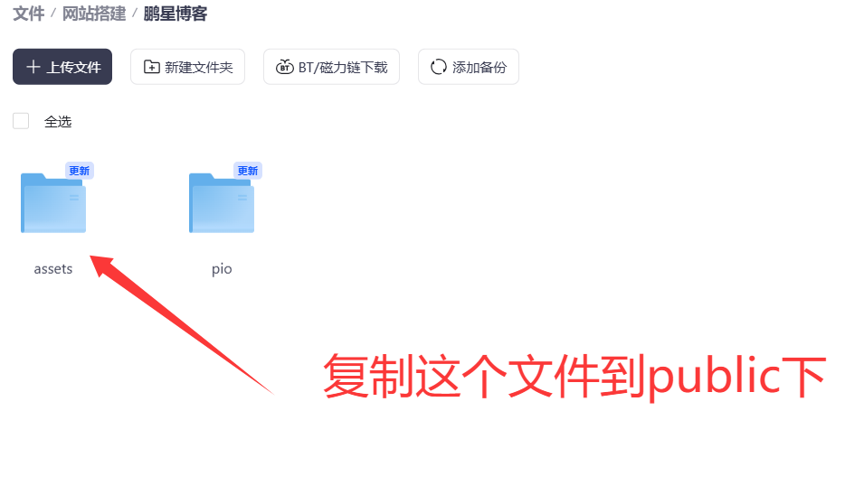

## 概述

音乐播放器配置用于在网站中添加音乐播放功能，基于 APlayer 和 MetingJS，支持本地音乐和在线音乐两种模式。

## 基础配置

### 启用音乐播放器

```typescript
export const musicPlayerConfig: MusicPlayerConfig = {
  enable: true, // 启用音乐播放器功能
  mode: "local", // 播放器模式："local" 本地音乐，"meting" 在线音乐
};
```

## 播放器模式

### 本地音乐模式

```typescript
local: {
  playlist: [
    {
      name: "歌曲名称",
      artist: "艺术家",
      url: "/assets/music/song.wav", // 音乐文件路径
      cover: "/assets/music/cover/cover.jpg", // 封面图片路径（可选）
      lrc: "", // 歌词内容，支持 LRC 格式（可选）
    },
  ],
}
```

**本地音乐文件要求：**

- 音乐文件放在 `public/assets/music/` 目录下
- 封面图片放在 `public/assets/music/cover/` 目录下
- 支持格式：MP3、WAV、OGG、M4A等
- 路径使用相对于 `public` 目录的路径（以 `/` 开头）

### 在线音乐模式（Meting API）

```typescript
meting: {
  // Meting API 地址
  api: "https://api.i-meto.com/meting/api?server=:server&type=:type&id=:id&r=:r",
  
  // 音乐平台：netease=网易云音乐, tencent=QQ音乐, kugou=酷狗音乐, xiami=虾米音乐, baidu=百度音乐
  server: "netease",
  
  // 类型：song=单曲, playlist=歌单, album=专辑, search=搜索, artist=艺术家
  type: "playlist",
  
  // 歌单/专辑/单曲 ID 或搜索关键词
  id: "8814137515", // 网易云音乐歌单ID示例
  
  // 认证 token（可选）
  auth: "",
  
  // 备用 API 配置（当主 API 失败时使用）
  fallbackApis: [
    "https://api.i-meto.com/meting/api?server=:server&type=:type&id=:id&r=:r",
  ],
  
  // MetingJS 脚本路径
  // 默认使用 CDN：https://cdn.jsdelivr.net/npm/meting@2/dist/Meting.min.js
  // 备用CDN：https://unpkg.com/meting@2/dist/Meting.min.js
  // 也可配置为本地路径（支持非根目录部署）
  jsPath: "https://unpkg.com/meting@2/dist/Meting.min.js",
}
```

**支持的音乐平台：**

- `netease`: 网易云音乐
- `tencent`: QQ音乐
- `kugou`: 酷狗音乐
- `xiami`: 虾米音乐
- `baidu`: 百度音乐

**类型选项：**

- `playlist`: 歌单
- `album`: 专辑
- `song`: 单曲
- `search`: 搜索
- `artist`: 艺术家

**MetingJS 脚本路径说明：**

- 支持 CDN 路径（http:// 或 https:// 开头）
- 支持本地路径（以 `/` 开头，会自动处理非根目录部署问题）
- 如果不配置，默认使用 `https://cdn.jsdelivr.net/npm/meting@2/dist/Meting.min.js`

## APlayer 配置选项

```typescript
player: {
  // 是否自动播放（浏览器可能会阻止，需用户交互一次网页后才自动播放）
  autoplay: true,
  
  // 主题色
  theme: "var(--btn-regular-bg)", // 可以使用 CSS 变量或颜色值
  
  // 循环模式：'all'=列表循环, 'one'=单曲循环, 'none'=不循环
  loop: "all",
  
  // 播放顺序：'list'=列表顺序, 'random'=随机播放
  order: "list",
  
  // 预加载：'none'=不预加载, 'metadata'=预加载元数据, 'auto'=自动
  preload: "auto",
  
  // 默认音量 (0-1)
  volume: 0.7,
  
  // 是否互斥播放（同时只能播放一个播放器）
  mutex: true,
  
  // 歌词类型：0=不显示, 1=显示（需要提供 lrc 字段）, 2=显示（从 HTML 内容读取）, 3=异步加载（从 API 获取）
  lrcType: 3,
  
  // 歌词是否默认隐藏（当 lrcType 不为 0 时，可以通过此选项控制初始显示状态）
  // true=默认隐藏（用户可以通过歌词按钮手动显示）, false=默认显示
  lrcHidden: true,
  
  // 播放列表是否默认折叠
  listFolded: false,
  
  // 播放列表最大高度
  listMaxHeight: "340px",
  
  // localStorage 存储键名
  storageName: "aplayer-setting",
}
```

**播放器固定位置和迷你模式说明：**

- `fixed` 和 `mini` 默认为 `true`，无需在配置中设置
- 播放器固定在页面右下角（fixed 模式）
- 默认以迷你模式显示（mini 模式）
- 如果需要修改这些行为，需要修改组件源码

**自动播放说明：**

- 现代浏览器通常会阻止自动播放音频
- 配置 `autoplay: true` 后，播放器会在用户第一次交互（点击、滚动、按键等）后自动开始播放
- 这是浏览器安全策略的要求，无法绕过

**歌词配置说明：**

- `lrcType: 0` - 不显示歌词
- `lrcType: 1` - 显示歌词（需要在本地音乐的 `lrc` 字段中提供歌词内容）
- `lrcType: 2` - 从 HTML 内容读取歌词（用于单个本地音乐）
- `lrcType: 3` - 异步加载歌词（用于 Meting API，从 API 获取歌词）
- `lrcHidden` - 当歌词功能启用时，控制初始显示状态

## 响应式配置

```typescript
responsive: {
  mobile: {
    // 在移动端是否隐藏
    hide: false,
    
    // 移动端断点（小于此宽度时应用移动端配置）
    breakpoint: 768, // 单位：px
  },
}
```

## 使用示例

### 完整配置示例（本地音乐）

```typescript
export const musicPlayerConfig: MusicPlayerConfig = {
  enable: true,
  mode: "local",
  
  local: {
    playlist: [
      {
        name: "使一颗心免于哀伤",
        artist: "知更鸟 / HOYO-MiX / Chevy",
        url: "/assets/music/使一颗心免于哀伤-哼唱.wav",
        cover: "/assets/music/cover/109951169585655912.jpg",
        lrc: "", // 歌词内容，支持 LRC 格式
      },
    ],
  },
  
  player: {
    autoplay: true,
    theme: "var(--btn-regular-bg)",
    loop: "all",
    order: "list",
    preload: "auto",
    volume: 0.7,
    mutex: true,
    lrcType: 3,
    lrcHidden: true,
    listFolded: false,
    listMaxHeight: "340px",
    storageName: "aplayer-setting",
  },
  
  responsive: {
    mobile: {
      hide: false,
      breakpoint: 768,
    },
  },
};
```

### 完整配置示例（Meting API）

```typescript
export const musicPlayerConfig: MusicPlayerConfig = {
  enable: true,
  mode: "meting",
  
  meting: {
    api: "https://api.i-meto.com/meting/api?server=:server&type=:type&id=:id&r=:r",
    server: "netease",
    type: "playlist",
    id: "8814137515",
    auth: "",
    fallbackApis: [
      "https://api.i-meto.com/meting/api?server=:server&type=:type&id=:id&r=:r",
    ],
    jsPath: "https://unpkg.com/meting@2/dist/Meting.min.js",
  },
  
  player: {
    autoplay: true,
    theme: "var(--btn-regular-bg)",
    loop: "all",
    order: "list",
    preload: "auto",
    volume: 0.7,
    mutex: true,
    lrcType: 3, // Meting API 模式下使用 3 从 API 获取歌词
    lrcHidden: false, // 默认显示歌词
    listFolded: false,
    listMaxHeight: "340px",
    storageName: "aplayer-setting",
  },
  
  responsive: {
    mobile: {
      hide: false,
      breakpoint: 768,
    },
  },
};
```

### 单个本地音乐配置示例（使用 MetingJS）

当本地音乐列表只有一首歌曲时，会自动使用 MetingJS 渲染：

```typescript
local: {
  playlist: [
    {
      name: "歌曲名称",
      artist: "艺术家",
      url: "/assets/music/song.wav",
      cover: "/assets/music/cover/cover.jpg",
      lrc: "[00:00.00] 歌词内容...", // 歌词内容，lrcType 会使用 2
    },
  ],
}
```

### 多个本地音乐配置示例（使用 APlayer 直接初始化）

当本地音乐列表有多首歌曲时，会使用 APlayer 直接初始化：

```typescript
local: {
  playlist: [
    {
      name: "歌曲1",
      artist: "艺术家1",
      url: "/assets/music/song1.wav",
      cover: "/assets/music/cover/cover1.jpg",
      lrc: "", // 多个音乐时，lrcType 使用配置的值
    },
    {
      name: "歌曲2",
      artist: "艺术家2",
      url: "/assets/music/song2.wav",
      cover: "/assets/music/cover/cover2.jpg",
      lrc: "",
    },
  ],
}
```

## 实现代码

### 复制music文件

夸克网盘：https://pan.quark.cn/s/c9afe5235080



### 新建 musicConfig.ts 文件

> 如果没有把 `src/config.ts` 模块化，那么不需要新建 `musicConfig.ts` 文件，直接把 `musicPlayerConfig`  写入到 `config.ts` 中就行

```js title="musicConfig.ts"
import type { MusicPlayerConfig } from "../types/config";

// 音乐播放器配置
export const musicPlayerConfig: MusicPlayerConfig = {
	// 基础功能开关
	enable: true, // 启用音乐播放器功能

	// 使用方式：'meting' 或 'local'
	mode: "meting", // "meting" 使用 Meting API，"local" 使用本地音乐列表

	// Meting API 配置
	meting: {
		// Meting API 地址
		// 默认使用官方 API，也可以使用自定义 API
		api: "https://api.i-meto.com/meting/api?server=:server&type=:type&id=:id&r=:r",

		// 音乐平台：netease=网易云音乐, tencent=QQ音乐, kugou=酷狗音乐, xiami=虾米音乐, baidu=百度音乐
		server: "netease",

		// 类型：song=单曲, playlist=歌单, album=专辑, search=搜索, artist=艺术家
		type: "playlist",

		// 歌单/专辑/单曲 ID 或搜索关键词
		id: "10046455237", // 网易云音乐歌单ID示例

		// 认证 token（可选）
		auth: "",

		// 备用 API 配置（当主 API 失败时使用）
		fallbackApis: [
			"https://api.injahow.cn/meting/?server=:server&type=:type&id=:id",
			"https://api.moeyao.cn/meting/?server=:server&type=:type&id=:id",
		],

		// MetingJS 脚本路径
		// 默认使用 CDN：https://cdn.jsdelivr.net/npm/meting@2/dist/Meting.min.js
		// 备用CDN：https://unpkg.com/meting@2/dist/Meting.min.js
		// 也可配置为本地路径
		jsPath: "https://unpkg.com/meting@2/dist/Meting.min.js",
	},

	// 本地音乐配置（当 mode 为 'local' 时使用）
	local: {
		playlist: [
			{
				name: "使一颗心免于哀伤",
				artist: "知更鸟 / HOYO-MiX / Chevy",
				url: "/assets/music/使一颗心免于哀伤-哼唱.wav",
				cover: "/assets/music/cover/109951169585655912.jpg",
				lrc: "", // 歌词内容，支持 LRC 格式
			},
		],
	},

	// APlayer 配置选项
	player: {
		// 是否自动播放  浏览器可能会阻止，需用户交互一次网页后才自动播放
		autoplay: false,

		// 主题色
		theme: "var(--btn-regular-bg)",

		// 循环模式：'all'=列表循环, 'one'=单曲循环, 'none'=不循环
		loop: "all",

		// 播放顺序：'list'=列表顺序, 'random'=随机播放
		order: "list",

		// 预加载：'none'=不预加载, 'metadata'=预加载元数据, 'auto'=自动
		preload: "auto",

		// 默认音量 (0-1)
		volume: 0.7,

		// 是否互斥播放（同时只能播放一个播放器）
		mutex: true,

		// 歌词类型：0=不显示, 1=显示（需要提供 lrc 字段）, 2=显示（从 HTML 内容读取）, 3=异步加载（从 API 获取）
		lrcType: 3,

		// 歌词是否默认隐藏（当 lrcType 不为 0 时，可以通过此选项控制初始显示状态）
		// true=默认隐藏（用户可以通过歌词按钮手动显示）, false=默认显示
		lrcHidden: true,

		// 播放列表是否默认折叠
		listFolded: false,

		// 播放列表最大高度
		listMaxHeight: "340px",

		// localStorage 存储键名
		storageName: "aplayer-setting",
	},

	// 响应式配置
	responsive: {
		// 移动端配置
		mobile: {
			// 在移动端是否隐藏
			hide: false,

			// 移动端断点（小于此宽度时应用移动端配置）
			breakpoint: 768,
		},
	},
};

```

### 新增src\types\config.ts音乐类别

```js title="src\types\config.ts"
// 。。。。省略

// 音乐播放器配置
export type MusicPlayerConfig = {
	// 基础功能开关
	enable: boolean; // 启用音乐播放器功能

	// 使用方式：'meting' 或 'local'
	mode?: "meting" | "local"; // "meting" 使用 Meting API，"local" 使用本地音乐列表

	// Meting API 配置
	meting?: {
		// Meting API 地址
		api?: string;

		// 音乐平台：netease=网易云音乐, tencent=QQ音乐, kugou=酷狗音乐, xiami=虾米音乐, baidu=百度音乐
		server?: "netease" | "tencent" | "kugou" | "xiami" | "baidu";

		// 类型：song=单曲, playlist=歌单, album=专辑, search=搜索, artist=艺术家
		type?: "song" | "playlist" | "album" | "search" | "artist";

		// 歌单/专辑/单曲 ID 或搜索关键词
		id?: string;

		// 认证 token（可选）
		auth?: string;

		// 备用 API 配置（当主 API 失败时使用）
		fallbackApis?: string[];

		// MetingJS 脚本路径（默认使用 CDN，也可配置为本地路径）
		jsPath?: string;
	};

	// 本地音乐配置（当 mode 为 'local' 时使用）
	local?: {
		playlist?: Array<{
			name: string; // 歌曲名称
			artist: string; // 艺术家
			url: string; // 音乐文件路径（相对于 public 目录）
			cover?: string; // 封面图片路径（相对于 public 目录）
			lrc?: string; // 歌词内容，支持 LRC 格式
		}>;
	};

	// APlayer 配置选项
	player?: {
		// 是否固定模式（固定在页面底部）
		fixed?: boolean;

		// 是否迷你模式
		mini?: boolean;

		// 是否自动播放
		autoplay?: boolean;

		// 主题色
		theme?: string;

		// 循环模式：'all'=列表循环, 'one'=单曲循环, 'none'=不循环
		loop?: "all" | "one" | "none";

		// 播放顺序：'list'=列表顺序, 'random'=随机播放
		order?: "list" | "random";

		// 预加载：'none'=不预加载, 'metadata'=预加载元数据, 'auto'=自动
		preload?: "none" | "metadata" | "auto";

		// 默认音量 (0-1)
		volume?: number;

		// 是否互斥播放（同时只能播放一个播放器）
		mutex?: boolean;

		// 歌词类型：0=不显示, 1=显示（需要提供 lrc 字段）, 2=显示（从 HTML 内容读取）, 3=异步加载（从 API 获取）
		lrcType?: 0 | 1 | 2 | 3;

		// 歌词是否默认隐藏（当 lrcType 不为 0 时，可以通过此选项控制初始显示状态）
		lrcHidden?: boolean;

		// 播放列表是否默认折叠
		listFolded?: boolean;

		// 播放列表最大高度
		listMaxHeight?: string;

		// localStorage 存储键名
		storageName?: string;
	};

	// 响应式配置
	responsive?: {
		// 移动端配置
		mobile?: {
			// 在移动端是否隐藏
			hide?: boolean;

			// 移动端断点（小于此宽度时应用移动端配置）
			breakpoint?: number;
		};
	};
};

```

### 新增src\components\widget\MusicPlayer.astro组件

``` js title="src\components\widget\MusicPlayer.astro"
---
import { musicPlayerConfig } from "@/config/musicConfig";
import { url } from "@/utils/url-utils";

const config = musicPlayerConfig;

// 预先生成本地资源路径，确保在非根目录部署时也能正确加载
const aplayerCssPath = url("/assets/css/APlayer.min.css");
const aplayerCustomCssPath = url("/assets/css/APlayer.custom.css");
const aplayerJsPath = url("/assets/js/APlayer.min.js");

// MetingJS 路径处理
// 如果配置的是相对路径（以 / 开头），使用 url() 处理以确保非根目录部署时正确
// 如果是完整的 URL（http/https），直接使用
const metingJsPath = config.meting?.jsPath
	? config.meting.jsPath.startsWith("http://") ||
		config.meting.jsPath.startsWith("https://")
		? config.meting.jsPath
		: url(config.meting.jsPath)
	: "https://cdn.jsdelivr.net/npm/meting@2/dist/Meting.min.js"; // 默认 CDN 路径

// 预处理本地音乐列表的路径（如果使用本地模式）
const processedLocalPlaylist =
	config.mode === "local" && config.local?.playlist
		? config.local.playlist.map((song) => ({
				...song,
				url: url(song.url),
				cover: song.cover ? url(song.cover) : undefined,
			}))
		: null;
---

{config.enable && (
  <>
    <!-- APlayer CSS -->
    <link
      rel="stylesheet"
      href={aplayerCssPath}
    />
    <link
      rel="stylesheet"
      href={aplayerCustomCssPath}
    />

    <!-- 音乐播放器容器 -->
    <div
      id="aplayer-container"
      class:mobile-hide={config.responsive?.mobile?.hide}
    >
      {config.mode === "meting" && config.meting ? (
        <!-- 使用 MetingJS -->
        <meting-js
          server={config.meting.server || "netease"}
          type={config.meting.type || "playlist"}
          id={config.meting.id || ""}
          api={config.meting.api}
          auth={config.meting.auth}
          fixed={(config.player?.fixed ?? true) ? "true" : "false"}
          mini={(config.player?.mini ?? true) ? "true" : "false"}
          autoplay={config.player?.autoplay ? "true" : "false"}
          theme={config.player?.theme || "#b7daff"}
          loop={config.player?.loop || "all"}
          order={config.player?.order || "list"}
          preload={config.player?.preload || "auto"}
          volume={String(config.player?.volume ?? 0.7)}
          mutex={config.player?.mutex !== false ? "true" : "false"}
          lrc-type={String(config.player?.lrcType ?? 3)}
          list-folded={config.player?.listFolded ? "true" : "false"}
          list-max-height={config.player?.listMaxHeight || "340px"}
          storage-name={config.player?.storageName || "aplayer-setting"}
        />
      ) : config.mode === "local" && processedLocalPlaylist && processedLocalPlaylist.length > 0 ? (
        <!-- 使用本地音乐列表 -->
        <!-- 单个音乐使用 MetingJS，多个音乐使用 APlayer 直接初始化 -->
        {processedLocalPlaylist.length === 1 ? (
          <meting-js
            name={processedLocalPlaylist?.[0]?.name || ""}
            artist={processedLocalPlaylist?.[0]?.artist || ""}
            url={processedLocalPlaylist?.[0]?.url || ""}
            cover={processedLocalPlaylist?.[0]?.cover}
            fixed={(config.player?.fixed ?? true) ? "true" : "false"}
            mini={(config.player?.mini ?? true) ? "true" : "false"}
            autoplay={config.player?.autoplay ? "true" : "false"}
            theme={config.player?.theme || "#b7daff"}
            loop={config.player?.loop || "all"}
            order={config.player?.order || "list"}
            preload={config.player?.preload || "auto"}
            volume={String(config.player?.volume ?? 0.7)}
            mutex={config.player?.mutex !== false ? "true" : "false"}
            lrc-type={processedLocalPlaylist[0]?.lrc ? "2" : "0"}
            list-folded={config.player?.listFolded ? "true" : "false"}
            list-max-height={config.player?.listMaxHeight || "340px"}
            storage-name={config.player?.storageName || "aplayer-setting"}
          >
            {processedLocalPlaylist?.[0]?.lrc && (
              <pre hidden>
                {processedLocalPlaylist[0].lrc}
              </pre>
            )}
          </meting-js>
        ) : (
          <!-- 多个本地音乐，使用 APlayer 直接初始化 -->
          <div id="local-aplayer"></div>
        )}
      ) : null}
    </div>
  </>
)}

<script define:vars={{ config, aplayerJsPath, metingJsPath, processedLocalPlaylist }} is:inline>
  // 动态加载 APlayer 和 MetingJS
  (function() {
    if (!config.enable) return;
    
    // 确保在浏览器环境中运行
    if (typeof window === 'undefined') return;

    // 加载 APlayer JS
    function loadAPlayer() {
      return new Promise((resolve) => {
        if (window.APlayer) {
          resolve(window.APlayer);
          return;
        }

        const aplayerScript = document.createElement("script");
        aplayerScript.src = aplayerJsPath;
        aplayerScript.async = true;
        aplayerScript.onload = () => resolve(window.APlayer);
        aplayerScript.onerror = () => {
          console.error("Failed to load APlayer");
          resolve(null);
        };
        document.head.appendChild(aplayerScript);
      });
    }

    // 全局用户交互状态
    if (!window.hasMusicInteracted) {
      window.hasMusicInteracted = false;
    }
    
    function tryAutoplay(aplayer) {
      if (!config.player?.autoplay) return;
      
      // 如果用户已经交互过，立即尝试播放
      if (window.hasMusicInteracted) {
        if (aplayer && aplayer.paused) {
          const playPromise = aplayer.play();
          if (playPromise && typeof playPromise.catch === 'function') {
            playPromise.catch((error) => {
              // 浏览器阻止自动播放是正常的，不需要报错
              if (error.name !== 'NotAllowedError') {
                console.log('自动播放失败:', error.name);
              }
            });
          }
        }
      } else {
        // 等待用户第一次交互后自动播放
        const enableAutoplay = () => {
          if (window.hasMusicInteracted) return;
          window.hasMusicInteracted = true;
          
          if (aplayer && aplayer.paused) {
            const playPromise = aplayer.play();
            if (playPromise && typeof playPromise.catch === 'function') {
              playPromise.catch((error) => {
                if (error.name !== 'NotAllowedError') {
                  console.log('自动播放失败:', error.name);
                }
              });
            }
          }
        };
        
        // 监听各种用户交互事件（只监听一次）
        ['click', 'keydown', 'touchstart', 'scroll'].forEach(eventType => {
          document.addEventListener(eventType, enableAutoplay, { 
            once: true, 
            passive: true 
          });
        });
      }
    }

    // 检查 MetingJS 元素是否成功加载了音乐
    function checkMetingSuccess(metingElement, timeout = 5000) {
      return new Promise((resolve) => {
        const startTime = Date.now();
        
        const checkSuccess = setInterval(() => {
          const aplayer = metingElement?.aplayer;
          // 检查是否有 APlayer 实例且有音频列表
          if (aplayer && aplayer.list && aplayer.list.audios && aplayer.list.audios.length > 0) {
            clearInterval(checkSuccess);
            resolve(true);
            return;
          }
          
          // 超时检查
          if (Date.now() - startTime >= timeout) {
            clearInterval(checkSuccess);
            resolve(false);
          }
        }, 100);
      });
    }

    // 重新创建 MetingJS 元素以使用新的 API
    function recreateMetingElement(container, apiUrl, config) {
      // 移除旧的元素
      const oldElement = container.querySelector('meting-js');
      if (oldElement) {
        // 如果已有 APlayer 实例，先销毁它
        if (oldElement.aplayer) {
          try {
            oldElement.aplayer.destroy();
          } catch (e) {
            console.warn('销毁旧 APlayer 实例时出错:', e);
          }
        }
        oldElement.remove();
      }
      
      // 创建新元素
      const newElement = document.createElement('meting-js');
      newElement.setAttribute('server', config.meting?.server || 'netease');
      newElement.setAttribute('type', config.meting?.type || 'playlist');
      newElement.setAttribute('id', config.meting?.id || '');
      newElement.setAttribute('api', apiUrl);
      if (config.meting?.auth) {
        newElement.setAttribute('auth', config.meting.auth);
      }
      newElement.setAttribute('fixed', (config.player?.fixed ?? true) ? 'true' : 'false');
      newElement.setAttribute('mini', (config.player?.mini ?? true) ? 'true' : 'false');
      newElement.setAttribute('autoplay', config.player?.autoplay ? 'true' : 'false');
      newElement.setAttribute('theme', config.player?.theme || '#b7daff');
      newElement.setAttribute('loop', config.player?.loop || 'all');
      newElement.setAttribute('order', config.player?.order || 'list');
      newElement.setAttribute('preload', config.player?.preload || 'auto');
      newElement.setAttribute('volume', String(config.player?.volume ?? 0.7));
      newElement.setAttribute('mutex', config.player?.mutex !== false ? 'true' : 'false');
      newElement.setAttribute('lrc-type', String(config.player?.lrcType ?? 3));
      newElement.setAttribute('list-folded', config.player?.listFolded ? 'true' : 'false');
      newElement.setAttribute('list-max-height', config.player?.listMaxHeight || '340px');
      newElement.setAttribute('storage-name', config.player?.storageName || 'aplayer-setting');
      
      container.appendChild(newElement);
      return newElement;
    }

    // 处理移动端显示/隐藏
    function handleMobileVisibility(aplayer) {
      if (!aplayer || !aplayer.container) return;
      
      const shouldHide = config.responsive?.mobile?.hide === true;
      const breakpoint = config.responsive?.mobile?.breakpoint || 768;
      const isMobile = window.innerWidth <= breakpoint;
      
      if (shouldHide && isMobile) {
        aplayer.container.style.display = 'none';
        aplayer.container.classList.add('mobile-hide');
        
        // 同时处理容器（如果存在）
        const container = document.getElementById('aplayer-container');
        if (container) {
          container.style.display = 'none';
          container.classList.add('mobile-hide');
        }
      } else {
        aplayer.container.style.display = '';
        aplayer.container.classList.remove('mobile-hide');
        
        // 同时处理容器（如果存在）
        const container = document.getElementById('aplayer-container');
        if (container) {
          container.style.display = '';
          container.classList.remove('mobile-hide');
        }
      }
    }
    
    // 初始化时处理容器的移动端显示/隐藏
    function initContainerMobileVisibility() {
      const container = document.getElementById('aplayer-container');
      if (!container) return;
      
      const shouldHide = config.responsive?.mobile?.hide === true;
      const breakpoint = config.responsive?.mobile?.breakpoint || 768;
      const isMobile = window.innerWidth <= breakpoint;
      
      if (shouldHide && isMobile) {
        container.style.display = 'none';
        container.classList.add('mobile-hide');
      } else {
        container.style.display = '';
        container.classList.remove('mobile-hide');
      }
      
      // 监听窗口大小变化
      const resizeHandler = () => {
        const nowIsMobile = window.innerWidth <= breakpoint;
        if (shouldHide && nowIsMobile) {
          container.style.display = 'none';
          container.classList.add('mobile-hide');
        } else {
          container.style.display = '';
          container.classList.remove('mobile-hide');
        }
      };
      window.addEventListener('resize', resizeHandler);
    }

    // 初始化 MetingJS 元素并设置播放器
    function setupMetingElement(metingElement) {
      return new Promise((resolve) => {
        // 监听 aplayer 初始化
        const checkAPlayer = setInterval(() => {
          const aplayer = metingElement.aplayer;
          if (aplayer && aplayer.container) {
            clearInterval(checkAPlayer);
            
            // 监听播放状态，更新封面动画
            const updatePlayingState = () => {
              if (aplayer.container) {
                const isPlaying = !aplayer.paused;
                aplayer.container.setAttribute('data-playing', String(isPlaying));
                if (isPlaying) {
                  aplayer.container.classList.add('aplayer-playing');
                } else {
                  aplayer.container.classList.remove('aplayer-playing');
                }
              }
            };
            
            // 监听播放/暂停事件
            if (aplayer.audio) {
              aplayer.audio.addEventListener('play', updatePlayingState);
              aplayer.audio.addEventListener('pause', updatePlayingState);
              aplayer.audio.addEventListener('ended', updatePlayingState);
            }
            
            aplayer.container.setAttribute('data-positioned', 'right');
            // 立即应用右侧样式
            requestAnimationFrame(() => {
              if (aplayer.container) {
                aplayer.container.style.right = '0';
                aplayer.container.style.left = 'unset';
                
                // 初始化播放状态
                updatePlayingState();
                
                // 处理移动端显示/隐藏
                handleMobileVisibility(aplayer);
                
                // 监听窗口大小变化，动态调整显示/隐藏
                const resizeHandler = () => handleMobileVisibility(aplayer);
                window.addEventListener('resize', resizeHandler);
                
                // 短暂延迟后标记为已初始化，恢复展开动画
                setTimeout(() => {
                  aplayer.container.setAttribute('data-initialized', 'true');
                  
                  // 如果配置了默认隐藏歌词，则隐藏歌词
                  if (config.player?.lrcHidden && aplayer.lrc) {
                    aplayer.lrc.hide();
                    // 同时设置歌词按钮为未激活状态
                    const lrcButton = aplayer.container.querySelector('.aplayer-icon-lrc');
                    if (lrcButton) {
                      lrcButton.classList.add('aplayer-icon-lrc-inactivity');
                    }
                  }
                  
                  // 如果自动播放被阻止，等待用户交互后恢复
                  if (config.player?.autoplay && aplayer.paused) {
                    tryAutoplay(aplayer);
                  }
                }, 200);
              }
            });
            
            resolve(true);
          }
        }, 50);
        
        // 10秒后停止检查
        setTimeout(() => {
          clearInterval(checkAPlayer);
          resolve(false);
        }, 10000);
      });
    }

    // 使用备用 API 重试加载
    async function retryWithFallbackAPI(container, fallbackApis, currentIndex = 0) {
      if (currentIndex >= fallbackApis.length) {
        console.error('所有 API 都失败了，无法加载音乐播放器');
        return null;
      }
      
      const fallbackApi = fallbackApis[currentIndex];
      console.log(`尝试使用备用 API ${currentIndex + 1}/${fallbackApis.length}: ${fallbackApi}`);
      
      // 替换 API URL 中的占位符
      const server = config.meting?.server || 'netease';
      const type = config.meting?.type || 'playlist';
      const id = config.meting?.id || '';
      
      let apiUrl = fallbackApi
        .replace(':server', server)
        .replace(':type', type)
        .replace(':id', id);
      
      // 设置全局 API
      window.meting_api = apiUrl;
      
      // 重新创建元素
      const newElement = recreateMetingElement(container, apiUrl, config);
      
      // 等待元素初始化
      await new Promise(resolve => setTimeout(resolve, 500));
      
      // 检查是否成功
      const success = await checkMetingSuccess(newElement, 5000);
      
      if (success) {
        console.log(`备用 API ${currentIndex + 1} 成功加载音乐`);
        return newElement;
      } else {
        // 如果失败，尝试下一个备用 API
        return retryWithFallbackAPI(container, fallbackApis, currentIndex + 1);
      }
    }

    // 加载 MetingJS
    function loadMetingJS() {
      return new Promise((resolve) => {
        if (window.customElements?.get("meting-js")) {
          resolve(true);
          return;
        }

        const metingScript = document.createElement("script");
        metingScript.src = metingJsPath;
        metingScript.async = true;
        metingScript.onload = async () => {
          // 等待 MetingJS 元素创建
          await new Promise(resolve => setTimeout(resolve, 100));
          
          const container = document.getElementById('aplayer-container');
          if (!container) {
            resolve(false);
            return;
          }
          
          let metingElement = container.querySelector('meting-js');
          
          if (config.mode === "meting" && config.meting?.api && metingElement) {
            const server = config.meting.server || 'netease';
            const type = config.meting.type || 'playlist';
            const id = config.meting.id || '';
            
            // 替换 API URL 中的占位符
            let mainApiUrl = config.meting.api
              .replace(':server', server)
              .replace(':type', type)
              .replace(':id', id)
              .replace(':r', Math.random().toString());
            
            // 设置全局 API
            window.meting_api = mainApiUrl;
            
            console.log('尝试使用主 API:', mainApiUrl);
            
            // 等待元素初始化
            await new Promise(resolve => setTimeout(resolve, 500));
            
            // 检查主 API 是否成功
            const mainApiSuccess = await checkMetingSuccess(metingElement, 5000);
            
            if (!mainApiSuccess && config.meting.fallbackApis && config.meting.fallbackApis.length > 0) {
              // 主 API 失败，尝试备用 API
              console.warn('主 API 失败，尝试使用备用 API');
              const newElement = await retryWithFallbackAPI(container, config.meting.fallbackApis);
              if (newElement) {
                metingElement = newElement;
              }
            }
          }
          
          // 设置播放器（如果元素存在）
          if (metingElement) {
            await setupMetingElement(metingElement);
          }
          
          resolve(true);
        };
        metingScript.onerror = () => {
          console.error("Failed to load MetingJS");
          resolve(false);
        };
        document.head.appendChild(metingScript);
      });
    }

    // 初始化本地音乐播放器（多个音乐）
    async function initLocalPlayer() {
      if (
        config.mode !== "local" ||
        !processedLocalPlaylist ||
        processedLocalPlaylist.length <= 1
      ) {
        return;
      }

      const APlayerClass = await loadAPlayer();
      if (!APlayerClass) return;

      const container = document.getElementById("local-aplayer");
      if (!container) return;

      // 使用预处理好的路径列表（已经在服务端处理了非根目录部署的问题）
      const audioList = processedLocalPlaylist.map((song) => ({
        name: song.name,
        artist: song.artist,
        url: song.url,
        cover: song.cover,
        lrc: song.lrc || undefined,
        type: "auto",
      }));

      const aplayerOptions = {
        container: container,
        audio: audioList,
        mutex: config.player?.mutex !== false,
        lrcType: config.player?.lrcType !== undefined ? config.player.lrcType : 0,
        fixed: config.player?.fixed ?? true,
        mini: config.player?.mini ?? true,
        autoplay: config.player?.autoplay || false, // 直接设置 autoplay，浏览器可能会阻止但可以后续通过用户交互恢复
        theme: config.player?.theme || "#b7daff",
        loop: config.player?.loop || "all",
        order: config.player?.order || "list",
        preload: config.player?.preload || "auto",
        volume: config.player?.volume || 0.7,
        listFolded: config.player?.listFolded || false,
        listMaxHeight: config.player?.listMaxHeight || "340px",
        storageName: config.player?.storageName || "aplayer-setting",
      };

      try {
        const aplayer = new APlayerClass(aplayerOptions);
        
        // 监听播放状态，更新封面动画
        const updatePlayingState = () => {
          if (aplayer.container) {
            const isPlaying = !aplayer.paused;
            aplayer.container.setAttribute('data-playing', String(isPlaying));
            if (isPlaying) {
              aplayer.container.classList.add('aplayer-playing');
            } else {
              aplayer.container.classList.remove('aplayer-playing');
            }
          }
        };
        
        // 监听播放/暂停事件
        if (aplayer.audio) {
          aplayer.audio.addEventListener('play', updatePlayingState);
          aplayer.audio.addEventListener('pause', updatePlayingState);
          aplayer.audio.addEventListener('ended', updatePlayingState);
        }
        
              // 立即设置右侧定位，避免动画
              if (aplayer.container) {
                aplayer.container.setAttribute('data-positioned', 'right');
                // 确保立即应用右侧样式，避免从左到右的过渡
                requestAnimationFrame(() => {
                  if (aplayer.container) {
                    aplayer.container.style.right = '0';
                    aplayer.container.style.left = 'unset';
                    
                    // 初始化播放状态
                    updatePlayingState();
                    
                    // 处理移动端显示/隐藏
                    handleMobileVisibility(aplayer);
                    
                    // 监听窗口大小变化，动态调整显示/隐藏
                    const resizeHandler = () => handleMobileVisibility(aplayer);
                    window.addEventListener('resize', resizeHandler);
                    
                    // 短暂延迟后标记为已初始化，恢复展开动画
                    setTimeout(() => {
                      aplayer.container.setAttribute('data-initialized', 'true');
                      
                      // 如果配置了默认隐藏歌词，则隐藏歌词
                      if (config.player?.lrcHidden && aplayer.lrc) {
                        aplayer.lrc.hide();
                        // 同时设置歌词按钮为未激活状态
                        const lrcButton = aplayer.container.querySelector('.aplayer-icon-lrc');
                        if (lrcButton) {
                          lrcButton.classList.add('aplayer-icon-lrc-inactivity');
                        }
                      }
                      
                      // 如果自动播放被阻止，等待用户交互后恢复
                      if (config.player?.autoplay && aplayer.paused) {
                        tryAutoplay(aplayer);
                      }
                    }, 100);
                  }
                });
              }
      } catch (error) {
        console.error("Failed to initialize APlayer:", error);
      }
    }

    // 初始化容器的移动端显示/隐藏
    if (document.readyState === "loading") {
      document.addEventListener("DOMContentLoaded", initContainerMobileVisibility);
    } else {
      initContainerMobileVisibility();
    }
    
    // 如果使用 Meting 模式，加载 MetingJS
    if (config.mode === "meting") {
      loadAPlayer().then(() => {
        loadMetingJS();
      });
    } else if (config.mode === "local") {
      // 本地模式：单个音乐使用 MetingJS，多个音乐使用 APlayer
      if (processedLocalPlaylist && processedLocalPlaylist.length > 1) {
        // 多个音乐，使用 APlayer
        if (document.readyState === "loading") {
          document.addEventListener("DOMContentLoaded", initLocalPlayer);
        } else {
          initLocalPlayer();
        }
      } else {
        // 单个音乐，使用 MetingJS
        loadAPlayer().then(() => {
          loadMetingJS();
        });
      }
    }
  })();
</script>

<style>
  #aplayer-container {
    position: relative;
    z-index: 1000;
  }

  /* 确保播放器在固定模式下正确显示 */
  #aplayer-container .aplayer-fixed {
    z-index: 9999;
  }

  /* 禁用 APlayer 初始化时的过渡动画，避免收缩效果 */
  #aplayer-container .aplayer.aplayer-fixed {
    animation: none !important;
  }
  
  #aplayer-container .aplayer.aplayer-fixed .aplayer-body {
    animation: none !important;
    transition: none !important;
  }
  
  /* 确保播放器初始化时就在右侧位置 */
  #aplayer-container .aplayer.aplayer-fixed[data-positioned="right"] {
    right: 0 !important;
    left: unset !important;
  }

  /* 移动端隐藏 - 通过 JavaScript 动态添加类 */
  .aplayer-fixed.mobile-hide {
    display: none !important;
  }
  
  /* 移动端隐藏容器 */
  #aplayer-container.mobile-hide {
    display: none !important;
  }
</style>

```

### 修改src\layouts\Layout.astro组件

```js title="src\layouts\Layout.astro" ins={7,28-29}
---
import "@fontsource/roboto/400.css";
import "@fontsource/roboto/500.css";
import "@fontsource/roboto/700.css";

import ConfigCarrier from "@components/ConfigCarrier.astro";
import MusicPlayer from "@components/widget/MusicPlayer.astro";
import SakuraEffect from "@/components/effects/SakuraEffect.astro";
import { profileConfig, siteConfig } from "@/config";

---

<!DOCTYPE html>
<html lang={siteLang} class="bg-[var(--page-bg)] transition text-[14px] md:text-[16px]"
	  data-overlayscrollbars-initialize
>
	<head>

		//。。。。省略

	</head>
	<body class=" min-h-screen transition " class:list={[{"lg:is-home": isHomePage, "enable-banner": enableBanner}]}
		  data-overlayscrollbars-initialize
	>
		<ConfigCarrier></ConfigCarrier>
		<slot />

		<!-- Music Player -->
		<MusicPlayer />
		<!-- 樱花特效 -->
		<SakuraEffect/>
		<!-- increase the page height during page transition to prevent the scrolling animation from jumping -->
		<div id="page-height-extend" class="hidden h-[300vh]"></div>
	</body>
</html>

// 。。。。省略

```

## 路径处理说明

音乐播放器组件会自动处理非根目录部署的路径问题：

- 本地音乐文件的 `url` 和 `cover` 路径会自动使用 `url()` 工具函数处理
- MetingJS 脚本路径如果配置为本地路径（以 `/` 开头），也会自动处理
- CDN 路径（http:// 或 https:// 开头）不会进行任何处理，直接使用

## 注意事项

1. **浏览器限制**：现代浏览器通常阻止自动播放，即使设置了 `autoplay: true`，也需要用户交互一次后才会自动播放
2. **文件格式**：确保音乐文件格式被浏览器支持（MP3、WAV、OGG、M4A等）
3. **文件大小**：注意音乐文件大小，过大的文件会影响加载速度
4. **版权问题**：使用在线音乐时请注意版权问题
5. **API稳定性**：在线音乐API可能不稳定，建议配置多个备用API
6. **固定位置**：播放器默认固定在右下角，`fixed` 和 `mini` 默认均为 `true`，无法通过配置文件修改
7. **歌词显示**：Meting API 模式下，歌词需要 API 返回歌词数据才能显示；本地音乐模式下，需要提供 `lrc` 字段内容
8. **路径配置**：本地音乐文件的路径必须相对于 `public` 目录，以 `/` 开头

## 常见问题

**Q: 音乐无法播放怎么办？** 

A: 检查文件路径是否正确，确保音乐文件格式被浏览器支持，文件路径以 `/` 开头

**Q: 如何添加更多歌曲？** 

A: 在 `local.playlist` 数组中添加更多歌曲对象

**Q: 如何更换音乐平台？** 

A: 修改 `meting.server` 的值（netease、tencent、kugou等）

**Q: 自动播放不生效怎么办？** 

A: 这是正常的浏览器安全策略，需要用户交互一次后才会自动播放。如果页面加载后立即需要播放，需要用户先点击页面任意位置

**Q: 如何隐藏歌词？** 

A: 设置 `player.lrcHidden: true`，或设置 `player.lrcType: 0` 完全禁用歌词功能

**Q: 如何获取网易云音乐歌单ID？**

 A: 在网易云音乐网页版打开歌单，URL 中的数字就是歌单ID，例如：`https://music.163.com/#/playlist?id=8814137515` 中的 `8814137515`

**Q: 如何在非根目录部署时使用本地 MetingJS 脚本？** 

A: 将 MetingJS 脚本文件放在 `public/assets/js/` 目录下，然后在配置中设置 `meting.jsPath: "/assets/js/Meting.min.js"`，组件会自动处理路径问题

**Q: 歌词不显示怎么办？**

 A:

- Meting API 模式：检查 `lrcType` 是否为 `3`，并确认 API 返回了歌词数据
- 本地音乐模式：检查是否提供了 `lrc` 字段内容，并设置正确的 `lrcType`（单个音乐使用 `2`，多个音乐使用 `1`）

**Q: 播放器位置可以调整吗？** 

A: 播放器固定在右下角，位置无法通过配置文件调整。如需调整，需要修改组件源码中的 CSS 样式