### MySQL的下载

搜索[MySQL官网](https://www.mysql.com/cn/downloads/)进行下载，社区版下载地址：https://dev.mysql.com/downloads/mysql/

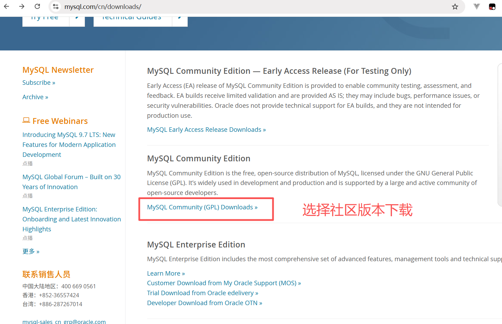

点击图片所指

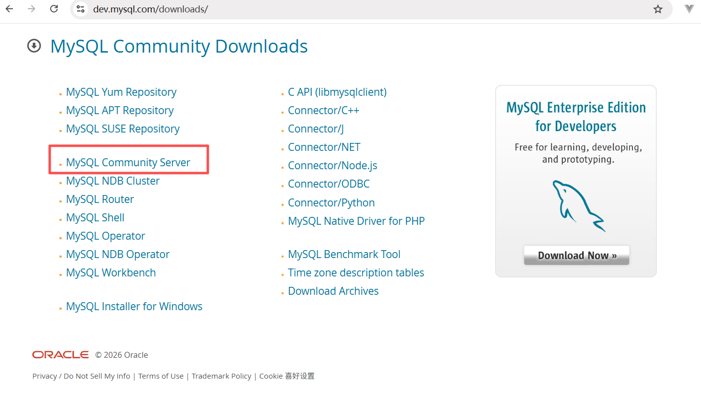

点击下载图片所指版本；

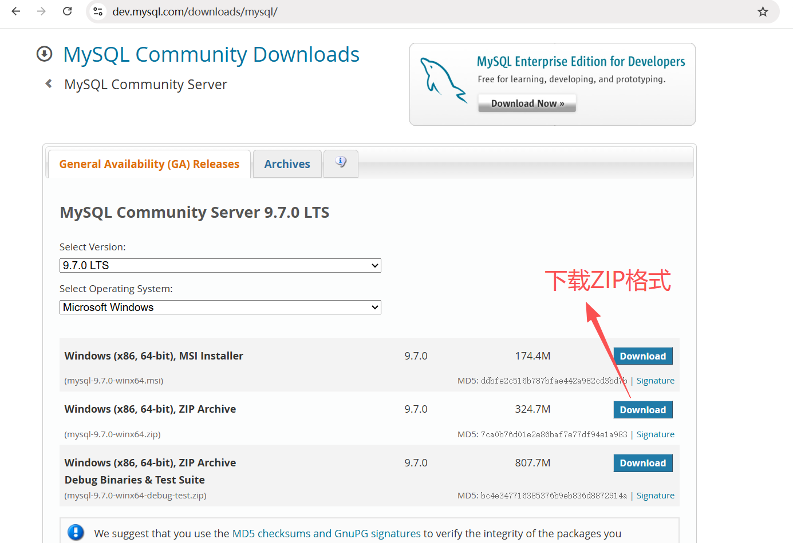

这里不用登录，直接点击图片所指；

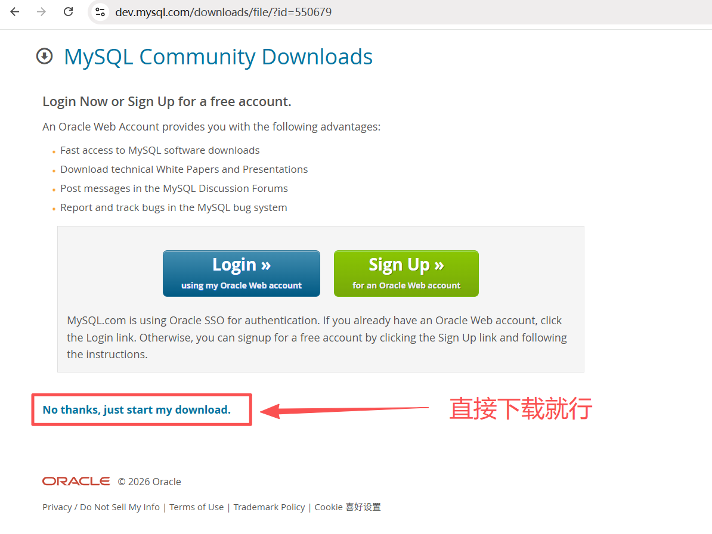

### 解压下载的压缩包

选择自己喜欢的位置存放MySQL解压文件夹，鹏星解压到`D:\MySQL\mysql-9.7.0-winx64` ，解压后如图所示：

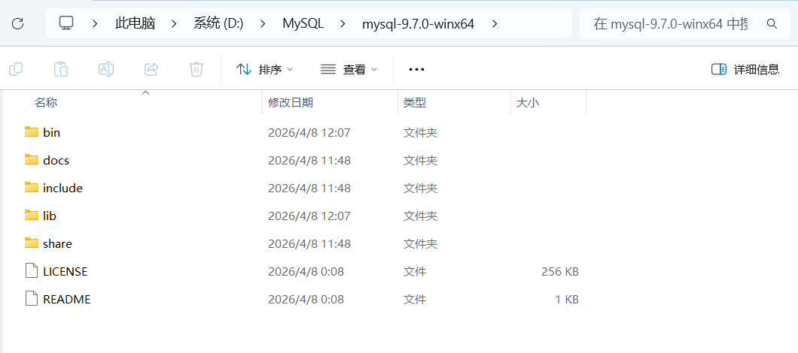

### 配置my.ini文件

解压之后的mysql目录下没有my.ini文件，别慌，这需要我们自己去配置，很简单，新建一个文本文件，将文件类型改为.ini

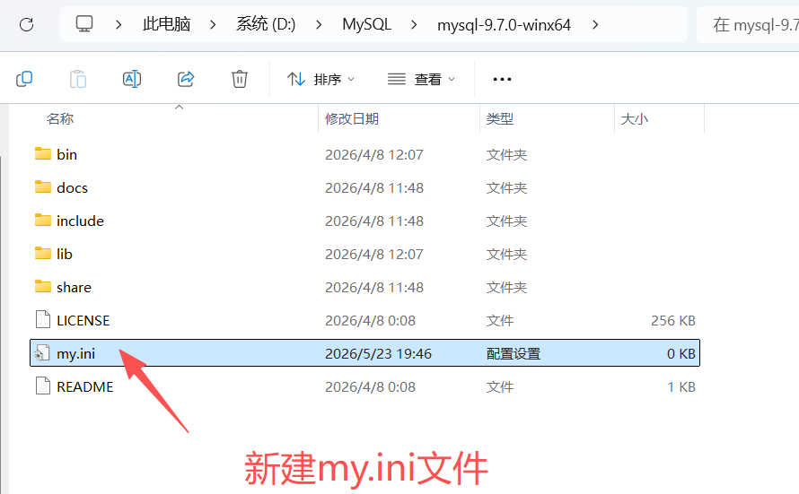

:::tip

若新建的文本文件不显示后缀.txt，点击当前文件目录左上角的查看，并勾选拓展文件名即可显示

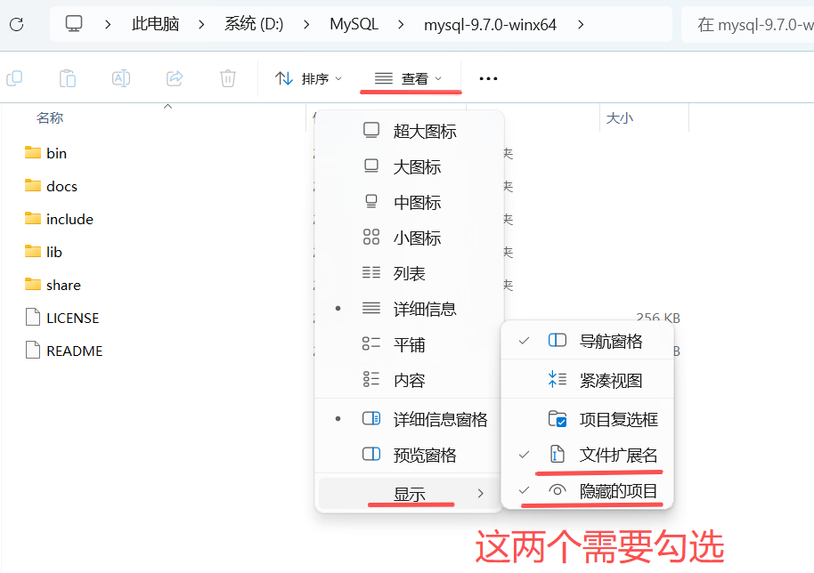

:::


写入`my.ini`基本配置：

> 注意：其中的data目录不需要创建，下一步初始化工作中会自动创建。

```ini
[mysqld]
# ---- 基础配置 ----
# 设置3306端口
port=3306 
# 设置mysql的安装目录
basedir=D:/MySQL/mysql-9.7.0-winx64
# 设置mysql数据库的数据的存放目录
datadir=D:/MySQL/mysql-9.7.0-winx64/data

# ---- 连接限制 ----
# 允许最大连接数
max_connections=200
# 允许连接失败的次数。这是为了防止有人从该主机试图攻击数据库系统
max_connect_errors=10

# ---- 字符集 ----
character-set-server=utf8mb4
collation-server=utf8mb4_0900_ai_ci

# ---- 存储引擎 ----
default-storage-engine=INNODB

# ---- InnoDB 核心配置 ----
innodb_buffer_pool_size=512M
innodb_flush_log_at_trx_commit=2
innodb_flush_method=unbuffered    # Windows 推荐用 unbuffered

# ---- SQL 模式 ----
sql_mode=ONLY_FULL_GROUP_BY,STRICT_TRANS_TABLES,ERROR_FOR_DIVISION_BY_ZERO,NO_ENGINE_SUBSTITUTION

# ---- 日志 ----
log-error=D:/MySQL/mysql-9.7.0-winx64/data/error.log

[mysql]
default-character-set=utf8mb4

[client]
port=3306
default-character-set=utf8mb4
```

### 管理员身份运行cmd

按住Win+X，选择 **终端管理员** 或者是底部搜索栏搜终端，然后鼠标右键，以管理员身份运行

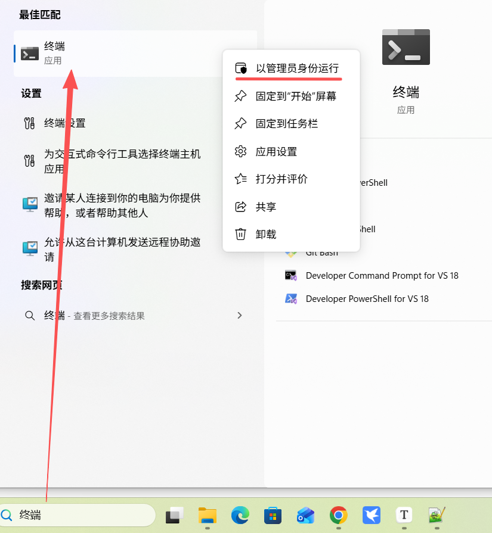

进入mysql的安装目录下的bin目录

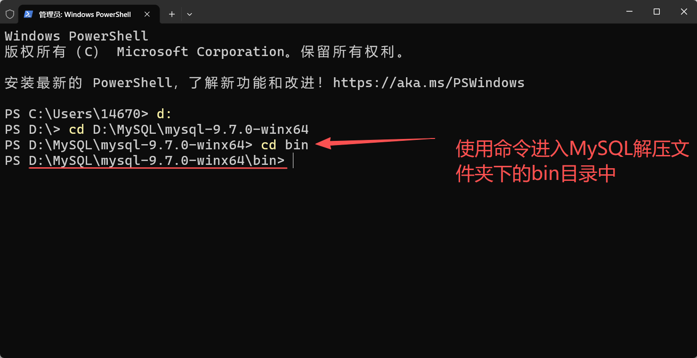

### 初始化

在mysql目录下的bin目录下输入“mysqld --initialize --console”，如下图所示：

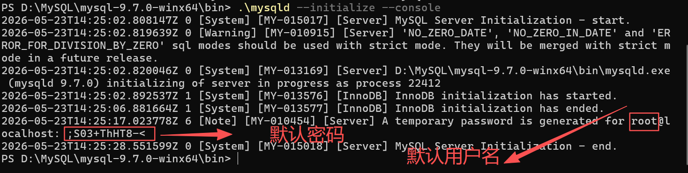

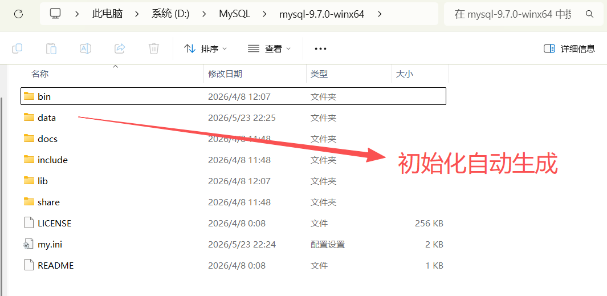

:::tip

- **CMD 命令提示符**：可以直接输入 `mysqld`
- **PowerShell**：为了安全，必须输入 `.\mysqld` 或完整路径

这是 PowerShell 的安全机制问题。PowerShell 默认不运行当前目录下的可执行文件，需要显式指定路径。

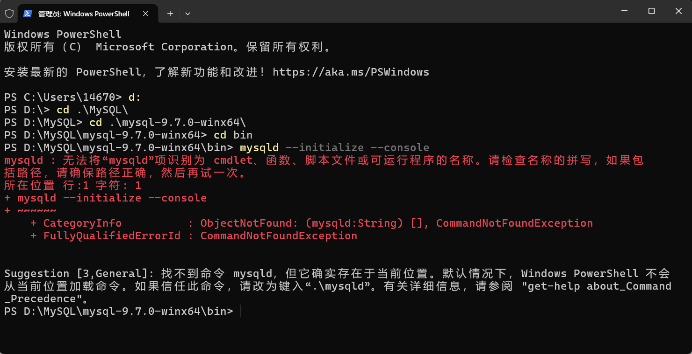

解决办法：

```powershell
# 1. 确保在 bin 目录下
cd D:\MySQL\mysql-9.7.0-winx64\bin

# 2. 初始化数据库（注意前面的 .\）
.\mysqld --initialize --console
```

:::

初始化自动生成的密码直接复制，不要有空格，下面要用(密码是随机生成的不同电脑生成的密码不一样)，`;S03+ThHT8-<`

### 启动 MySQL 服务并登录

#### 1. 安装 Windows 服务

```powershell
# mysqld --install [服务名]

# --defaults-file="D:\MySQL\mysql-9.7.0-winx64\my.ini"这样写是为了以后安装多个MySQL时，不会搞混单独配置的my.ini

# 如果只安装一个MySQL，可以直接使用  mysqld --install [服务名]

.\mysqld --install MySQL97 --defaults-file="D:\MySQL\mysql-9.7.0-winx64\my.ini"
```

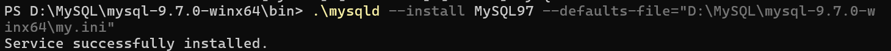

#### 2. 启动服务

```powershell
net start MySQL97
```

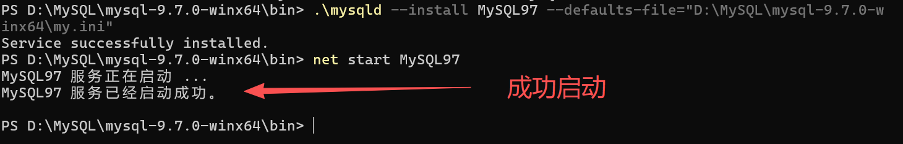

#### 3. 登录 MySQL（使用临时密码）

```powershell
.\mysql -u root -p
```

提示输入密码时粘贴：`;S03+ThHT8-<`

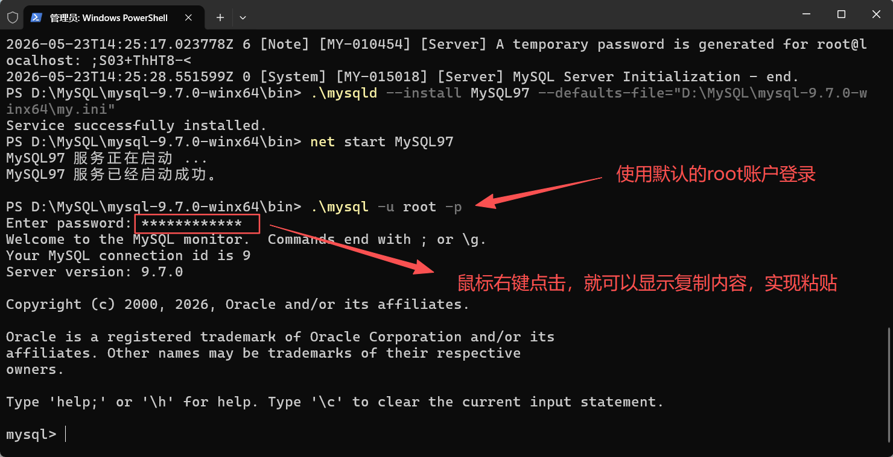

#### 4. 修改 root 密码（强烈推荐）

登录成功后，在 MySQL 命令行中执行：

> ALTER USER 'root'@'localhost' IDENTIFIED WITH mysql_native_password BY '新密码';
>
> 这个命令在MySQL9.7版本中已经不能使用了
>
> ### 🔍 为什么这条命令不再有效？
>
> 从 MySQL 8.0 到 9.7 版本，认证插件经历了三个阶段的变化：
>
> | MySQL 版本       | `mysql_native_password` 状态 | 默认认证插件            |
> | :--------------- | :--------------------------- | :---------------------- |
> | **8.0.x**        | 可用（但已弃用）             | `caching_sha2_password` |
> | **8.4.x**        | 默认禁用，需手动开启         | `caching_sha2_password` |
> | **9.0+ (含9.7)** | **已彻底移除**               | `caching_sha2_password` |
>
> SQL 语法本身虽然可以执行，但因为 9.7 的服务端已不再包含 `mysql_native_password` 这个插件，所以 MySQL 无法识别 `WITH` 子句中指定的插件名称，最终会返回类似 “Plugin ‘mysql_native_password’ is not loaded” 的错误

```sql
ALTER USER 'root'@'localhost' IDENTIFIED BY '你的新密码';
FLUSH PRIVILEGES;
```

**例如**设置新密码为 `root`：

```sql
ALTER USER 'root'@'localhost' IDENTIFIED BY 'root';
FLUSH PRIVILEGES;
```

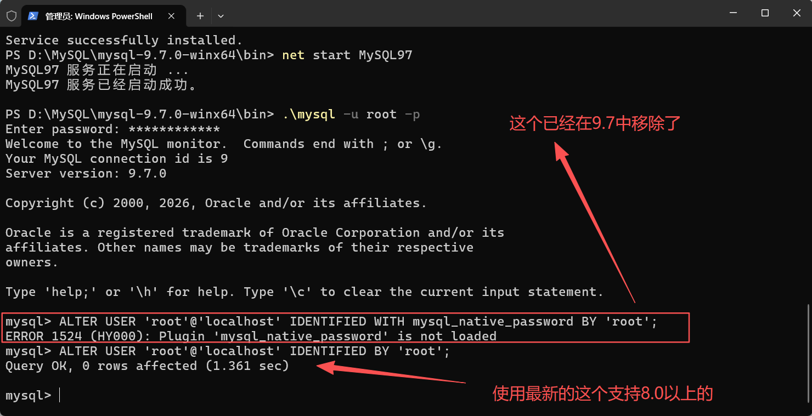

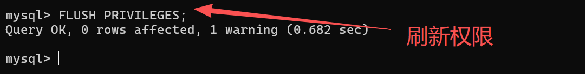

#### 5. 退出并重新登录测试

```sql
EXIT;
```

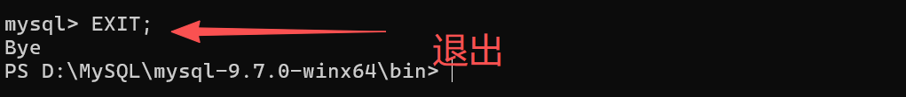

```powershell
.\mysql -u root -p
# 输入新密码root
```

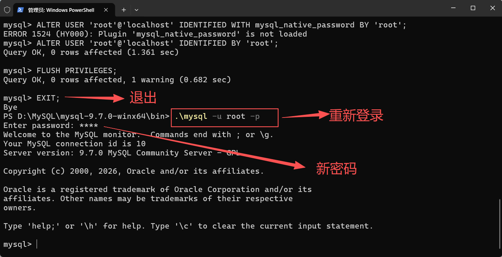

### 添加环境变量

配置环境变量是为了在cmd任意位置都能够启动mysql

#### 1. 以管理员身份打开 PowerShell

```powershell
# 1. 获取当前系统 PATH
$currentPath = [Environment]::GetEnvironmentVariable("Path", "Machine")

# 2. 检查是否已存在（避免重复）
if ($currentPath -notlike "*mysql-9.7.0*") {
    # 3. 追加 MySQL bin 路径
    [Environment]::SetEnvironmentVariable(
        "Path",
        $currentPath + ";D:\MySQL\mysql-9.7.0-winx64\bin",
        "Machine"
    )
    Write-Host "已添加"
} else {
    Write-Host "已存在，跳过"
}
```

#### 2. 图形界面方式

1.右键桌面上 “我的电脑” >> “属性” ，在弹出的页面上点击“高级系统设置”

2.在弹出的“系统属性”窗口中“高级”标签页下点击“环境变量”按钮。

3.在系统变量里设置Path环境变量，该变量已经存在，所以在列表中选择Path，点击下方的“编辑”按钮

4.在弹出的窗口中添加如下信息：`D:\MySQL\mysql-9.7.0-winx64\bin`  然后点击“确认”按钮即可

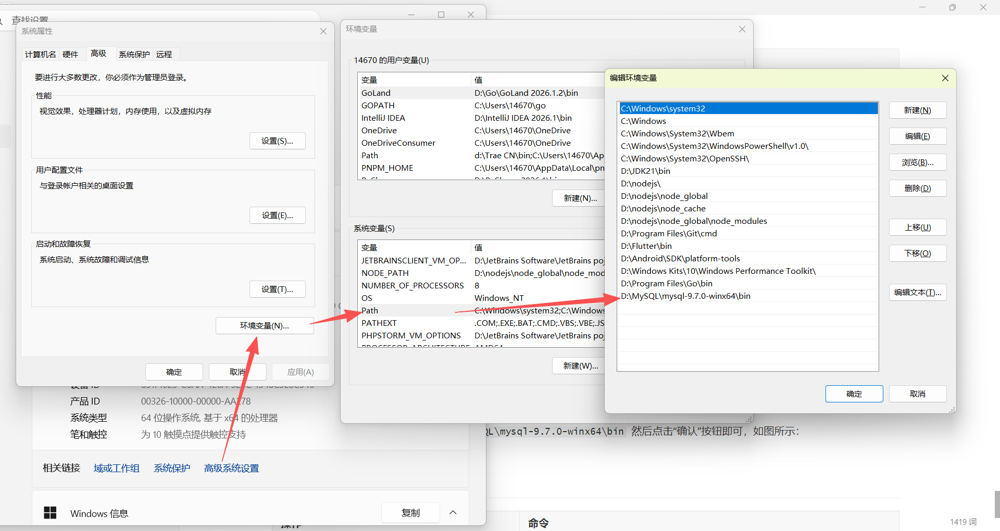

5.验证是否设置成功：

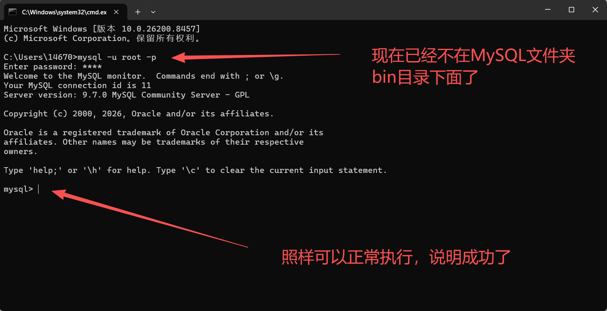

## 🔧 常用命令速查

| 操作         | 命令                 |
| :----------- | :------------------- |
| 启动服务     | `net start MySQL97`  |
| 停止服务     | `net stop MySQL97`   |
| 删除服务     | `sc delete MySQL97`  |
| 查看服务状态 | `sc query MySQL97`   |
| 登录 MySQL   | `.\mysql -u root -p` |

## ✅ 验证安装

登录成功后执行：


```sql
SELECT VERSION();        -- 查看版本
SELECT DATABASE();       -- 查看当前数据库
SHOW DATABASES;          -- 查看所有数据库
```

一切就绪！MySQL 9.7 已经成功安装并可以使用了。
