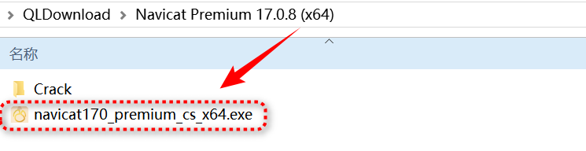
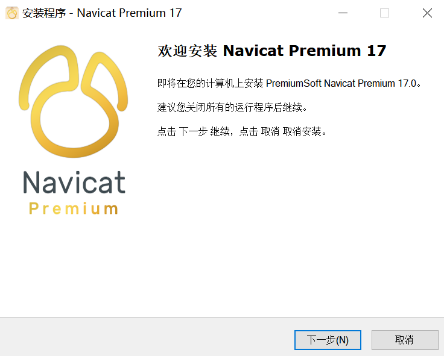
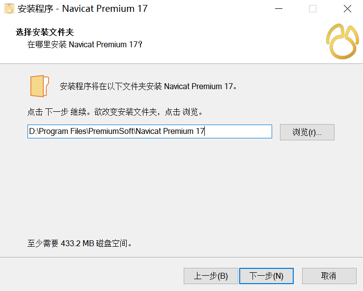
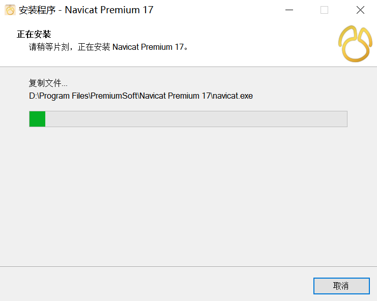
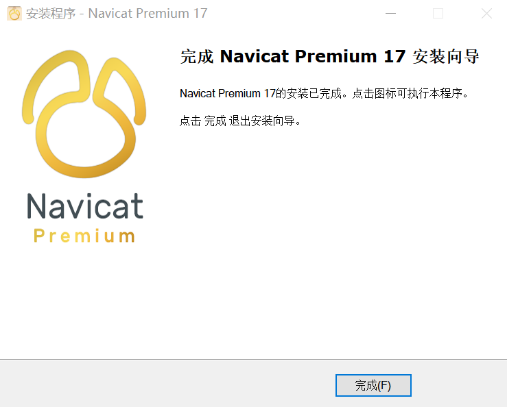
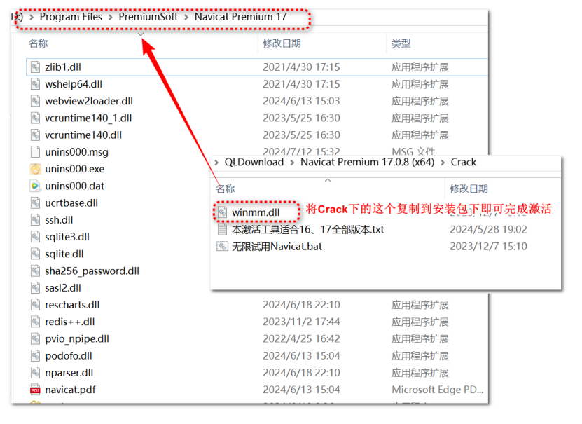
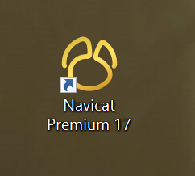
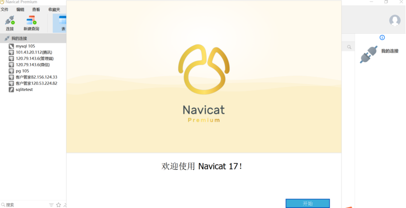
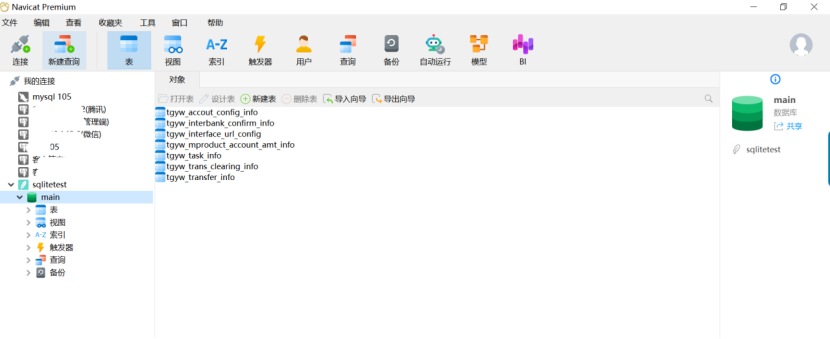

## 前言

Navicat Premium 是一套可创建多个连接的数据库开发工具，让你从单一应用程序中同时连接 MySQL、MariaDB、MongoDB、SQL Server、Oracle、PostgreSQL 和 SQLite 。

它与 OceanBase 数据库及 Amazon RDS、Amazon Aurora、Amazon Redshift、Microsoft Azure、Oracle Cloud、MongoDB Atlas、阿里云、腾讯云和华为云等云数据库兼容。可以快速轻松地创建、管理和维护数据库。

## 一、下载地址

Navicat Premium 17 激活破解版已经放到网盘了，需要的自取。

网盘地址一：https://pan.baidu.com/s/1YN7OJiyWn-QKv3_xrM41kw?pwd=pyxh

提取码：pyxh

## 二、安装步骤

1、点击运行navicat170_premium_cs_x64.exe

2、开始安装

3、选择安装路径，最好不要放在系统盘C盘，后面两个步骤默认

4、安装中，耐心等待1-2分钟

5、安装完成，点击【完成】，先不要启动软件

6、返回我们解压的文件夹内，访问crack文件夹，将crack文件夹下的winmm.dll文件覆盖到Navicat Premium的安装位置即可激活

7、点击桌面启动

8、激活成功，点击开始即可

9、可以看到能够正常连接数据库

