# vue-admin-template

> # 前言
>
> [vue-admin-template](https://github.com/PanJiaChen/vue-admin-template.git)里面本身是没有TagViews标签页的，只有完整版的[vue-element-admin](https://github.com/PanJiaChen/vue-element-admin)才有，翻找网上的其他教程，要么代码不完整，要么有bug，本篇文章就教大家如何在vue-admin-template的基础上新增TagViews

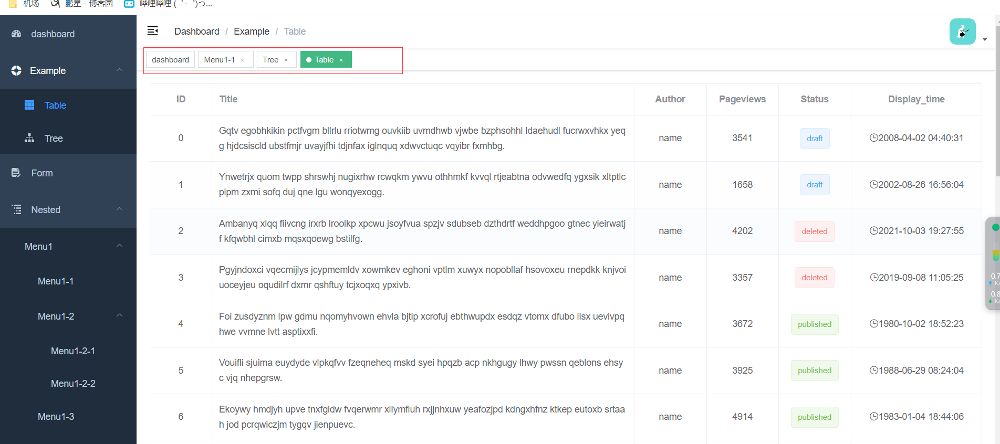

# 步骤

## 1. 从vue-element-admin复制文件

新增文件夹`\src\layout\components\TagsView`，并新建文件`index.vue`，`ScrollPane.vue`

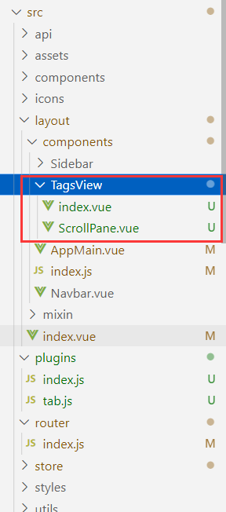

`index.vue`：

```vue
<template>
  <div id="tags-view-container" class="tags-view-container">
    <scroll-pane
      ref="scrollPane"
      class="tags-view-wrapper"
      @scroll="handleScroll"
    >
      <router-link
        v-for="tag in visitedViews"
        ref="tag"
        :key="tag.path"
        :class="isActive(tag) ? 'active' : ''"
        :to="{ path: tag.path, query: tag.query, fullPath: tag.fullPath }"
        tag="span"
        class="tags-view-item"
        :style="activeStyle(tag)"
        @click.middle.native="!isAffix(tag) ? closeSelectedTag(tag) : ''"
        @contextmenu.prevent.native="openMenu(tag, $event)"
      >
        {{ tag.title }}
        <span
          v-if="!isAffix(tag)"
          class="el-icon-close"
          @click.prevent.stop="closeSelectedTag(tag)"
        />
      </router-link>
    </scroll-pane>
    <ul
      v-show="visible"
      :style="{ left: left + 'px', top: top + 'px' }"
      class="contextmenu"
    >
      <!-- <li @click="refreshSelectedTag(selectedTag)">
        <i class="el-icon-refresh-right"></i> 刷新页面
      </li> -->
      <li v-if="!isAffix(selectedTag)" @click="closeSelectedTag(selectedTag)">
        <i class="el-icon-close"></i> 关闭当前
      </li>
      <li @click="closeOthersTags">
        <i class="el-icon-circle-close"></i> 关闭其他
      </li>
      <li v-if="!isFirstView()" @click="closeLeftTags">
        <i class="el-icon-back"></i> 关闭左侧
      </li>
      <li v-if="!isLastView()" @click="closeRightTags">
        <i class="el-icon-right"></i> 关闭右侧
      </li>
      <li @click="closeAllTags(selectedTag)">
        <i class="el-icon-circle-close"></i> 全部关闭
      </li>
    </ul>
  </div>
</template>

<script>
import ScrollPane from "./ScrollPane";
import path from "path";

export default {
  components: { ScrollPane },
  data() {
    return {
      visible: false,
      top: 0,
      left: 0,
      selectedTag: {},
      affixTags: [],
    };
  },
  computed: {
    visitedViews() {
      return this.$store.state.tagsView.visitedViews;
    },
    // 没有用到权限验证
    // routes() {
    // return this.$store.state.permission.routes
    // },
    theme() {
      return this.$store.state.settings.theme;
    },
  },
  watch: {
    $route() {
      this.addTags();
      this.moveToCurrentTag();
    },
    visible(value) {
      if (value) {
        document.body.addEventListener("click", this.closeMenu);
      } else {
        document.body.removeEventListener("click", this.closeMenu);
      }
    },
  },
  mounted() {
    this.initTags();
    this.addTags();
     // 刷新页面标签不丢失
     this.beforeUnload();
  },
  methods: {
    beforeUnload() {
      // 监听页面刷新
      window.addEventListener("beforeunload", () => {
        // visitedViews数据结构太复杂无法直接JSON.stringify处理，先转换需要的数据
        // console.log(this.visitedViews,'this.visitedViews')
        let tabViews = this.visitedViews.map((item) => {
          return {
            fullPath: item.fullPath,
            hash: item.hash,
            meta: { ...item.meta },
            name: item.name,
            params: { ...item.params },
            path: item.path,
            query: { ...item.query },
            title: item.title,
          };
        });
        sessionStorage.setItem("tabViews", JSON.stringify(tabViews));
      });
      // 页面初始化加载判断缓存中是否有数据
      let oldViews = JSON.parse(sessionStorage.getItem("tabViews")) || [];
      //  console.log(oldViews,'this.visitedViews2')
      if (oldViews.length > 0) {
        this.$store.state.tagsView.visitedViews = oldViews;
      }
    },
    isActive(route) {
      return route.path === this.$route.path;
    },
    activeStyle(tag) {
      if (!this.isActive(tag)) return {};
      return {
        "background-color": this.theme,
        "border-color": this.theme,
      };
    },
    isAffix(tag) {
      return tag.meta && tag.meta.affix;
    },
    isFirstView() {
      try {
        return (
          this.selectedTag.fullPath === this.visitedViews[1].fullPath ||
          this.selectedTag.fullPath === "/index"
        );
      } catch (err) {
        return false;
      }
    },
    isLastView() {
      try {
        return (
          this.selectedTag.fullPath ===
          this.visitedViews[this.visitedViews.length - 1].fullPath
        );
      } catch (err) {
        return false;
      }
    },
    filterAffixTags(routes, basePath = "/") {
      let tags = [];
      if (this.routes) {
        routes.forEach((route) => {
          if (route.meta && route.meta.affix) {
            const tagPath = path.resolve(basePath, route.path);
            tags.push({
              fullPath: tagPath,
              path: tagPath,
              name: route.name,
              meta: { ...route.meta },
            });
          }
          if (route.children) {
            const tempTags = this.filterAffixTags(route.children, route.path);
            if (tempTags.length >= 1) {
              tags = [...tags, ...tempTags];
            }
          }
        });
      }
      return tags;
    },
    initTags() {
      const affixTags = (this.affixTags = this.filterAffixTags(this.routes));
      for (const tag of affixTags) {
        // Must have tag name
        if (tag.name) {
          this.$store.dispatch("tagsView/addVisitedView", tag);
        }
      }
    },
    addTags() {
      const { name } = this.$route;
      if (name) {
        this.$store.dispatch("tagsView/addView", this.$route);
        if (this.$route.meta.link) {
          this.$store.dispatch("tagsView/addIframeView", this.$route);
        }
      }
      return false;
    },
    moveToCurrentTag() {
      const tags = this.$refs.tag;
      this.$nextTick(() => {
        for (const tag of tags) {
          if (tag.to.path === this.$route.path) {
            this.$refs.scrollPane.moveToTarget(tag);
            // when query is different then update
            if (tag.to.fullPath !== this.$route.fullPath) {
              this.$store.dispatch("tagsView/updateVisitedView", this.$route);
            }
            break;
          }
        }
      });
    },
    refreshSelectedTag(view) {
      this.$tab.refreshPage(view);
      // if (this.$route.meta.link) {
        this.$store.dispatch("tagsView/delIframeView", this.$route).then((res)=>{
          console.log(res);
          console.log(view);
          const {fullPath}=view;
          this.$nextTick(()=>{
            this.$router.replace({
              path:'/redirect'+fullPath
            })
          })
        });
      // }
    },
    closeSelectedTag(view) {
      this.$tab.closePage(view).then(({ visitedViews }) => {
        if (this.isActive(view)) {
          this.toLastView(visitedViews, view);
        }
      });
    },
    closeRightTags() {
      this.$tab.closeRightPage(this.selectedTag).then((visitedViews) => {
        if (!visitedViews.find((i) => i.fullPath === this.$route.fullPath)) {
          this.toLastView(visitedViews);
        }
      });
    },
    closeLeftTags() {
      this.$tab.closeLeftPage(this.selectedTag).then((visitedViews) => {
        if (!visitedViews.find((i) => i.fullPath === this.$route.fullPath)) {
          this.toLastView(visitedViews);
        }
      });
    },
    closeOthersTags() {
      console.log('关闭其他标签');
      // this.$router.push(this.selectedTag).catch(() => {});
      this.$router.push(this.selectedTag);
      this.$tab.closeOtherPage(this.selectedTag).then(() => {
        this.moveToCurrentTag();
      }).catch(() => {});
    },
    closeAllTags(view) {
      this.$tab.closeAllPage().then(({ visitedViews }) => {
        if (this.affixTags.some((tag) => tag.path === this.$route.path)) {
          return;
        }
        this.toLastView(visitedViews, view);
      });
    },
    toLastView(visitedViews, view) {
      const latestView = visitedViews.slice(-1)[0];
      if (latestView) {
        this.$router.push(latestView.fullPath);
      } else {
        // now the default is to redirect to the home page if there is no tags-view,
        // you can adjust it according to your needs.
        if (view.name === "Dashboard") {
          // to reload home page
          this.$router.replace({ path: "/redirect" + view.fullPath });
        } else {
          this.$router.push("/");
        }
      }
    },
    openMenu(tag, e) {
      const menuMinWidth = 105;
      const offsetLeft = this.$el.getBoundingClientRect().left; // container margin left
      const offsetWidth = this.$el.offsetWidth; // container width
      const maxLeft = offsetWidth - menuMinWidth; // left boundary
      const left = e.clientX - offsetLeft + 15; // 15: margin right

      if (left > maxLeft) {
        this.left = maxLeft;
      } else {
        this.left = left;
      }

      this.top = e.clientY;
      this.visible = true;
      this.selectedTag = tag;
    },
    closeMenu() {
      this.visible = false;
    },
    handleScroll() {
      this.closeMenu();
    },
  },
};
</script>

<style lang="scss" scoped>
.tags-view-container {
  height: 34px;
  width: 100%;
  background: #fff;
  border-bottom: 1px solid #d8dce5;
  box-shadow: 0 1px 3px 0 rgba(0, 0, 0, 0.12), 0 0 3px 0 rgba(0, 0, 0, 0.04);
  .tags-view-wrapper {
    .tags-view-item {
      display: inline-block;
      position: relative;
      cursor: pointer;
      height: 26px;
      line-height: 26px;
      border: 1px solid #d8dce5;
      color: #495060;
      background: #fff;
      padding: 0 8px;
      font-size: 12px;
      margin-left: 5px;
      margin-top: 4px;
      &:first-of-type {
        margin-left: 15px;
      }
      &:last-of-type {
        margin-right: 15px;
      }
      &.active {
        background-color: #42b983;
        color: #fff;
        border-color: #42b983;
        &::before {
          content: "";
          background: #fff;
          display: inline-block;
          width: 8px;
          height: 8px;
          border-radius: 50%;
          position: relative;
          margin-right: 2px;
        }
      }
    }
  }
  .contextmenu {
    margin: 0;
    background: #fff;
    z-index: 3000;
    position: absolute;
    list-style-type: none;
    padding: 5px 0;
    border-radius: 4px;
    font-size: 12px;
    font-weight: 400;
    color: #333;
    box-shadow: 2px 2px 3px 0 rgba(0, 0, 0, 0.3);
    li {
      margin: 0;
      padding: 7px 16px;
      cursor: pointer;
      &:hover {
        background: #eee;
      }
    }
  }
}
</style>

<style lang="scss">
//reset element css of el-icon-close
.tags-view-wrapper {
  .tags-view-item {
    .el-icon-close {
      width: 16px;
      height: 16px;
      vertical-align: 2px;
      border-radius: 50%;
      text-align: center;
      transition: all 0.3s cubic-bezier(0.645, 0.045, 0.355, 1);
      transform-origin: 100% 50%;
      &:before {
        transform: scale(0.6);
        display: inline-block;
        vertical-align: -3px;
      }
      &:hover {
        background-color: #b4bccc;
        color: #fff;
      }
    }
  }
}
</style>


```

ScrollPane.vue

```vue
<template>
  <el-scrollbar ref="scrollContainer" :vertical="false" class="scroll-container" @wheel.native.prevent="handleScroll">
    <slot />
  </el-scrollbar>
</template>

<script>
const tagAndTagSpacing = 4 // tagAndTagSpacing

export default {
  name: 'ScrollPane',
  data() {
    return {
      left: 0
    }
  },
  computed: {
    scrollWrapper() {
      return this.$refs.scrollContainer.$refs.wrap
    }
  },
  mounted() {
    this.scrollWrapper.addEventListener('scroll', this.emitScroll, true)
  },
  beforeDestroy() {
    this.scrollWrapper.removeEventListener('scroll', this.emitScroll)
  },
  methods: {
    handleScroll(e) {
      const eventDelta = e.wheelDelta || -e.deltaY * 40
      const $scrollWrapper = this.scrollWrapper
      $scrollWrapper.scrollLeft = $scrollWrapper.scrollLeft + eventDelta / 4
    },
    emitScroll() {
      this.$emit('scroll')
    },
    moveToTarget(currentTag) {
      const $container = this.$refs.scrollContainer.$el
      const $containerWidth = $container.offsetWidth
      const $scrollWrapper = this.scrollWrapper
      const tagList = this.$parent.$refs.tag

      let firstTag = null
      let lastTag = null

      // find first tag and last tag
      if (tagList.length > 0) {
        firstTag = tagList[0]
        lastTag = tagList[tagList.length - 1]
      }

      if (firstTag === currentTag) {
        $scrollWrapper.scrollLeft = 0
      } else if (lastTag === currentTag) {
        $scrollWrapper.scrollLeft = $scrollWrapper.scrollWidth - $containerWidth
      } else {
        // find preTag and nextTag
        const currentIndex = tagList.findIndex(item => item === currentTag)
        const prevTag = tagList[currentIndex - 1]
        const nextTag = tagList[currentIndex + 1]

        // the tag's offsetLeft after of nextTag
        const afterNextTagOffsetLeft = nextTag.$el.offsetLeft + nextTag.$el.offsetWidth + tagAndTagSpacing

        // the tag's offsetLeft before of prevTag
        const beforePrevTagOffsetLeft = prevTag.$el.offsetLeft - tagAndTagSpacing

        if (afterNextTagOffsetLeft > $scrollWrapper.scrollLeft + $containerWidth) {
          $scrollWrapper.scrollLeft = afterNextTagOffsetLeft - $containerWidth
        } else if (beforePrevTagOffsetLeft < $scrollWrapper.scrollLeft) {
          $scrollWrapper.scrollLeft = beforePrevTagOffsetLeft
        }
      }
    }
  }
}
</script>

<style lang="scss" scoped>
.scroll-container {
  white-space: nowrap;
  position: relative;
  overflow: hidden;
  width: 100%;
  ::v-deep {
    .el-scrollbar__bar {
      bottom: 0px;
    }
    .el-scrollbar__wrap {
      height: 49px;
    }
  }
}
</style>


```

从[vue-element-admin](https://github.com/PanJiaChen/vue-element-admin)复制文件`src\store\modules\tagsView.js`并放到相同目录下

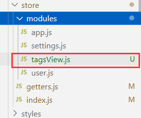

tagsView.js

```js
const state = {
  visitedViews: [],
  cachedViews: [],
  iframeViews: []
}

const mutations = {
  ADD_IFRAME_VIEW: (state, view) => {
    if (state.iframeViews.some(v => v.path === view.path)) return
    state.iframeViews.push(
      Object.assign({}, view, {
        title: view.meta.title || 'no-name'
      })
    )
  },
  ADD_VISITED_VIEW: (state, view) => {
    if (state.visitedViews.some(v => v.path === view.path)) return
    state.visitedViews.push(
      Object.assign({}, view, {
        title: view.meta.title || 'no-name'
      })
    )
  },
  ADD_CACHED_VIEW: (state, view) => {
    if (state.cachedViews.includes(view.name)) return
    if (view.meta && !view.meta.noCache) {
      state.cachedViews.push(view.name)
    }
  },
  DEL_VISITED_VIEW: (state, view) => {
    for (const [i, v] of state.visitedViews.entries()) {
      if (v.path === view.path) {
        state.visitedViews.splice(i, 1)
        break
      }
    }
    state.iframeViews = state.iframeViews.filter(item => item.path !== view.path)
  },
  DEL_IFRAME_VIEW: (state, view) => {
    state.iframeViews = state.iframeViews.filter(item => item.path !== view.path)
  },
  DEL_CACHED_VIEW: (state, view) => {
    const index = state.cachedViews.indexOf(view.name)
    index > -1 && state.cachedViews.splice(index, 1)
  },

  DEL_OTHERS_VISITED_VIEWS: (state, view) => {
    state.visitedViews = state.visitedViews.filter(v => {
      return v.meta.affix || v.path === view.path
    })
    state.iframeViews = state.iframeViews.filter(item => item.path === view.path)
  },
  DEL_OTHERS_CACHED_VIEWS: (state, view) => {
    const index = state.cachedViews.indexOf(view.name)
    if (index > -1) {
      state.cachedViews = state.cachedViews.slice(index, index + 1)
    } else {
      state.cachedViews = []
    }
  },
  DEL_ALL_VISITED_VIEWS: state => {
    // keep affix tags
    const affixTags = state.visitedViews.filter(tag => tag.meta.affix)
    state.visitedViews = affixTags
    state.iframeViews = []
  },
  DEL_ALL_CACHED_VIEWS: state => {
    state.cachedViews = []
  },
  UPDATE_VISITED_VIEW: (state, view) => {
    for (let v of state.visitedViews) {
      if (v.path === view.path) {
        v = Object.assign(v, view)
        break
      }
    }
  },
  DEL_RIGHT_VIEWS: (state, view) => {
    const index = state.visitedViews.findIndex(v => v.path === view.path)
    if (index === -1) {
      return
    }
    state.visitedViews = state.visitedViews.filter((item, idx) => {
      if (idx <= index || (item.meta && item.meta.affix)) {
        return true
      }
      const i = state.cachedViews.indexOf(item.name)
      if (i > -1) {
        state.cachedViews.splice(i, 1)
      }
      if(item.meta.link) {
        const fi = state.iframeViews.findIndex(v => v.path === item.path)
        state.iframeViews.splice(fi, 1)
      }
      return false
    })
  },
  DEL_LEFT_VIEWS: (state, view) => {
    const index = state.visitedViews.findIndex(v => v.path === view.path)
    if (index === -1) {
      return
    }
    state.visitedViews = state.visitedViews.filter((item, idx) => {
      if (idx >= index || (item.meta && item.meta.affix)) {
        return true
      }
      const i = state.cachedViews.indexOf(item.name)
      if (i > -1) {
        state.cachedViews.splice(i, 1)
      }
      if(item.meta.link) {
        const fi = state.iframeViews.findIndex(v => v.path === item.path)
        state.iframeViews.splice(fi, 1)
      }
      return false
    })
  }
}

const actions = {
  addView({ dispatch }, view) {
    dispatch('addVisitedView', view)
    dispatch('addCachedView', view)
  },
  addIframeView({ commit }, view) {
    commit('ADD_IFRAME_VIEW', view)
  },
  addVisitedView({ commit }, view) {
    commit('ADD_VISITED_VIEW', view)
  },
  addCachedView({ commit }, view) {
    commit('ADD_CACHED_VIEW', view)
  },
  delView({ dispatch, state }, view) {
    return new Promise(resolve => {
      dispatch('delVisitedView', view)
      dispatch('delCachedView', view)
      resolve({
        visitedViews: [...state.visitedViews],
        cachedViews: [...state.cachedViews]
      })
    })
  },
  delVisitedView({ commit, state }, view) {
    return new Promise(resolve => {
      commit('DEL_VISITED_VIEW', view)
      resolve([...state.visitedViews])
    })
  },
  delIframeView({ commit, state }, view) {
    return new Promise(resolve => {
      commit('DEL_IFRAME_VIEW', view)
      resolve([...state.iframeViews])
    })
  },
  delCachedView({ commit, state }, view) {
    return new Promise(resolve => {
      commit('DEL_CACHED_VIEW', view)
      resolve([...state.cachedViews])
    })
  },
  delOthersViews({ dispatch, state }, view) {
    return new Promise(resolve => {
      dispatch('delOthersVisitedViews', view)
      dispatch('delOthersCachedViews', view)
      resolve({
        visitedViews: [...state.visitedViews],
        cachedViews: [...state.cachedViews]
      })
    })
  },
  delOthersVisitedViews({ commit, state }, view) {
    return new Promise(resolve => {
      commit('DEL_OTHERS_VISITED_VIEWS', view)
      resolve([...state.visitedViews])
    })
  },
  delOthersCachedViews({ commit, state }, view) {
    return new Promise(resolve => {
      commit('DEL_OTHERS_CACHED_VIEWS', view)
      resolve([...state.cachedViews])
    })
  },
  delAllViews({ dispatch, state }, view) {
    return new Promise(resolve => {
      dispatch('delAllVisitedViews', view)
      dispatch('delAllCachedViews', view)
      resolve({
        visitedViews: [...state.visitedViews],
        cachedViews: [...state.cachedViews]
      })
    })
  },
  delAllVisitedViews({ commit, state }) {
    return new Promise(resolve => {
      commit('DEL_ALL_VISITED_VIEWS')
      resolve([...state.visitedViews])
    })
  },
  delAllCachedViews({ commit, state }) {
    return new Promise(resolve => {
      commit('DEL_ALL_CACHED_VIEWS')
      resolve([...state.cachedViews])
    })
  },
  updateVisitedView({ commit }, view) {
    commit('UPDATE_VISITED_VIEW', view)
  },
  delRightTags({ commit }, view) {
    return new Promise(resolve => {
      commit('DEL_RIGHT_VIEWS', view)
      resolve([...state.visitedViews])
    })
  },
  delLeftTags({ commit }, view) {
    return new Promise(resolve => {
      commit('DEL_LEFT_VIEWS', view)
      resolve([...state.visitedViews])
    })
  },
}

export default {
  namespaced: true,
  state,
  mutations,
  actions
}


```

## 2. 修改\src\layout\components\AppMain.vue

`src\ayout\components\AppMain.vue`新增修改以下内容

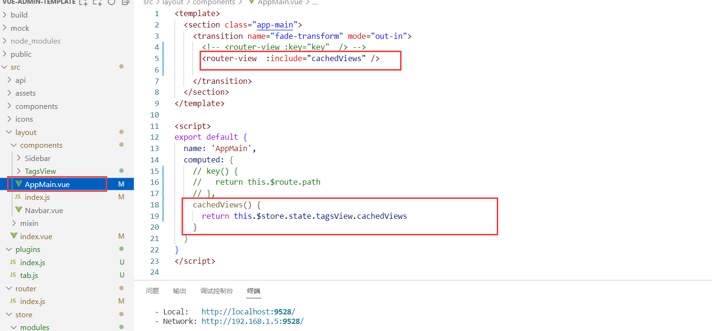

代码：

```vue
<template>
  <section class="app-main">
    <transition name="fade-transform" mode="out-in">
      <!-- <router-view :key="key"  /> -->
      <router-view  :include="cachedViews" />

    </transition>
  </section>
</template>

<script>
export default {
  name: 'AppMain',
  computed: {
    // key() {
    //   return this.$route.path
    // },
    cachedViews() {
      return this.$store.state.tagsView.cachedViews
    }
  }
}
</script>

<style scoped>
.app-main {
  /*50 = navbar  */
  min-height: calc(100vh - 50px);
  width: 100%;
  position: relative;
  overflow: hidden;
}
.fixed-header+.app-main {
  padding-top: 50px;
}
</style>

<style lang="scss">
// fix css style bug in open el-dialog
.el-popup-parent--hidden {
  .fixed-header {
    padding-right: 15px;
  }
}
</style>


```

## 3. 修改\src\layout\components\index.js

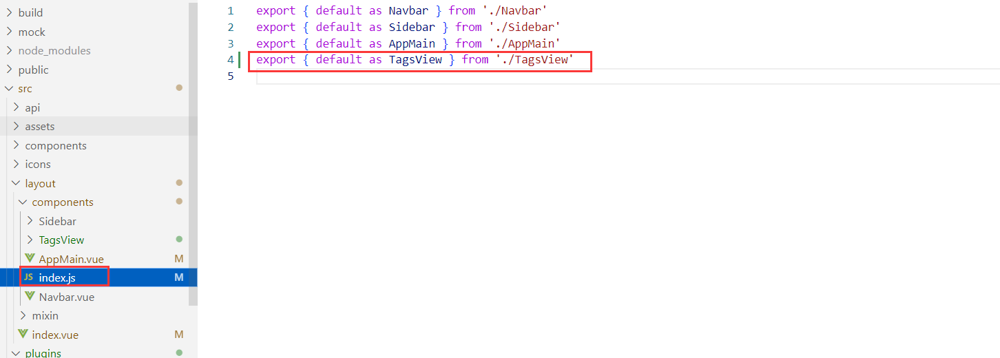

```js
export { default as TagsView } from './TagsView'
```

## 4. 修改\src\layout\index.vue

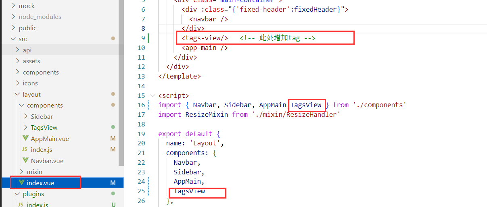

## 5. 修改 \src\store\getters.js

```javascript
visitedViews: state => state.tagsView.visitedViews,
cachedViews: state => state.tagsView.cachedViews,
```

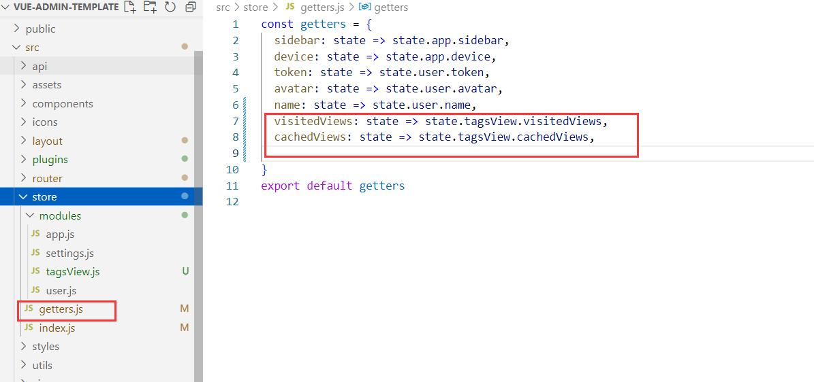

## 6. 修改\src\store\index.js

新增以下代码

```js
import tagsView from './modules/tagsView'

const store = new Vuex.Store({
  modules: {
    // ...
    tagsView,
  },
})

```

## 7. 修改vue-admin-template\src\settings.js

新增一行代码

```js
tagsView: true,

```

## 8. 修改\src\store\modules\settings.js

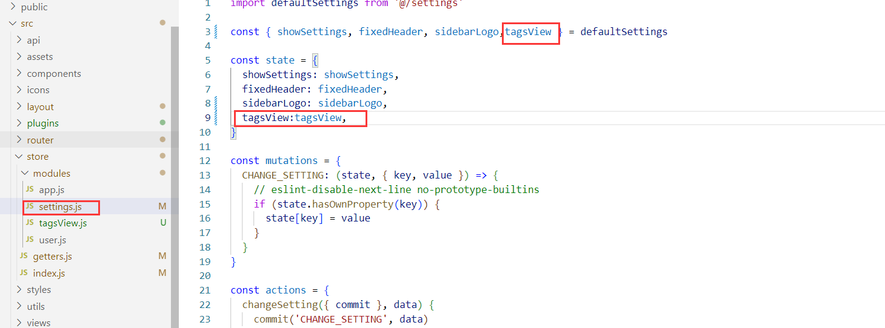

## 9. 新建 plugins文件夹,tab.js,index.js

在src下面新建文件夹plugins，下面新建`tab.js`和`index.js`
`tab.js`：

```js
import store from '@/store'
import router from '@/router';

export default {
  // 刷新当前tab页签
  refreshPage(obj) {
    const { path, query, matched } = router.currentRoute;
    if (obj === undefined) {
      matched.forEach((m) => {
        if (m.components && m.components.default && m.components.default.name) {
          if (!['Layout', 'ParentView'].includes(m.components.default.name)) {
            obj = { name: m.components.default.name, path: path, query: query };
          }
        }
      });
    }
    return store.dispatch('tagsView/delCachedView', obj).then(() => {
      const { path, query } = obj
      router.replace({
        path: '/redirect' + path,
        query: query
      })
    })
  },
  // 关闭当前tab页签，打开新页签
  closeOpenPage(obj) {
    store.dispatch("tagsView/delView", router.currentRoute);
    if (obj !== undefined) {
      return router.push(obj);
    }
  },
  // 关闭指定tab页签
  closePage(obj) {
    if (obj === undefined) {
      return store.dispatch('tagsView/delView', router.currentRoute).then(({ lastPath }) => {
        return router.push(lastPath || '/');
      });
    }
    return store.dispatch('tagsView/delView', obj);
  },
  // 关闭所有tab页签
  closeAllPage() {
    return store.dispatch('tagsView/delAllViews');
  },
  // 关闭左侧tab页签
  closeLeftPage(obj) {
    return store.dispatch('tagsView/delLeftTags', obj || router.currentRoute);
  },
  // 关闭右侧tab页签
  closeRightPage(obj) {
    return store.dispatch('tagsView/delRightTags', obj || router.currentRoute);
  },
  // 关闭其他tab页签
  closeOtherPage(obj) {
    return store.dispatch('tagsView/delOthersViews', obj || router.currentRoute);
  },
  // 添加tab页签
  openPage(title, url, params) {
    var obj = { path: url, meta: { title: title } }
    store.dispatch('tagsView/addView', obj);
    return router.push({ path: url, query: params });
  },
  // 修改tab页签
  updatePage(obj) {
    return store.dispatch('tagsView/updateVisitedView', obj);
  }
}


```

index.js

```js
import tab from './tab'

export default {
  install(Vue) {
    // 页签操作
    Vue.prototype.$tab = tab
  }
}

```

## 10. 修改main.js

`main.js`新增两行代码：

```js
import plugins from './plugins' // plugins
Vue.use(plugins)

```

## 11. 修改router文件夹中的index.js

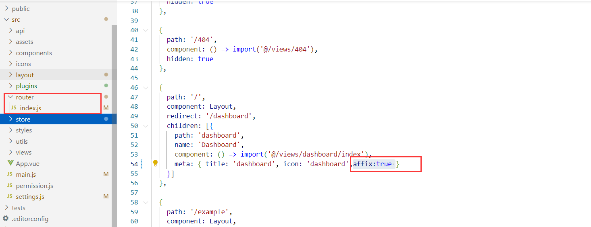


# 效果图

大功告成：

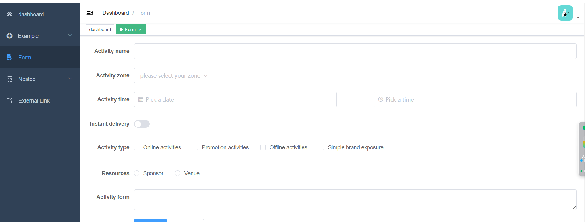

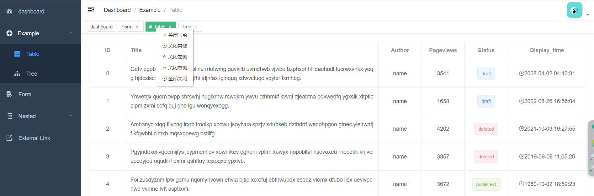
